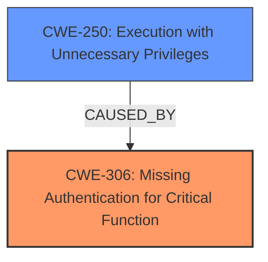

# Analysis for CVE-2022-29934

# Summary
| CWE ID | CWE Name | Confidence | CWE Abstraction Level | CWE Vulnerability Mapping Label | CWE-Vulnerability Mapping Notes |
|---|---|---|---|---|---|
| CWE-306 | Missing Authentication for Critical Function | 0.9 | Base | Allowed | Primary CWE. The vulnerability description explicitly mentions **missing Polkit authentication**. |
| CWE-250 | Execution with Unnecessary Privileges | 0.7 | Base | Allowed | Secondary CWE. The vulnerability allows smartcollector users to achieve **root access** via pkexec, indicating execution with unnecessary privileges. |

## Evidence and Confidence

*   **Confidence Score:** 0.8
*   **Evidence Strength:** HIGH

## Relationship Analysis
The primary CWE is CWE-306, which directly addresses the **missing authentication**. CWE-250 is a related issue because the lack of authentication leads to the execution of pkexec with root privileges, something that should not happen.

## Vulnerability Chain
The vulnerability chain starts with **missing Polkit authentication** (CWE-306), leading to the ability for `smartcollector` users to execute `pkexec` with **root access** (CWE-250).

## Summary of Analysis
The initial assessment focuses on identifying the root cause and resulting impact based on the provided vulnerability description. The primary weakness, **missing Polkit authentication**, directly corresponds to CWE-306. The subsequent attainment of **root access** via `pkexec` is a clear indication of CWE-250.

The vulnerability description explicitly states the **missing Polkit authentication**, which is the root cause that allows unauthorized users to gain root access.

The selection of CWE-306 as the primary CWE is based on the direct mention of **missing authentication** in the vulnerability description. CWE-250 is a secondary CWE that highlights the consequence of the missing authentication.

Relevant CWE Information:

# Enhanced Context (25 CWEs)
The following CWEs were identified as potentially relevant to this vulnerability:

## CWE-306: Missing Authentication for Critical Function
**Abstraction:** Base
**Similarity Score**: 0.193
**Source**: sparse

**Description**:
The product does not perform any authentication for functionality that requires a provable user identity or consumes a significant amount of resources.

**Mapping Guidance**:
- Usage: Allowed
- Rationale: This CWE entry is at the Base level of abstraction, which is a preferred level of abstraction for mapping to the root causes of vulnerabilities.
- Acceptable-Use.

## CWE-250: Execution with Unnecessary Privileges
**Abstraction:** Base
**Similarity Score**: 0.448
**Source**: dense

**Description**:
The product performs an operation at a privilege level that is higher than the minimum level required, which creates new weaknesses or amplifies the consequences of other weaknesses.

**Mapping Guidance**:
- Usage: Allowed
- Rationale: This CWE entry is at the Base level of abstraction, which is a preferred level of abstraction for mapping to the root causes of vulnerabilities.
- Acceptable-Use.

CWEs considered but not used:

*   CWE-203 (Observable Discrepancy): While potentially related, it does not directly address the root cause of **missing authentication**.
*   CWE-754 (Improper Check for Unusual or Exceptional Conditions): Not directly relevant as the primary issue is the **lack of authentication**, not a check for unusual conditions.
*   CWE-911 (Improper Update of Reference Count): Not relevant to authentication bypass.
*   CWE-611 (Improper Restriction of XML External Entity Reference): Not related to this vulnerability.
*   CWE-613 (Insufficient Session Expiration): Not relevant as the vulnerability doesn't involve session management.
*   CWE-290 (Authentication Bypass by Spoofing): This is a possible candidate, but CWE-306 is more direct because it's about **missing authentication**.
*   CWE-502 (Deserialization of Untrusted Data): Not relevant to this vulnerability.
*   CWE-259 (Use of Hard-coded Password): Not applicable as there is no mention of hard-coded passwords.