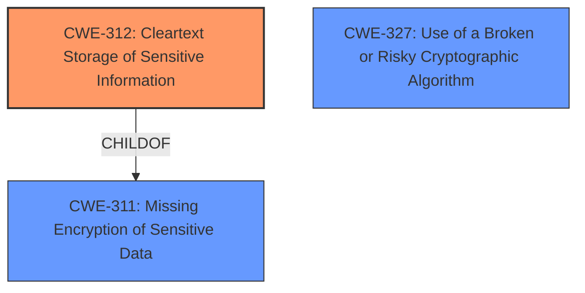

# Analysis for CVE-2022-29959

# Summary

| CWE ID  | CWE Name | Confidence | CWE Abstraction Level | CWE Vulnerability Mapping Label | CWE-Vulnerability Mapping Notes |
|----------------|---------------------------------------------------------------------|----------------|-------------------------|-----------------------------------|-----------------------------------------------------------------|
| CWE-312 | Cleartext Storage of Sensitive Information | 0.9 | Base | Allowed | Primary CWE |
| CWE-327 | Use of a Broken or Risky Cryptographic Algorithm | 0.7 | Class | Allowed-with-Review | Secondary Candidate |

## Evidence and Confidence

*   **Confidence Score:** 0.8
*   **Evidence Strength:** HIGH

## Relationship Analysis

The primary relationship that influenced the CWE selection was the parent-child relationship between CWE-311 (Missing Encryption of Sensitive Data) and CWE-312 (Cleartext Storage of Sensitive Information). Since the vulnerability specifically involves storing credentials in cleartext, CWE-312, being a child of CWE-311, provides a more precise classification. CWE-327 (Use of a Broken or Risky Cryptographic Algorithm) was considered because the vulnerability description notes that the credentials are not adequately protected, but it's a broader Class-level CWE.

## Vulnerability Chain

The vulnerability chain starts with the **insecure credential storage**, leading to potential compromise of credentials and subsequent malicious activities.

*   Root Cause: **Insecure credential storage** (CWE-312 Cleartext Storage of Sensitive Information)
*   Weakness: Use of a simple string transformation instead of a cryptographic mechanism (Potentially CWE-327 Use of a Broken or Risky Cryptographic Algorithm)
*   Impact: Compromise of stored credentials, potentially leading to remote code execution or other malicious activities.

## Summary of Analysis

The initial assessment focused on identifying the root cause of the vulnerability, which is the **insecure storage of credentials**. The vulnerability description clearly states that the credentials are stored **insecurely** in the SecUsers.ini file using a simple string transformation rather than a cryptographic mechanism.

The primary CWE, CWE-312 (Cleartext Storage of Sensitive Information), was chosen because it directly addresses the vulnerability of storing sensitive information in cleartext. The "CVE Reference Links Content Summary" supports this by stating that the "vulnerability stems from the **insecure storage of credentials**" and the credentials are "not adequately protected". The retriever results also listed CWE-312 as a top candidate.

CWE-327 (Use of a Broken or Risky Cryptographic Algorithm) was considered as a secondary candidate because the "CVE Reference Links Content Summary" mentions the "Use of a Broken or Risky Cryptographic Algorithm (CWE-327)". However, the primary issue is the lack of encryption, making CWE-312 a more direct and specific fit.

The selection of CWE-312 is at the optimal level of specificity (Base), as it accurately represents the core weakness: the storing of sensitive information in cleartext.

Relevant CWE Information:

# Enhanced Context (25 CWEs)

## CWE-312: Cleartext Storage of Sensitive Information
**Abstraction Level**: Base
**Similarity Score**: 0.81
**Source**: dense

**Description**:
The product stores sensitive information in cleartext within a resource that might be accessible to another control sphere.

**Mapping Guidance**:
- Usage: Allowed
- Rationale: This CWE entry is at the Base level of abstraction, which is a preferred level of abstraction for mapping to the root causes of vulnerabilities.

## CWE-327: Use of a Broken or Risky Cryptographic Algorithm
**Abstraction Level**: Class
**Similarity Score**: 5455.15
**Source**: sparse

**Description**:
The product uses a broken or risky cryptographic algorithm or protocol.

**Mapping Guidance**:
- Usage: Allowed-with-Review
- Rationale: This CWE entry is a Class and might have Base-level children that would be more appropriate
### Technical Explanation for CWE-312: Cleartext Storage of Sensitive Information

*   **How the vulnerability's details match the CWE's characteristics:** The vulnerability description explicitly states that the credentials for various users are stored **insecurely** in the SecUsers.ini file by using a simple string transformation rather than a cryptographic mechanism. This aligns directly with the CWE's description of storing sensitive information in cleartext.
*   **The security implications and potential impact:** Storing credentials in cleartext allows attackers who gain access to the SecUsers.ini file to easily retrieve and use those credentials, leading to unauthorized access and potential compromise of the system.
*   **Any parent-child relationships or chain patterns that influenced your mapping:** CWE-312 is a child of CWE-311 (Missing Encryption of Sensitive Data). This relationship influenced the mapping because the core issue is the absence of encryption, making CWE-312 the more specific and appropriate choice.
*   **Whether the weakness is primary or secondary in the vulnerability:** The weakness is primary, as the **insecure storage** is the fundamental flaw.
*   **How the official MITRE mapping guidance influenced your decision:** The MITRE mapping guidance for CWE-312 indicates that it is at the Base level of abstraction, which is preferred for mapping root causes. The guidance also states that the CWE should be carefully read to ensure it is an appropriate fit, which it is in this case.

### Technical Explanation for CWE-327: Use of a Broken or Risky Cryptographic Algorithm

*   **How the vulnerability's details match the CWE's characteristics:** The vulnerability description mentions that the credentials are stored using a "simple string transformation rather than a cryptographic mechanism." This could potentially imply the use of a weak or broken algorithm, but the core issue is the lack of proper encryption.
*   **The security implications and potential impact:** Using a broken or risky cryptographic algorithm could allow attackers to more easily decrypt or bypass the encryption, leading to unauthorized access and potential compromise of the system.
*   **Any parent-child relationships or chain patterns that influenced your mapping:** CWE-327 is a Class-level CWE with several potential children. However, none of the children are directly applicable, as the main issue is the absence of robust encryption, not the use of a specific broken algorithm.
*   **Whether the weakness is primary or secondary in the vulnerability:** The weakness is secondary, as the primary flaw is the **cleartext storage**, not the use of a broken algorithm (although a weak transformation is used).
*   **How the official MITRE mapping guidance influenced your decision:** The MITRE mapping guidance for CWE-327 indicates that it is a Class-level CWE and suggests examining its children for a better fit. Since none of the children are directly applicable, CWE-327 is a less precise fit than CWE-312.

### Considered but Not Used:

*   CWE-256 (Plaintext Storage of a Password), CWE-257 (Storing Passwords in a Recoverable Format): These were considered, but CWE-312 is a broader category that covers more than just passwords, encompassing all sensitive information.
*   CWE-798 (Use of Hard-coded Credentials): This was not selected because the credentials are not hard-coded; they are associated with user accounts and stored **insecurely**.
*   CWE-522 (Insufficiently Protected Credentials): This is a Class-level CWE, making it less specific than the chosen Base-level CWE-312.
*   CWE-1392 (Use of Default Credentials): This was not selected because the credentials are not default credentials; they are associated with user accounts and stored **insecurely**.