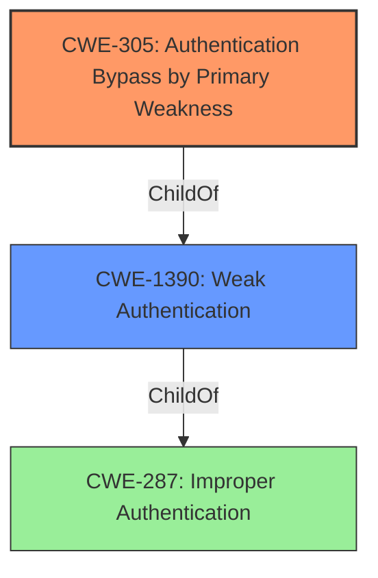

# Enhanced Analysis for CVE-2022-30034

# Summary
| CWE ID | CWE Name | Confidence | CWE Abstraction Level | CWE Vulnerability Mapping Label | CWE-Vulnerability Mapping Notes |
|---|---|---|---|---|---|
| CWE-305 | Authentication Bypass by Primary Weakness | 0.9 | Base | Allowed | Primary CWE |
| CWE-1390 | Weak Authentication | 0.7 | Class | Allowed-with-Review | Secondary Candidate |

## Evidence and Confidence

*   **Confidence Score:** 0.8
*   **Evidence Strength:** HIGH

## Relationship Analysis
The primary relationship influencing the CWE selection is the ChildOf relationship between CWE-305 and CWE-1390, with CWE-305 being a more specific case of CWE-1390. Additionally, the observed example in CWE-1390 includes CVE-2022-30034, the CVE being analyzed. The vulnerability involves an authentication bypass due to a flaw in the email validation regex, thus fitting the description of CWE-305.



## Vulnerability Chain
The vulnerability chain starts with the **insecure regex** used for email validation, leading to an **OAuth authentication bypass**. This allows an attacker to access the Flower API, potentially leading to arbitrary Celery RPC call execution or denial of service.

## Summary of Analysis
The initial analysis identified several candidate CWEs, including CWE-1390 (Weak Authentication) and CWE-305 (Authentication Bypass by Primary Weakness). The final decision favors CWE-305 due to the specific nature of the bypass, which stems from a flaw in the email validation regex (**insecure regex**). This aligns with CWE-305's description of "Authentication Bypass by Primary Weakness," where the authentication algorithm itself isn't fundamentally flawed, but a separate weakness allows for the bypass. CWE-1390 remains a valid secondary consideration as it represents the broader class of authentication weaknesses. The presence of CVE-2022-30034 as an observed example in CWE-1390 further supports this selection.

The evidence supporting this decision is primarily found in the "CVE Reference Links Content Summary," which states, "The regular expression used to validate user emails during OAuth login lacked regex anchors, allowing attackers to bypass the intended email domain restrictions." This explicitly describes a bypass due to a flawed regex, aligning perfectly with CWE-305.

The selected CWEs are at the optimal level of specificity. CWE-305 is a Base level CWE that directly addresses the root cause: an authentication bypass caused by a primary weakness (the flawed regex). While CWE-1390 is a Class level CWE and thus less specific, it is still relevant as a broader categorization of the **weakness** and is included as a secondary candidate.

Relevant CWE Information:

# Enhanced Context (25 CWEs)

## CWE-23: Relative Path Traversal
**Abstraction Level**: Base
**Similarity Score**: 0.80
The vulnerability doesn't involve path manipulation, so this is not a relevant CWE.

## CWE-41: Improper Resolution of Path Equivalence
**Abstraction Level**: Base
**Similarity Score**: 0.79
The vulnerability doesn't involve path manipulation, so this is not a relevant CWE.

## CWE-36: Absolute Path Traversal
**Abstraction Level**: Base
**Similarity Score**: 0.79
The vulnerability doesn't involve path manipulation, so this is not a relevant CWE.

## CWE-73: External Control of File Name or Path
**Abstraction Level**: Base
**Similarity Score**: 0.77
The vulnerability doesn't involve path manipulation, so this is not a relevant CWE.

## CWE-668: Exposure of Resource to Wrong Sphere
**Abstraction Level**: Class
**Similarity Score**: 0.77
This is too broad and not specific to the authentication bypass mechanism.

## CWE-59: Improper Link Resolution Before File Access ('Link Following')
**Abstraction Level**: Base
**Similarity Score**: 0.77
The vulnerability doesn't involve link resolution, so this is not a relevant CWE.

## CWE-611: Improper Restriction of XML External Entity Reference
**Abstraction Level**: Base
**Similarity Score**: 0.77
The vulnerability doesn't involve XML processing, so this is not a relevant CWE.

## CWE-552: Files or Directories Accessible to External Parties
**Abstraction Level**: Base
**Similarity Score**: 0.76
This is not the primary issue, which is the authentication bypass.

## CWE-923: Improper Restriction of Communication Channel to Intended Endpoints
**Abstraction Level**: Class
**Similarity Score**: 0.76
This is not relevant to the authentication bypass mechanism.

## CWE-74: Improper Neutralization of Special Elements in Output Used by a Downstream Component ('Injection')
**Abstraction Level**: Class
**Similarity Score**: 0.76
This vulnerability doesn't involve injection, so this is not a relevant CWE.

## CWE-1390: Weak Authentication
**Abstraction Level**: Class
**Similarity Score**: 5816.61
This CWE is considered a secondary candidate.

## CWE-611: Improper Restriction of XML External Entity Reference
**Abstraction Level**: Base
**Similarity Score**: 5598.96
The vulnerability doesn't involve XML processing, so this is not a relevant CWE.

## CWE-367: Time-of-check Time-of-use (TOCTOU) Race Condition
**Abstraction Level**: Base
**Similarity Score**: 5516.62
The vulnerability doesn't involve race conditions, so this is not a relevant CWE.

## CWE-287: Improper Authentication
**Abstraction Level**: Class
**Similarity Score**: 5437.68
This CWE is too general and thus not considered the best fit.

## CWE-798: Use of Hard-coded Credentials
**Abstraction Level**: Base
**Similarity Score**: 5412.69
The vulnerability doesn't involve hard-coded credentials, so this is not a relevant CWE.

## CWE-613: Insufficient Session Expiration
**Abstraction Level**: base
**Similarity Score**: 4.33
The vulnerability doesn't involve session expiration, so this is not a relevant CWE.

## CWE-22: Improper Limitation of a Pathname to a Restricted Directory ('Path Traversal')
**Abstraction Level**: base
**Similarity Score**: 4.33
The vulnerability doesn't involve path traversal, so this is not a relevant CWE.

## CWE-257: Storing Passwords in a Recoverable Format
**Abstraction Level**: base
**Similarity Score**: 3.64
The vulnerability doesn't involve password storage, so this is not a relevant CWE.

## CWE-798: Use of Hard-coded Credentials
**Abstraction Level**: base
**Similarity Score**: 3.64
The vulnerability doesn't involve hard-coded credentials, so this is not a relevant CWE.

## CWE-502: Deserialization of Untrusted Data
**Abstraction Level**: base
**Similarity Score**: 3.64
The vulnerability doesn't involve deserialization of untrusted data, so this is not a relevant CWE.

## CWE-915: Improperly Controlled Modification of Dynamically-Determined Object Attributes
**Abstraction Level**: base
**Similarity Score**: 3.64
This CWE is not relevant to the authentication bypass mechanism.

## CWE-183: Permissive List of Allowed Inputs
**Abstraction Level**: base
**Similarity Score**: 3.52
The vulnerability doesn't involve a permissive list of allowed inputs, so this is not a relevant CWE.

## CWE-441: Unintended Proxy or Intermediary ('Confused Deputy')
**Abstraction Level**: class
**Similarity Score**: 2.98
This CWE is not relevant to the authentication bypass mechanism.

## CWE-367: Time-of-check Time-of-use (TOCTOU) Race Condition
**Abstraction Level**: base
**Similarity Score**: 2.96
The vulnerability doesn't involve race conditions, so this is not a relevant CWE.

## CWE-41: Improper Resolution of Path Equivalence
**Abstraction Level**: Base
**Similarity Score**: 2.91
The vulnerability doesn't involve path equivalence, so this is not a relevant CWE.


## CWE Relationship Analysis

Current CWEs represent these abstraction levels: .


### Vulnerability Chain Analysis

**Chain starting from CWE-41:**
- 41 (Improper Resolution of Path Equivalence) - ROOT


**Chain starting from CWE-668:**
- 668 (Exposure of Resource to Wrong Sphere) - ROOT


### CWE Relationship Diagram

```mermaid
graph TD
    classDef primary fill:#f96,stroke:#333,stroke-width:2px
    classDef secondary fill:#69f,stroke:#333
    classDef tertiary fill:#9e9,stroke:#333
```