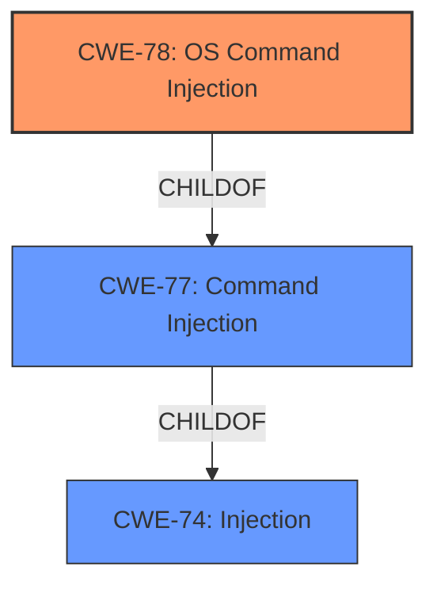

# Raw Analyzer Response for CVE-2022-30079

# Summary
| CWE ID | CWE Name | Confidence | CWE Abstraction Level | CWE Vulnerability Mapping Label | CWE-Vulnerability Mapping Notes |
|---|---|---|---|---|---|
| CWE-78 | Improper Neutralization of Special Elements used in an OS Command ('OS Command Injection') | 1.0 | Base | Allowed | Primary CWE |
| CWE-74 | Improper Neutralization of Special Elements in Output Used by a Downstream Component ('Injection') | 0.7 | Class | Discouraged | Secondary Candidate |

## Evidence and Confidence

*   **Confidence Score:** 1.0
*   **Evidence Strength:** HIGH

## Relationship Analysis
The primary relationship that impacted my decision was the parent-child relationship between CWE-77 (Improper Neutralization of Special Elements used in a Command ('Command Injection')) and CWE-78 (Improper Neutralization of Special Elements used in an OS Command ('OS Command Injection')). CWE-78 is a more specific Base CWE, making it a better fit than the Class CWE-77. The relationship between CWE-74 and CWE-78 also influenced my decision, as CWE-78 is a child of CWE-74, and the vulnerability clearly involves injection.

## Vulnerability Chain
The vulnerability chain starts with the **improper handling of the `ipv6_wan_gateway` parameter**, which is then passed unsanitized to a `system` call, resulting in **OS Command Injection**.

## Summary of Analysis
The initial analysis identified **Command injection** as the key weakness based on the vulnerability description. The CVE Reference Links Content Summary provided strong evidence that the `ipv6_wan_gateway` parameter is passed to a `sprintf` function using `%s` format string, then passed to a `system` function without proper sanitization. This confirms that the root cause is **improper neutralization of special elements** leading to **OS Command Injection**.

The Retriever Results further supported the selection of CWE-78, with a high score and a Base abstraction level. The relationship analysis highlighted the parent-child relationship between CWE-77 and CWE-78, confirming that CWE-78 is the more specific and appropriate choice.

The final decision is based on the evidence that the vulnerability involves injecting OS commands via an unsanitized parameter into a `system` call. CWE-78 accurately captures this weakness at the appropriate level of specificity.

Relevant CWE Information:

# Enhanced Context (25 CWEs)
The following CWEs were identified as potentially relevant to this vulnerability:

## CWE-74: Improper Neutralization of Special Elements in Output Used by a Downstream Component ('Injection')
**Abstraction Level**: Class
**Similarity Score**: 0.78
**Source**: dense

**Description**:
The product constructs all or part of a command, data structure, or record using externally-influenced input from an upstream component, but it does not neutralize or incorrectly neutralizes special elements that could modify how it is parsed or interpreted when it is sent to a downstream component.

**Mapping Guidance**:
- Usage: Discouraged
- Rationale: CWE-74 is high-level and often misused when lower-level weaknesses are more appropriate.

## CWE-78: Improper Neutralization of Special Elements used in an OS Command ('OS Command Injection')
**Abstraction Level**: Base
**Similarity Score**: 7356.53
**Source**: sparse

**Description**:
The product constructs all or part of an OS command using externally-influenced input from an upstream component, but it does not neutralize or incorrectly neutralizes special elements that could modify the intended OS command when it is sent to a downstream component.

**Mapping Guidance**:
- Usage: Allowed
- Rationale: This CWE entry is at the Base level of abstraction, which is a preferred level of abstraction for mapping to the root causes of vulnerabilities.

## CWE-78: Improper Neutralization of Special Elements used in an OS Command ('OS Command Injection')
**Abstraction Level**: base
**Similarity Score**: 5.03
**Source**: graph

**Description**:
CWE-78: Improper Neutralization of Special Elements used in an OS Command ('OS Command Injection')

**Mapping Guidance**:
- Usage: Allowed
- Rationale: This CWE entry is at the Base level of abstraction, which is a preferred level of abstraction for mapping to the root causes of vulnerabilities.

**Relationships**:
- CANFOLLOW -> CWE-184
- CANALSOBE -> CWE-88
- CHILDOF -> CWE-77
- CHILDOF -> CWE-77
- CHILDOF -> CWE-74

## CWE-78: Improper Neutralization of Special Elements used in an OS Command ('OS Command Injection')
**CWE-78: Improper Neutralization of Special Elements used in an OS Command ('OS Command Injection')**
The vulnerability lies in the `/sbin/acos_service` binary of the Netgear R6200_v2 router, where the `ipv6_wan_gateway` variable is passed to a `sprintf` function using `%s` format string, then this is passed to a `system` function, leading to command injection because the attacker controlled value is not sanitized. This matches the description of CWE-78, where the product constructs an OS command using externally influenced input without proper neutralization. The security implication is that an attacker can execute arbitrary commands on the router's operating system, potentially gaining full control of the device. The relationship to CWE-77 is that CWE-78 is a specific type of command injection, focusing on OS commands. This is the primary weakness in the vulnerability. The official MITRE mapping guidance ALLOWS this mapping because it is at the Base level of abstraction.

**CWE-74: Improper Neutralization of Special Elements in Output Used by a Downstream Component ('Injection')**
CWE-74 was considered as a broader class of injection vulnerabilities. While the vulnerability does involve injection, CWE-78 is more specific as it clearly indicates that the injection occurs in the context of OS commands. The mapping guidance for CWE-74 DISCOURAGES its use when lower-level weaknesses are more appropriate. Therefore, CWE-74 is a secondary candidate.