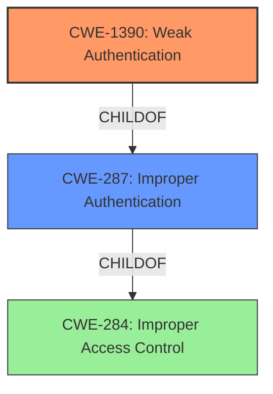

# Analysis for CVE-2022-30124

# Summary
| CWE ID  | CWE Name                                              | Confidence | CWE Abstraction Level | CWE Vulnerability Mapping Label | CWE-Vulnerability Mapping Notes |
| :-------- | :---------------------------------------------------- | :--------- | :---------------------- | :------------------------------ | :------------------------------ |
| CWE-1390  | Weak Authentication                                   | 0.9        | Class                   | Allowed-with-Review             | Primary CWE                     |
| CWE-287   | Improper Authentication                               | 0.6        | Class                   | Discouraged                     | Secondary Candidate             |

## Evidence and Confidence

*   **Confidence Score:** 0.9
*   **Evidence Strength:** HIGH

## Relationship Analysis
The primary relationship that influenced my decision was the ChildOf relationship between CWE-1390 **Weak Authentication** and CWE-287 **Improper Authentication**. CWE-1390 is a more specific type of **improper authentication**. Since the vulnerability description states an **improper authentication** vulnerability exists, and the retriever results list **Weak Authentication** as a strong candidate, I chose CWE-1390 as the primary CWE and CWE-287 as a secondary candidate.

## Vulnerability Chain
The vulnerability chain starts with the **improper authentication** (**ROOT CAUSE**) that allows an attacker with physical access to bypass local authentication (PIN code) (**IMPACT**).

## Summary of Analysis
The initial analysis identified **improper authentication** as the root cause of the vulnerability. The Retriever Results suggested several CWEs related to authentication and authorization. Based on the vulnerability description, CWE-1390 **Weak Authentication** and CWE-287 **Improper Authentication** are the best matches. The vulnerability description explicitly mentions **improper authentication**, which aligns with the description of CWE-287. However, CWE-1390, a child of CWE-287, is more specific and accurate since a PIN code, a form of authentication, is bypassed.

The final decision to prioritize CWE-1390 was influenced by:
1.  The explicit mention of **improper authentication** in the vulnerability description.
2.  The Retriever Results, which listed CWE-1390 **Weak Authentication** as the top candidate.
3.  The relationship analysis, showing that CWE-1390 is a child of CWE-287, making it a more specific representation of the vulnerability.

CWE-285 **Improper Authorization** was considered but not used because the vulnerability is specifically related to authentication (bypassing PIN code), not authorization. CWE-319 **Cleartext Transmission of Sensitive Information** was also considered but not used because the vulnerability description does not mention any sensitive information being transmitted in cleartext. The other CWEs listed in the Retriever Results were not as relevant to the vulnerability description as CWE-1390 and CWE-287.

Relevant CWE Information:

# Enhanced Context (25 CWEs)

## CWE-1390: Weak Authentication
**Abstraction:** Class
**Status:** Incomplete

### Description
The product uses an authentication mechanism to restrict access to specific users or identities, but the mechanism does not sufficiently prove that the claimed identity is correct.

### Extended Description
Attackers may be able to bypass weak authentication faster and/or with less effort than expected.

### Observed Examples
- **CVE-2022-35248:** Chat application skips validation when Central Authentication Service (CAS) is enabled, effectively removing the second factor from two-factor authentication

## CWE-287: Improper Authentication
**Abstraction:** Class
**Status:** Draft

### Description
When an actor claims to have a given identity, the product does not prove or insufficiently proves that the claim is correct.

### Observed Examples
- **CVE-2022-35248:** Chat application skips validation when Central Authentication Service (CAS) is enabled, effectively removing the second factor from two-factor authentication
- **CVE-2022-36436:** Python-based authentication proxy does not enforce password authentication during the initial handshake, allowing the client to bypass authentication by specifying a 'None' authentication type.