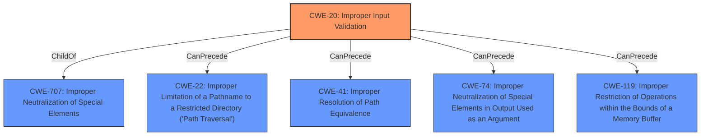

# Raw Analyzer Response for CVE-2022-30233

# Summary
| CWE ID | CWE Name | Confidence | CWE Abstraction Level | CWE Vulnerability Mapping Label | CWE-Vulnerability Mapping Notes |
|---|---|---|---|---|---|
| CWE-20 | Improper Input Validation | 0.7 | Class | Discouraged | Consider more specific children |

## Evidence and Confidence

*   **Confidence Score:** 0.7
*   **Evidence Strength:** MEDIUM

## Relationship Analysis
The primary CWE considered was CWE-20 **Improper Input Validation**. Although the description explicitly mentions "Improper Input Validation," the CWE mapping guidance discourages its use due to its high-level nature. It's a child of CWE-707 and has potential chain relationships with CWE-22, CWE-41, CWE-74, and CWE-119, suggesting a potential path traversal or buffer overflow scenario if the input is not validated correctly.

## Vulnerability Chain
The vulnerability chain starts with **Improper Input Validation** (CWE-20). A malicious actor could exploit this by providing crafted input. The lack of proper validation could lead to subsequent weaknesses, potentially causing path traversal or buffer overflow issues, depending on the specific context and how the input is processed.

## Summary of Analysis
The initial assessment identified CWE-20 **Improper Input Validation** as a potential match, based on the **rootcause** explicitly stated in the Vulnerability Description Key Phrases. However, the CWE mapping guidance strongly discourages using CWE-20 directly, recommending more specific child CWEs.

The vulnerability description mentions that the product can be "maliciously manipulated when the user is tricked into performing certain actions on a webpage." This suggests the **impact** of the vulnerability. The provided CVE Reference Links Content Summary is unrelated, so there is no supporting information from that section.

The final decision is to assign CWE-20 because it is explicitly stated in the vulnerability description, but to acknowledge that a more specific CWE could be more appropriate if more information was available. The confidence is rated at 0.7 due to the lack of specific details. CWE-20 is a Class-level CWE.