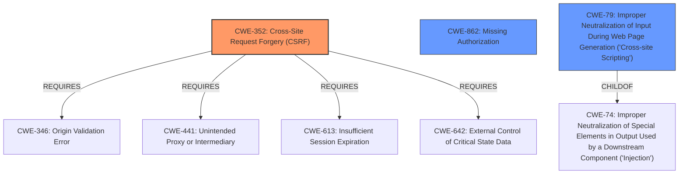

# Raw Analyzer Response for CVE-2022-3024

# Summary
| CWE ID | CWE Name | Confidence | CWE Abstraction Level | CWE Vulnerability Mapping Label | CWE-Vulnerability Mapping Notes |
|---|---|---|---|---|---|
| CWE-352 | Cross-Site Request Forgery (CSRF) | 1.0 | Compound | Allowed | Primary CWE |
| CWE-862 | Missing Authorization | 0.9 | Class | Allowed-with-Review | Secondary CWE |
| CWE-79 | Improper Neutralization of Input During Web Page Generation ('Cross-site Scripting') | 0.8 | Base | Allowed | Secondary CWE |

## Evidence and Confidence

*   **Confidence Score:** 0.9
*   **Evidence Strength:** HIGH

## Relationship Analysis
The primary weakness is CWE-352 [Cross-Site Request Forgery (CSRF)], a compound weakness, which occurs due to a **lack of authorization**. This lack of authorization, CWE-862 [Missing Authorization], allows an attacker to perform actions on behalf of another user. Additionally, the **lack of sanitization** leads to CWE-79 [Improper Neutralization of Input During Web Page Generation ('Cross-site Scripting')], allowing for stored XSS.

## Vulnerability Chain
The vulnerability chain starts with the **lack of authorization and CSRF protection**, leading to the ability to **add/delete/edit bonds**. The **lack of sanitization and escaping** further leads to **stored XSS**.

## Summary of Analysis
Based on the vulnerability description, the plugin **lacks authorization and CSRF protection** in an AJAX action, allowing authenticated users to perform unauthorized actions. Additionally, the **lack of sanitization and escaping** leads to stored XSS.

The primary CWE is CWE-352 [Cross-Site Request Forgery (CSRF)] because the vulnerability description explicitly mentions the **lack of CSRF** protection. The "CVE Reference Links Content Summary" section says that the "**Root cause of vulnerability:** The WordPress plugin "Simple Bitcoin Faucets" **lacks authorization and CSRF protection** in an AJAX action.". The retriever results also strongly support this.

The secondary CWE is CWE-862 [Missing Authorization] because the plugin **lacks authorization** checks, allowing unauthorized users to perform actions. The "CVE Reference Links Content Summary" section says that the "**Root cause of vulnerability:** The WordPress plugin "Simple Bitcoin Faucets" **lacks authorization** and CSRF protection in an AJAX action.".

Another secondary CWE is CWE-79 [Improper Neutralization of Input During Web Page Generation ('Cross-site Scripting')] because the plugin **lacks sanitization and escaping**, leading to stored XSS. The "Vulnerability Description" section says that "due to the **lack of sanitisation and escaping**, it could also lead to Stored Cross-Site Scripting issues". The "CVE Reference Links Content Summary" section says that "a **lack of sanitization and escaping** allows for stored cross-site scripting (XSS) vulnerabilities".

The selected CWEs are at the optimal level of specificity because they accurately represent the **lack of CSRF protection, lack of authorization, and lack of sanitization and escaping** in the plugin.

Relevant CWE Information:

# Enhanced Context (25 CWEs)
The following CWEs were identified as potentially relevant to this vulnerability:

## CWE-74: Improper Neutralization of Special Elements in Output Used by a Downstream Component ('Injection')
**Abstraction Level**: Class
**Similarity Score**: 0.78
**Source**: dense

**Description**:
The product constructs all or part of a command, data structure, or record using externally-influenced input from an upstream component, but it does not neutralize or incorrectly neutralizes special elements that could modify how it is parsed or interpreted when it is sent to a downstream component.

**Mapping Guidance**:
- Usage: Discouraged
- Rationale: CWE-74 is high-level and often misused when lower-level weaknesses are more appropriate.

## CWE-80: Improper Neutralization of Script-Related HTML Tags in a Web Page (Basic XSS)
**Abstraction Level**: Variant
**Similarity Score**: 0.77
**Source**: dense

**Description**:
The product receives input from an upstream component, but it does not neutralize or incorrectly neutralizes special characters such as "<", ">", and "&" that could be interpreted as web-scripting elements when they are sent to a downstream component that processes web pages.

**Mapping Guidance**:
- Usage: Allowed
- Rationale: This CWE entry is at the Variant level of abstraction, which is a preferred level of abstraction for mapping to the root causes of vulnerabilities.

## CWE-184: Incomplete List of Disallowed Inputs
**Abstraction Level**: Base
**Similarity Score**: 0.77
**Source**: dense

**Description**:
The product implements a protection mechanism that relies on a list of inputs (or properties of inputs) that are not allowed by policy or otherwise require other action to neutralize before additional processing takes place, but the list is incomplete.

**Mapping Guidance**:
- Usage: Allowed
- Rationale: This CWE entry is at the Base level of abstraction, which is a preferred level of abstraction for mapping to the root causes of vulnerabilities.

## CWE-1289: Improper Validation of Unsafe Equivalence in Input
**Abstraction Level**: Base
**Similarity Score**: 0.77
**Source**: dense

**Description**:
The product receives an input value that is used as a resource identifier or other type of reference, but it does not validate or incorrectly validates that the input is equivalent to a potentially-unsafe value.

**Mapping Guidance**:
- Usage: Allowed
- Rationale: This CWE entry is at the Base level of abstraction, which is a preferred level of abstraction for mapping to the root causes of vulnerabilities.

## CWE-138: Improper Neutralization of Special Elements
**Abstraction Level**: Class
**Similarity Score**: 0.77
**Source**: dense

**Description**:
The product receives input from an upstream component, but it does not neutralize or incorrectly neutralizes special elements that could be interpreted as control elements or syntactic markers when they are sent to a downstream component.

**Mapping Guidance**:
- Usage: Discouraged
- Rationale: This CWE entry is a level-1 Class (i.e., a child of a Pillar). It might have lower-level children that would be more appropriate

## CWE-472: External Control of Assumed-Immutable Web Parameter
**Abstraction Level**: Base
**Similarity Score**: 0.76
**Source**: dense

**Description**:
The web application does not sufficiently verify inputs that are assumed to be immutable but are actually externally controllable, such as hidden form fields.

**Mapping Guidance**:
- Usage: Allowed
- Rationale: This CWE entry is at the Base level of abstraction, which is a preferred level of abstraction for mapping to the root causes of vulnerabilities.

## CWE-116: Improper Encoding or Escaping of Output
**Abstraction Level**: Class
**Similarity Score**: 0.76
**Source**: dense

**Description**:
The product prepares a structured message for communication with another component, but encoding or escaping of the data is either missing or done incorrectly. As a result, the intended structure of the message is not preserved.

**Mapping Guidance**:
- Usage: Allowed-with-Review
- Rationale: This CWE entry is a Class and might have Base-level children that would be more appropriate

## CWE-639: Authorization Bypass Through User-Controlled Key
**Abstraction Level**: Base
**Similarity Score**: 0.76
**Source**: dense

**Description**:
The system's authorization functionality does not prevent one user from gaining access to another user's data or record by modifying the key value identifying the data.

**Mapping Guidance**:
- Usage: Allowed
- Rationale: This CWE entry is at the Base level of abstraction, which is a preferred level of abstraction for mapping to the root causes of vulnerabilities.