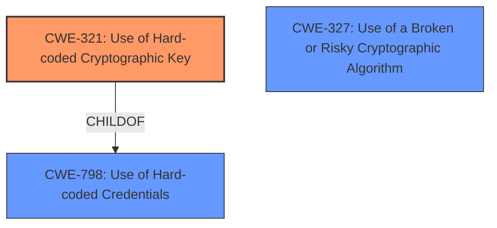

# Analysis for CVE-2022-30274

# Summary
| CWE ID | CWE Name | Confidence | CWE Abstraction Level | CWE Vulnerability Mapping Label | CWE-Vulnerability Mapping Notes |
|---|---|---|---|---|---|
| CWE-321 | Use of Hard-coded Cryptographic Key | 1 | Variant | Allowed | Primary CWE. This is the most specific CWE that accurately describes the vulnerability. |
| CWE-327 | Use of a Broken or Risky Cryptographic Algorithm | 0.8 | Class | Allowed-with-Review | Secondary CWE. The use of ECB mode with TEA is considered a risky cryptographic algorithm. |
| CWE-798 | Use of Hard-coded Credentials | 0.7 | Base | Allowed | Secondary CWE. The hard-coded key is a type of hard-coded credential. |

## Evidence and Confidence

*   **Confidence Score:** 0.9
*   **Evidence Strength:** HIGH

## Relationship Analysis
The primary weakness is CWE-321, which is a variant of CWE-798 (Use of Hard-coded Credentials). CWE-327 (Use of a Broken or Risky Cryptographic Algorithm) is related because the use of ECB mode is a known risky practice.

## Vulnerability Chain
The chain starts with the **use of a hard-coded cryptographic key** (CWE-321), which is then used with ECB encryption, a **risky cryptographic algorithm** (CWE-327). This allows an attacker to decrypt the credentials and gain unauthorized access.

## Summary of Analysis
The primary CWE is CWE-321 (Use of Hard-coded Cryptographic Key) because the vulnerability description explicitly mentions the use of a hard-coded key. The vulnerability description mentions: "Credentials for accessing this gateway are stored after being encrypted with the Tiny Encryption Algorithm (TEA) in ECB mode using a **hardcoded key**."
This is reinforced by the CVE Reference Links Content Summary: "The Motorola Solutions ACE1000 device communicates with an XRT Lan-to-radio gateway using an embedded client. The credentials for this gateway are stored after being encrypted with the Tiny Encryption Algorithm (TEA) in ECB mode using a **hardcoded key**."

CWE-327 (Use of a Broken or Risky Cryptographic Algorithm) is also applicable because the description mentions the use of ECB encryption, which is known to be insecure. The use of ECB mode is explicitly called out in the "Root Cause of Vulnerability" and "Weaknesses/Vulnerabilities Present" sections of the CVE reference.

CWE-798 (Use of Hard-coded Credentials) is also relevant because a cryptographic key is a type of credential. The CWE specification for CWE-798 mentions: "The product contains hard-coded credentials, such as a password or cryptographic key."

The selection of CWE-321 as the primary CWE is based on the principle of selecting the most specific CWE that accurately represents the weakness. CWE-321 is a variant of CWE-798, making it more specific.

Relevant CWE Information:

# Enhanced Context (25 CWEs)
The following CWEs were identified as potentially relevant to this vulnerability:

## CWE-312: Cleartext Storage of Sensitive Information
**Abstraction Level**: Base
**Similarity Score**: 0.81
**Source**: dense

**Description**:
The product stores sensitive information in cleartext within a resource that might be accessible to another control sphere.

**Mapping Guidance**:
- Usage: Allowed
- Rationale: This CWE entry is at the Base level of abstraction, which is a preferred level of abstraction for mapping to the root causes of vulnerabilities.

**Why Not Selected:** The sensitive information is not stored in cleartext; it is stored encrypted, albeit with a weak method.

## CWE-1391: Use of Weak Credentials
**Abstraction Level**: Class
**Similarity Score**: 0.80
**Source**: dense

**Description**:
The product uses weak credentials (such as a default key or hard-coded password) that can be calculated, derived, reused, or guessed by an attacker.

**Mapping Guidance**:
- Usage: Allowed-with-Review
- Rationale: This CWE entry is a Class and might have Base-level children that would be more appropriate

**Why Not Selected:** Although the hardcoded key leads to weak credentials, it is better to focus on the root cause.

## CWE-311: Missing Encryption of Sensitive Data
**Abstraction Level**: Class
**Similarity Score**: 0.80
**Source**: dense

**Description**:
The product does not encrypt sensitive or critical information before storage or transmission.

**Mapping Guidance**:
- Usage: Discouraged
- Rationale: CWE-311 is high-level with more precise children available. It is a level-1 Class (i.e., a child of a Pillar).

**Why Not Selected:** The sensitive data *is* encrypted, so this CWE is not applicable.

## CWE-1240: Use of a Cryptographic Primitive with a Risky Implementation
**Abstraction Level**: Base
**Similarity Score**: 0.79
**Source**: dense

**Description**:
To fulfill the need for a cryptographic primitive, the product implements a cryptographic algorithm using a non-standard, unproven, or disallowed/non-compliant cryptographic implementation.

**Mapping Guidance**:
- Usage: Allowed
- Rationale: This CWE entry is at the Base level of abstraction, which is a preferred level of abstraction for mapping to the root causes of vulnerabilities.

**Why Not Selected:** CWE-327, Use of a Broken or Risky Cryptographic Algorithm, is a better fit because ECB is a "broken or risky" algorithm.

## CWE-319: Cleartext Transmission of Sensitive Information
**Abstraction Level**: Base
**Similarity Score**: 0.79
**Source**: dense

**Description**:
The product transmits sensitive or security-critical data in cleartext in a communication channel that can be sniffed by unauthorized actors.

**Mapping Guidance**:
- Usage: Allowed
- Rationale: This CWE entry is at the Base level of abstraction, which is a preferred level of abstraction for mapping to the root causes of vulnerabilities.

**Why Not Selected:** The data is not transmitted in cleartext.

## CWE-798: Use of Hard-coded Credentials
**Abstraction Level**: Base
**Similarity Score**: 0.78
**Source**: dense

**Description**:
The product contains hard-coded credentials, such as a password or cryptographic key.

**Mapping Guidance**:
- Usage: Allowed
- Rationale: This CWE entry is at the Base level of abstraction, which is a preferred level of abstraction for mapping to the root causes of vulnerabilities.

**Why Not Selected:** CWE-321 is a more specific variant of this CWE.

## CWE-326: Inadequate Encryption Strength
**Abstraction Level**: Class
**Similarity Score**: 0.77
**Source**: dense

**Description**:
The product stores or transmits sensitive data using an encryption scheme that is theoretically sound, but is not strong enough for the level of protection required.

**Mapping Guidance**:
- Usage: Allowed-with-Review
- Rationale: This CWE entry is a Class and might have Base-level children that would be more appropriate

**Why Not Selected:** CWE-327 is a better fit because it specifically calls out "broken or risky" algorithms.

## CWE-321: Use of Hard-coded Cryptographic Key
**Abstraction Level**: Variant
**Similarity Score**: 0.77
**Source**: dense

**Description**:
The use of a hard-coded cryptographic key significantly increases the possibility that encrypted data may be recovered.

**Mapping Guidance**:
- Usage: Allowed
- Rationale: This CWE entry is at the Variant level of abstraction, which is a preferred level of abstraction for mapping to the root causes of vulnerabilities.

**Why Not Selected:** This CWE is selected as the Primary.

## CWE-345: Insufficient Verification of Data Authenticity
**Abstraction Level**: Class
**Similarity Score**: 0.77
**Source**: dense

**Description**:
The product does not sufficiently verify the origin or authenticity of data, in a way that causes it to accept invalid data.

**Mapping Guidance**:
- Usage: Discouraged
- Rationale: This CWE entry is a level-1 Class (i.e., a child of a Pillar). It might have lower-level children that would be more appropriate

**Why Not Selected:** This CWE does not fit the vulnerability description.

## CWE-1392: Use of Default Credentials
**Abstraction Level**: Base
**Similarity Score**: 0.77
**