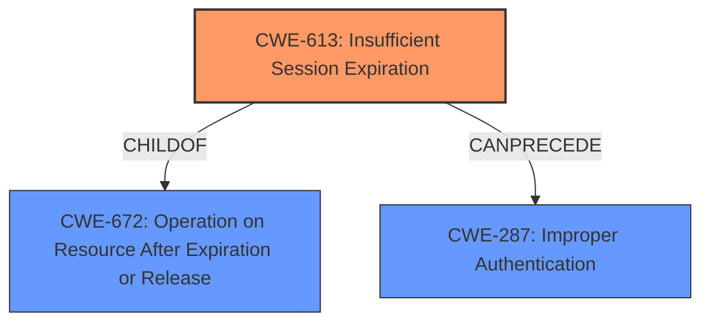

# Analysis Report for CVE-2022-30277

# Vulnerability Analysis Report: CVE-2022-30277

## Description


## Analysis (with Relationship Data)

# Summary
| CWE ID | CWE Name | Confidence | CWE Abstraction Level | CWE Vulnerability Mapping Label | CWE-Vulnerability Mapping Notes |
|---|---|---|---|---|---|
| CWE-613 | Insufficient Session Expiration | 1.0 | Base | Allowed | Primary CWE |
| CWE-798 | Use of Hard-coded Credentials | 0.3 | Base | Allowed | Secondary Candidate |
| CWE-259 | Use of Hard-coded Password | 0.2 | Variant | Allowed | Secondary Candidate |

## Evidence and Confidence

*   **Confidence Score:** 1.0
*   **Evidence Strength:** HIGH

## Relationship Analysis
The primary CWE, CWE-613 (Insufficient Session Expiration), is a Base level CWE, which aligns with the goal of identifying the root cause of the vulnerability. It is a child of CWE-672 (Operation on Resource After Expiration or Release). While other CWEs like CWE-287 (Improper Authentication) are related through chain relationships (CWE-613 CanPrecede CWE-287), CWE-613 directly addresses the **insufficient session expiration**, making it the most specific and appropriate choice.



## Vulnerability Chain
The vulnerability chain starts with the **insufficient session expiration** (CWE-613), which allows threat actors to maintain access to sensitive information for an extended period. This can lead to unauthorized access, modification, or deletion of data, ultimately impacting data confidentiality and integrity.

CWE-613 (Root Cause) -> Unauthorized Access/Modification/Deletion (Impact)

## Summary of Analysis
The analysis is based on the vulnerability description, focusing on the root cause: **insufficient session expiration**. The provided text explicitly states this weakness and its potential impact. The retriever results also list CWE-613 as the top candidate, further supporting this classification.

The selection of CWE-613 is based on the explicit description of the vulnerability as an **insufficient session expiration** issue. This aligns directly with the CWE's definition and characteristics. The vulnerability allows attackers to access, modify, or delete sensitive information due to sessions not being properly terminated. The graph relationships reinforce the connection between session expiration and potential authentication issues. The choice of CWE-613 is at the optimal level of specificity because it directly reflects the described weakness.

Other CWEs Considered:

*   CWE-798 (Use of Hard-coded Credentials): While this CWE was considered due to its appearance in the retriever results, there is no mention of hard-coded credentials in the vulnerability description. Therefore, it is not a suitable match.
*   CWE-259 (Use of Hard-coded Password): Similar to CWE-798, this CWE is not supported by the provided evidence.
*   CWE-319 (Cleartext Transmission of Sensitive Information): There is no mention of cleartext transmission.
*   CWE-863 (Incorrect Authorization): This is a broader class of errors, and the evidence points more directly to session management.
*   CWE-384 (Session Fixation): This CWE is a compound weakness and requires multiple conditions to be met. The vulnerability description focuses solely on **insufficient session expiration**, not the broader session fixation attack.
*   CWE-306 (Missing Authentication for Critical Function): This CWE doesn't fit because the application requires authentication, but sessions don't properly expire.

Relevant CWE Information:

# Enhanced Context (25 CWEs)

## CWE-613: Insufficient Session Expiration
**Abstraction Level**: Base
**Similarity Score**: 0.530
**Source**: sparse

**Description**:
According to WASC, "Insufficient Session Expiration is when a web site permits an attacker to reuse old session credentials or session IDs for authorization."

**Mapping Guidance**:
- Usage: Allowed
- Rationale: This CWE entry is at the Base level of abstraction, which is a preferred level of abstraction for mapping to the root causes of vulnerabilities.

**Relationships**:
- REQUIREDBY -> CWE-352
- CANPRECEDE -> CWE-287
- CHILDOF -> CWE-672
- CHILDOF -> CWE-672
- PARENTOF -> CWE-613

## CWE-798: Use of Hard-coded Credentials
**Abstraction Level**: Base
**Similarity Score**: 0.372
**Source**: sparse

**Description**:
The product contains hard-coded credentials, such as a password or cryptographic key.

**Mapping Guidance**:
- Usage: Allowed
- Rationale: This CWE entry is at the Base level of abstraction, which is a preferred level of abstraction for mapping to the root causes of vulnerabilities.

## CWE-259: Use of Hard-coded Password
**Abstraction Level**: Variant
**Similarity Score**: 0.002
**Source**: graph

**Description**:
The product contains a hard-coded password, which it uses for its own inbound authentication or for outbound communication to external components.

**Mapping Guidance**:
- Usage: Allowed
- Rationale: This CWE entry is at the Variant level of abstraction, which is a preferred level of abstraction for mapping to the root causes of vulnerabilities.


## CWE Relationship Analysis

Current CWEs represent these abstraction levels: .


### Vulnerability Chain Analysis

**Chain starting from CWE-319:**
- 319 (Cleartext Transmission of Sensitive Information) - ROOT


**Chain starting from CWE-259:**
- 259 (Use of Hard-coded Password) - ROOT


### CWE Relationship Diagram

```mermaid
graph TD
    classDef primary fill:#f96,stroke:#333,stroke-width:2px
    classDef secondary fill:#69f,stroke:#333
    classDef tertiary fill:#9e9,stroke:#333
```


*Report generated on 2025-03-31 05:50:30*
