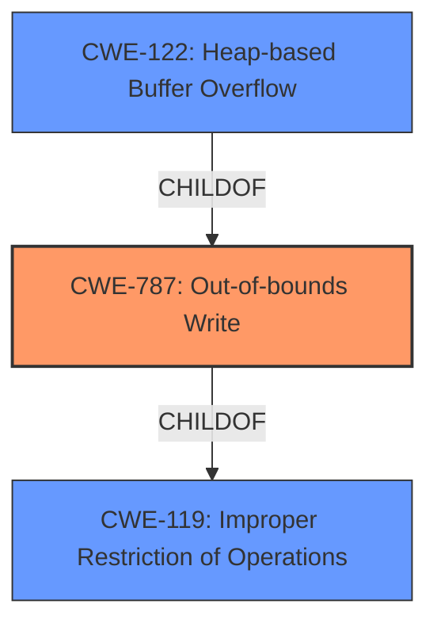

# Analysis for CVE-2022-30293

# Summary
| CWE ID  | CWE Name                                                                    | Confidence | CWE Abstraction Level | CWE Vulnerability Mapping Label | CWE-Vulnerability Mapping Notes |
| :-------- | :-------------------------------------------------------------------------- | :--------- | :---------------------- | :------------------------------ | :-------------------------------- |
| CWE-787 | Out-of-bounds Write                                                            | 0.9        | Base                   | Primary                         | Allowed                            |
| CWE-122 | Heap-based Buffer Overflow                                                     | 0.8        | Variant                | Secondary                       | Allowed                            |
| CWE-119 | Improper Restriction of Operations within the Bounds of a Memory Buffer      | 0.6        | Class                  | Secondary                       | Discouraged                        |

## Evidence and Confidence

*   **Confidence Score:** 0.8
*   **Evidence Strength:** HIGH

## Relationship Analysis
The primary weakness is CWE-787 Out-of-bounds Write, which is a base-level CWE. CWE-122 Heap-based Buffer Overflow is a variant of CWE-787, specifying the location of the overflow on the heap. CWE-119 Improper Restriction of Operations within the Bounds of a Memory Buffer is a class-level CWE that is a parent of both CWE-787 and CWE-122. Choosing CWE-787 provides the most specific root cause of the vulnerability.

## Vulnerability Chain
The vulnerability chain starts with a race condition that leads to a dangling pointer. When the dangling pointer is accessed, a heap-based buffer overflow occurs, leading to an out-of-bounds write condition.

## Summary of Analysis
The initial analysis considered CWE-119, CWE-122, and CWE-787. The vulnerability description and CVE Reference Links Content Summary provide sufficient evidence to identify the **heap-based buffer overflow** (**out-of-bounds write**) as the root cause. The vulnerability occurs in `WebCoreTextureMapperLayersetContentsLayer` due to a race condition, where a dangling pointer to a released layer leads to a use-after-free when the proxy is later accessed, leading to a **heap-buffer-overflow** within `setContentsLayer`.

The evidence for the selection of CWE-787 is strong:
*   "**heap-based buffer overflow** in WebCoreTextureMapperLayersetContentsLayer in WebCore/platform/graphics/texmap/TextureMapperLayer.cpp"
*   "A memory corruption issue, specifically a **heap-buffer-overflow**, in the `WebCore::TextureMapperLayer::setContentsLayer` function."
*   "A **heap-buffer-overflow** occurs within `setContentsLayer`"

CWE-787 is the most specific and accurate representation of the vulnerability. While CWE-122 is also relevant, CWE-787 is preferred since it directly describes the out-of-bounds write condition. CWE-119 is a more general class of weakness and is discouraged when more specific CWEs are available.

Relevant CWE Information:

# Enhanced Context (25 CWEs)

## CWE-787: Out-of-bounds Write
**Abstraction Level**: base

**CWE-787** is the primary CWE because the root cause of the vulnerability is an out-of-bounds write. The vulnerability description mentions a "heap-based buffer overflow" and the "CVE Reference Links Content Summary" confirms that a **heap-buffer-overflow** occurs in the `setContentsLayer` function due to a race condition and use-after-free, leading to memory corruption. This aligns perfectly with the description of CWE-787: Out-of-bounds Write.

## CWE-122: Heap-based Buffer Overflow
**Abstraction Level**: Variant

**CWE-122** is a secondary CWE because the vulnerability involves a heap-based buffer overflow. While CWE-787 more accurately describes the root cause (out-of-bounds write), CWE-122 provides additional context by specifying that the buffer overflow occurs on the heap.

## CWE-119: Improper Restriction of Operations within the Bounds of a Memory Buffer
**Abstraction Level**: Class

**CWE-119** is a secondary CWE as it is a more general class encompassing buffer overflows and out-of-bounds writes. While relevant, it is less specific than CWE-787 and CWE-122. The mapping guidance for CWE-119 discourages its use when more specific CWEs are available.

CWE-120, CWE-124, CWE-125, CWE-126, CWE-128, CWE-131, CWE-170, CWE-190, CWE-193, CWE-195, CWE-1284, CWE-1339, CWE-463, CWE-617, CWE-681, CWE-805 were considered but not selected because they did not accurately describe the root cause of the vulnerability or were less specific than the chosen CWEs. For example, CWE-190 (Integer Overflow or Wraparound) and CWE-681 (Incorrect Conversion between Numeric Types) were considered due to the potential for integer manipulation in buffer overflow scenarios, but the primary issue is the out-of-bounds write itself.