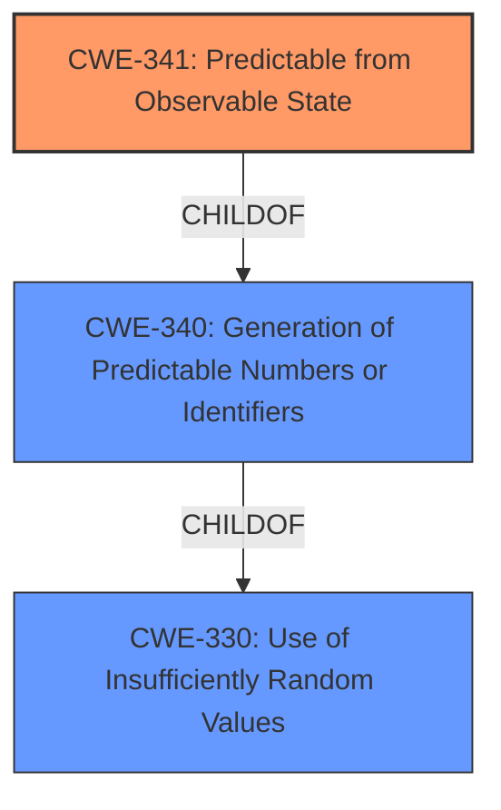

# Analysis for CVE-2022-30295

# Summary
| CWE ID | CWE Name | Confidence | CWE Abstraction Level | CWE Vulnerability Mapping Label | CWE-Vulnerability Mapping Notes |
|---|---|---|---|---|---|
| **CWE-341** | **Predictable from Observable State** | 0.9 | Base | Primary CWE | Allowed |
| CWE-340 | Generation of Predictable Numbers or Identifiers | 0.7 | Class | Secondary Candidate | Allowed-with-Review |
| CWE-330 | Use of Insufficiently Random Values | 0.6 | Class | Secondary Candidate | Discouraged |

## Evidence and Confidence

*   **Confidence Score:** 0.9
*   **Evidence Strength:** HIGH

## Relationship Analysis
The primary CWE is CWE-341, which is a Base level weakness, directly related to the predictability of the DNS transaction IDs due to an observable state (the sequentially incremented `last_id`). CWE-341 is a child of CWE-340, which is a more general class describing the generation of predictable identifiers. CWE-340 is a child of CWE-330, which is a broader class related to insufficient randomness. Choosing CWE-341 provides the most specific and accurate representation of the vulnerability.

## Vulnerability Chain
The vulnerability chain begins with the **reset of a value to 0x2** which causes **predictable DNS transaction IDs**, which can lead to DNS cache poisoning.

## Summary of Analysis
The initial assessment, based on the provided evidence, points strongly to a weakness related to predictable number generation. The **Vulnerability Description Key Phrases** identify "**predictable DNS transaction IDs**" as the weakness and "**reset of a value to 0x2**" as the root cause. The **CVE Reference Links Content Summary** confirms this, stating: "The vulnerability lies in the predictable generation of DNS transaction IDs (TXID) within the `__dns_lookup` function... Instead of generating random IDs, the libraries initialize a static variable `last_id` to 1 and increment it by 1 for each subsequent DNS request."

The Retriever results suggest CWE-330 (Use of Insufficiently Random Values), CWE-340 (Generation of Predictable Numbers or Identifiers), and CWE-337 (Predictable Seed in Pseudo-Random Number Generator (PRNG)). However, examining the complete CWE specifications and relationships reveals that CWE-341 (Predictable from Observable State) is the most specific and accurate fit. The vulnerability stems from the predictable nature of the transaction IDs due to a simple, observable incrementing counter.

CWE-341 is preferred because the predictability is derived from an observable state (the incrementing counter), aligning perfectly with its description. While CWE-340 is a parent class, CWE-341 offers greater specificity. CWE-330 is even more general and less appropriate.

Therefore, the final selection is CWE-341 (Predictable from Observable State) as the primary CWE.

Relevant CWE Information:

# Enhanced Context (25 CWEs)
The following CWEs were identified as potentially relevant to this vulnerability:

## CWE-330: Use of Insufficiently Random Values
**Abstraction Level**: Class
**Similarity Score**: 0.82
**Source**: dense

**Description**:
The product uses insufficiently random numbers or values in a security context that depends on unpredictable numbers.

**Mapping Guidance**:
- Usage: Discouraged
- Rationale: This CWE entry is a level-1 Class (i.e., a child of a Pillar). It might have lower-level children that would be more appropriate

## CWE-341: Predictable from Observable State
**Abstraction Level**: Base
**Similarity Score**: 0.77
**Source**: dense

**Description**:
A number or object is predictable based on observations that the attacker can make about the state of the system or network, such as time, process ID, etc.

**Mapping Guidance**:
- Usage: Allowed
- Rationale: This CWE entry is at the Base level of abstraction, which is a preferred level of abstraction for mapping to the root causes of vulnerabilities.