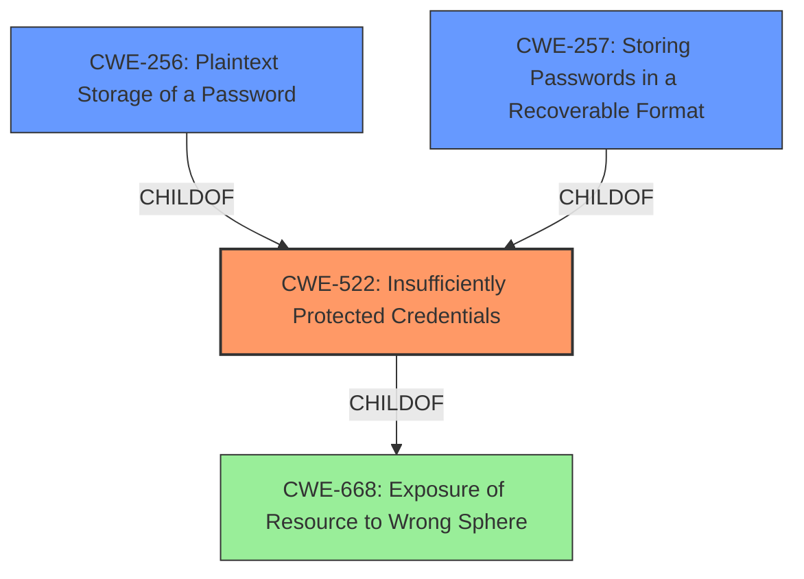

# Enhanced Analysis for CVE-2022-30296

# Summary
| CWE ID | CWE Name | Confidence | CWE Abstraction Level | CWE Vulnerability Mapping Label | CWE-Vulnerability Mapping Notes |
|---|---|---|---|---|---|
| CWE-522 | Insufficiently Protected Credentials | 0.9 | Class | Allowed-with-Review | Examine children of this entry to see if there is a better fit |
| CWE-256 | Plaintext Storage of a Password | 0.7 | Base | Allowed | The application may be storing the credentials in plaintext. |
| CWE-257 | Storing Passwords in a Recoverable Format | 0.6 | Base | Allowed | The application may be storing the credentials in a recoverable format. |
| CWE-668 | Exposure of Resource to Wrong Sphere | 0.5 | Class | Discouraged | High-level, consider more specific CWEs. |

## Evidence and Confidence

*   **Confidence Score:** 0.8
*   **Evidence Strength:** HIGH

## Relationship Analysis
The primary CWE is CWE-522 (Insufficiently Protected Credentials), a class-level CWE. While it's a good starting point, the mapping guidance advises examining its children for a better fit. Two potential child CWEs, CWE-256 (Plaintext Storage of a Password) and CWE-257 (Storing Passwords in a Recoverable Format), are considered as possible base-level refinements. CWE-668 (Exposure of Resource to Wrong Sphere) is also a parent of CWE-522 but discouraged, as it's too high-level.



## Vulnerability Chain
The vulnerability chain starts with **insufficiently protected credentials** (CWE-522), potentially leading to the **plaintext storage of a password** (CWE-256) or storing passwords in a recoverable format (CWE-257). The impact is **information disclosure**, which can be exploited via **network access** by an **unauthenticated user**.

## Summary of Analysis
The initial assessment pointed to CWE-522 (Insufficiently Protected Credentials) due to the **rootcause** of the vulnerability being **"Insufficiently protected credentials."** The CWE description aligns with the vulnerability description, as it involves the transmission or storage of authentication credentials using an insecure method. The impact is information disclosure, aligning with the potential consequences of CWE-522.

However, since CWE-522 is a Class-level CWE, the analysis also considered its children, CWE-256 (Plaintext Storage of a Password) and CWE-257 (Storing Passwords in a Recoverable Format), to provide a more specific classification. The evidence does not explicitly state that the credentials are stored in plaintext or a recoverable format, but these are strong possibilities given the "insufficiently protected" nature of the credentials. Therefore, both CWE-256 and CWE-257 were added as secondary CWEs with slightly lower confidence scores.

CWE-668 (Exposure of Resource to Wrong Sphere) was considered but ultimately deemed too high-level. The mapping guidance for CWE-668 discourages its use as a catch-all and suggests focusing on the specific mistake allowing the resource to be exposed. While technically applicable, CWE-522 and its potential children offer a more precise characterization of the vulnerability.

The selection of CWE-522, along with the possible refinements of CWE-256 and CWE-257, provides the optimal level of specificity based on the available evidence. The final assessment is primarily based on the provided evidence, specifically the **rootcause** phrase "**Insufficiently protected credentials**," and the retriever results, which highlighted the relevance of CWE-522 and related CWEs.


## CWE Relationship Analysis

Current CWEs represent these abstraction levels: .


### Vulnerability Chain Analysis

**Chain starting from CWE-522:**
- 522 (Insufficiently Protected Credentials) - ROOT


**Chain starting from CWE-257:**
- 257 (Storing Passwords in a Recoverable Format) - ROOT


### CWE Relationship Diagram

```mermaid
graph TD
    classDef primary fill:#f96,stroke:#333,stroke-width:2px
    classDef secondary fill:#69f,stroke:#333
    classDef tertiary fill:#9e9,stroke:#333
```