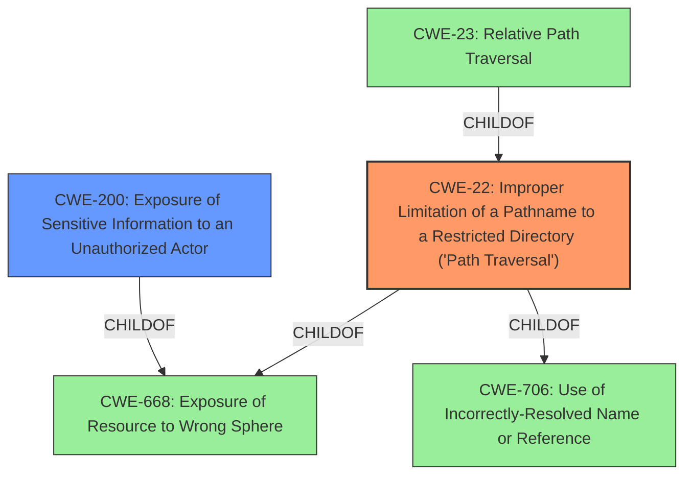

# Enhanced Analysis for CVE-2022-30299

# Summary
| CWE ID | CWE Name | Confidence | CWE Abstraction Level | CWE Vulnerability Mapping Label | CWE-Vulnerability Mapping Notes |
|---|---|---|---|---|---|
| CWE-22 | Improper Limitation of a Pathname to a Restricted Directory ('Path Traversal') | 1.0 | Base | Primary | Allowed |
| CWE-200 | Exposure of Sensitive Information to an Unauthorized Actor | 0.7 | Class | Secondary | Discouraged |

## Evidence and Confidence

*   **Confidence Score:** 0.9
*   **Evidence Strength:** HIGH

## Relationship Analysis
The primary CWE selected is CWE-22 [Improper Limitation of a Pathname to a Restricted Directory ('Path Traversal')], which is a Base level CWE. It has parent relationships with CWE-706 and CWE-668, reflecting how it fits into broader categories of resource handling and control sphere issues. CWE-23 [Relative Path Traversal] is a child of CWE-22, representing a more specific case, but CWE-22 is a better fit because the description does not specify that relative path traversal is the only method of exploiting the vulnerability. CWE-200 [Exposure of Sensitive Information to an Unauthorized Actor] is a Class level CWE representing the impact of the Path Traversal, but is less specific to the root cause.



## Vulnerability Chain
The vulnerability chain starts with the **Path Traversal** [CWE-22] vulnerability, which allows an attacker to **retrieve specific parts of files** from the underlying file system, leading to **Exposure of Sensitive Information** [CWE-200].
  - The root cause is the **improper limitation of a pathname**, which enables the exploit
  - The weakness is the ability to **retrieve files** due to the path traversal
  - The impact is the **exposure of sensitive information**.

## Summary of Analysis
The initial assessment strongly points to CWE-22 [Improper Limitation of a Pathname to a Restricted Directory ('Path Traversal')] as the primary weakness. The vulnerability description and CVE Reference Links Content Summary both explicitly state a **path traversal** issue.

The vulnerability description states: "A **path traversal** vulnerability [CWE-23] in the API of FortiWeb...may allow an authenticated attacker to **retrieve specific parts of files** from the underlying file system via specially crafted web requests."

The CVE Reference Links Content Summary states: "The vulnerability is due to a **path traversal** issue in the web API of FortiWeb." and "**Path Traversal (CWE-23):** The web API is susceptible to path traversal, which allows an attacker to navigate the file system outside of the intended directory."

The Retriever Results also strongly support CWE-22, with a score of 1.0. While CWE-23 [Relative Path Traversal] is also listed, CWE-22 is more appropriate as the description does not limit the traversal to only relative paths.

CWE-200 [Exposure of Sensitive Information to an Unauthorized Actor] is considered as a secondary weakness, as it represents the impact of the path traversal. However, CWE-200 is a Class-level CWE and is often misused. It's included here to represent the information disclosure aspect, but the focus remains on the root cause, which is the path traversal.

The selected CWEs are at the optimal level of specificity, with CWE-22 being a Base-level CWE directly addressing the **path traversal** root cause, and CWE-200 representing the resulting information exposure.

CWEs considered but not used:

*   CWE-23 [Relative Path Traversal]: While related, the vulnerability description doesn't explicitly limit the traversal to relative paths, making CWE-22 a broader and more accurate fit.
*   CWE-639 [Authorization Bypass Through User-Controlled Key]: This CWE is related to authorization bypass, but the primary issue is path traversal, not a flaw in authorization mechanisms.
*   CWE-113 [Improper Neutralization of CRLF Sequences in HTTP Headers ('HTTP Request/Response Splitting')]: This is not relevant as the vulnerability is about path traversal, not HTTP header manipulation.
* CWE-78 [Improper Neutralization of Special Elements used in an OS Command ('OS Command Injection')]: This is not relevant as the vulnerability is about path traversal, not OS Command injection.


## CWE Relationship Analysis

Current CWEs represent these abstraction levels: .


### Vulnerability Chain Analysis

**Chain starting from CWE-200:**
- 200 (Exposure of Sensitive Information to an Unauthorized Actor) - ROOT


**Chain starting from CWE-706:**
- 706 (Use of Incorrectly-Resolved Name or Reference) - ROOT


### CWE Relationship Diagram

```mermaid
graph TD
    classDef primary fill:#f96,stroke:#333,stroke-width:2px
    classDef secondary fill:#69f,stroke:#333
    classDef tertiary fill:#9e9,stroke:#333
```