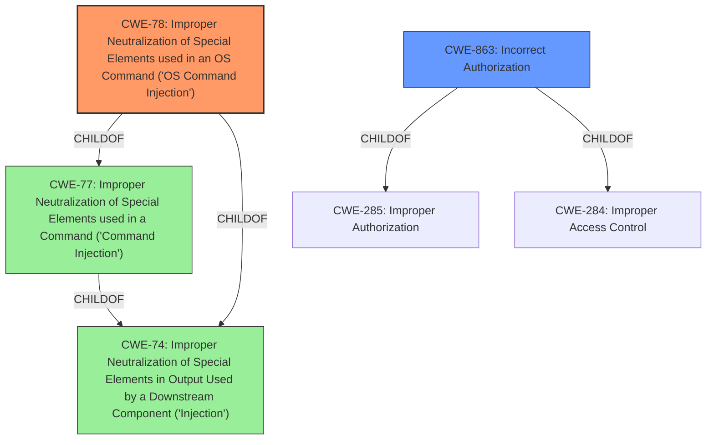

# Analysis Report for CVE-2022-30308

# Vulnerability Analysis Report: CVE-2022-30308

## Description


## Analysis (with Relationship Data)

# Summary
| CWE ID | CWE Name | Confidence | CWE Abstraction Level | CWE Vulnerability Mapping Label | CWE-Vulnerability Mapping Notes |
|---|---|---|---|---|---|
| CWE-78 | Improper Neutralization of Special Elements used in an OS Command ('Command Injection') | 1.0 | Base | Primary | Allowed |
| CWE-863 | Incorrect Authorization | 0.8 | Class | Secondary | Allowed-with-Review |

## Evidence and Confidence

*   **Confidence Score:** 0.9
*   **Evidence Strength:** HIGH

## Relationship Analysis
The primary CWE is CWE-78, which is a Base level CWE, directly addressing the **command injection** vulnerability. It is a child of CWE-77, which is a more general case of command injection. CWE-863, Incorrect Authorization, is a Class level CWE and a potential secondary weakness due to the **improper access control**.



## Vulnerability Chain
The vulnerability chain starts with **improper access control**, potentially leading to the **command injection** vulnerability, which allows unauthorized execution of system commands.
  - The chain is **Improper Access Control** -> **Command Injection** -> **OS Command Execution**

## Summary of Analysis
The vulnerability description clearly states that the "http-endpoint cecc-x-web-viewer-request-on POST request doesn't check for port syntax," resulting in "unauthorized execution of system commands with root privileges due to **improper access control** **command injection**."

The primary weakness is **command injection**, specifically CWE-78, as it directly describes the **improper neutralization of special elements used in an OS command**. The "CVE Reference Links Content Summary" confirms this, stating that the **root cause** is the "lack of proper input validation," leading to "Command injection." The attacker can "execute arbitrary system commands with root privileges."

CWE-863, Incorrect Authorization, is a secondary weakness due to **improper access control**. The "CVE Reference Links Content Summary" supports this by listing **improper access control** as a weakness. This means the application doesn't correctly perform the authorization check, leading to unauthorized access.

The selection of CWE-78 is at the optimal level of specificity because it directly addresses the **OS command injection** vulnerability. While CWE-77 is a parent CWE, CWE-78 is more specific and accurately represents the vulnerability. The MITRE mapping guidance allows for the use of CWE-78. CWE-863 is a more general class, but it is still applicable as a secondary weakness.

Other CWEs considered but not used:
*   CWE-20: Improper Input Validation - This is too general and doesn't specify the type of vulnerability.
*   CWE-306: Missing Authentication for Critical Function - While there's **improper access control**, the root cause is the **command injection** through missing validation.
*   CWE-74: Improper Neutralization of Special Elements in Output Used by a Downstream Component ('Injection') - This is a parent of CWE-78, so CWE-78 is preferred.
*   CWE-88: Improper Neutralization of Argument Delimiters in a Command ('Argument Injection') - Argument Injection might be present, but the root cause of the issue stems from the **command injection**, so CWE-78 is more descriptive.
*   CWE-94: Improper Control of Generation of Code ('Code Injection') - While the impact is code execution, the vulnerability is triggered by the injection of commands, making CWE-78 more appropriate.
*   CWE-425: Direct Request ('Forced Browsing') - This is related to unauthorized access, but the **command injection** is the more specific weakness.


## CWE Relationship Analysis

Current CWEs represent these abstraction levels: .


### Vulnerability Chain Analysis

**Chain starting from CWE-425:**
- 425 (Direct Request ('Forced Browsing')) - ROOT


**Chain starting from CWE-306:**
- 306 (Missing Authentication for Critical Function) - ROOT


### CWE Relationship Diagram

```mermaid
graph TD
    classDef primary fill:#f96,stroke:#333,stroke-width:2px
    classDef secondary fill:#69f,stroke:#333
    classDef tertiary fill:#9e9,stroke:#333
```


*Report generated on 2025-03-30 13:06:45*
