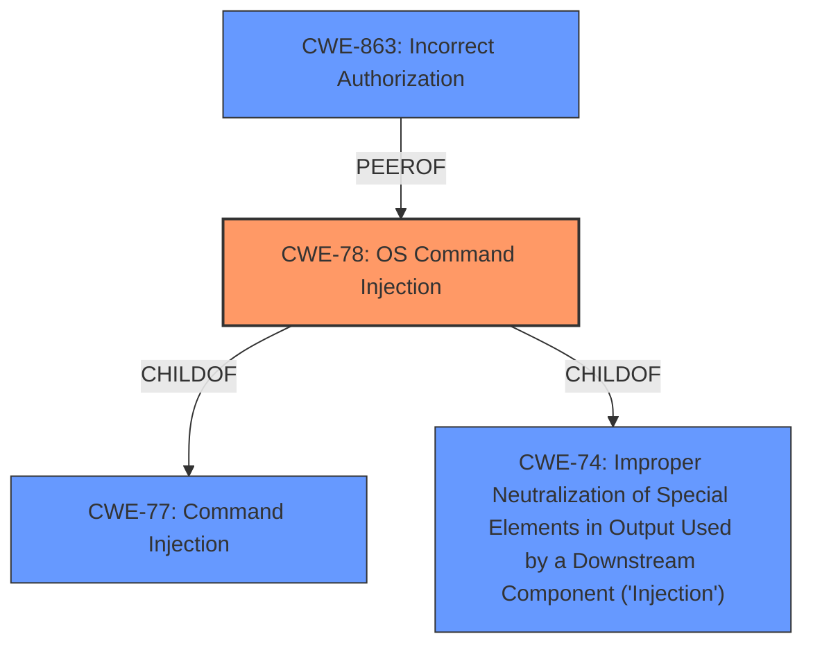

# Raw Analyzer Response for CVE-2022-30309

# Summary
| CWE ID | CWE Name | Confidence | CWE Abstraction Level | CWE Vulnerability Mapping Label | CWE-Vulnerability Mapping Notes |
|---|---|---|---|---|---|
| CWE-78 | Improper Neutralization of Special Elements used in an OS Command ('OS Command Injection') | 0.9 | Base | Primary | Allowed |
| CWE-863 | Incorrect Authorization | 0.7 | Class | Secondary | Allowed-with-Review |

## Evidence and Confidence

*   **Confidence Score:** 0.8
*   **Evidence Strength:** HIGH

## Relationship Analysis
The primary CWE is CWE-78, which is a base-level weakness and a child of CWE-77 and CWE-74. CWE-77 is a Class-level weakness for command injection in general, while CWE-78 is specific to OS commands. CWE-863 is a Class-level weakness related to incorrect authorization, which can be related to command injection vulnerabilities when **improper access control** leads to unauthorized command execution. The selection of CWE-78 is more specific than CWE-77, reflecting the OS command injection nature of the vulnerability.

## Vulnerability Chain
The vulnerability chain involves **improper access control** and **command injection**. The lack of input validation for port syntax allows an attacker to inject arbitrary system commands, leading to unauthorized execution with root privileges.

## Summary of Analysis
The initial assessment identified the root cause as a combination of **improper access control** and **command injection** due to the lack of input validation. The retriever results and vulnerability description support the selection of CWE-78 (OS Command Injection) as the primary weakness and CWE-863 (Incorrect Authorization) as a secondary weakness.

The vulnerability description states: "This can result in unauthorized execution of system commands with root privileges due to **improper access control** **command injection**."
The CVE Reference Links Content Summary states: "Command Injection: Due to the missing port syntax check, an attacker can inject arbitrary system commands."

CWE-78 is at the Base level of abstraction, which is a preferred level for mapping root causes. It accurately reflects the injection of OS commands due to the lack of proper input validation and resulting unauthorized command execution. CWE-863 captures the **improper access control** aspect, as the system's authorization mechanisms are bypassed, allowing unauthorized actions.

Other CWEs were considered but deemed less suitable:
- CWE-77 (Command Injection): While related, CWE-78 is more specific as it involves OS commands.
- CWE-20 (Improper Input Validation): This is too high-level and doesn't capture the specific type of weakness (command injection).
- CWE-306 (Missing Authentication for Critical Function): While authentication might be a related concern, the primary issue is the **command injection** resulting from **improper access control** after a request is made.
- CWE-94 (Improper Control of Generation of Code ('Code Injection')): While related to code injection, the vulnerability is directly related to command injection, making CWE-78 a more precise fit.

The final selection emphasizes the specific nature of the OS command injection vulnerability (CWE-78) and the role of incorrect authorization (CWE-863).