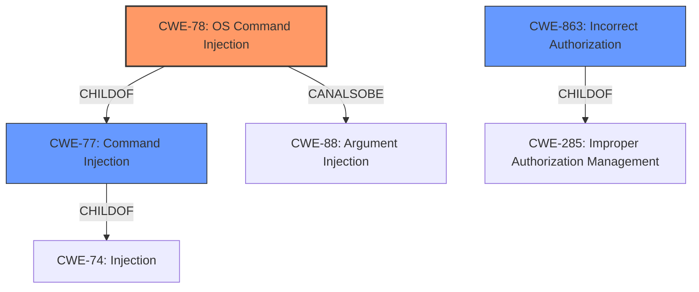

# Analysis Report for CVE-2022-30310

# Vulnerability Analysis Report: CVE-2022-30310

## Description


## Analysis (with Relationship Data)

# Summary
| CWE ID | CWE Name | Confidence | CWE Abstraction Level | CWE Vulnerability Mapping Label | CWE-Vulnerability Mapping Notes |
|---|---|---|---|---|---|
| CWE-78 | Improper Neutralization of Special Elements used in an OS Command ('OS Command Injection') | 1.0 | Base | Allowed | Primary CWE: The vulnerability allows execution of arbitrary OS commands due to **improper neutralization** of special elements. |
| CWE-863 | Incorrect Authorization | 0.7 | Class | Allowed-with-Review | Secondary CWE: The vulnerability involves **improper access control**, which can be seen as a form of incorrect authorization. |

## Evidence and Confidence

*   **Confidence Score:** 0.9
*   **Evidence Strength:** HIGH

## Relationship Analysis
The primary relationship that influenced the decision was the parent-child relationship between CWE-77 and CWE-78. CWE-78 is a more specific version of command injection. The description specifically mentioned unauthorized execution of system commands, which aligns well with OS command injection. CWE-863 was considered because the description also mentioned **improper access control**, which is related to authorization issues.



## Vulnerability Chain
The vulnerability chain involves a lack of input validation leading to command injection and unauthorized command execution.

1.  **Root Cause:** Lack of port syntax checking on the "cecc-x-acknerr-request" HTTP endpoint.
2.  **Weakness:** Command injection (CWE-78) due to **improper neutralization** of special elements in the crafted HTTP POST request.
3.  **Impact:** Unauthorized execution of system commands with root privileges, potentially leading to full system compromise.

## Summary of Analysis
The initial analysis focused on identifying the root cause of the vulnerability. The description clearly mentioned **improper access control** and **command injection**. The CVE Reference Links Content Summary confirmed that the lack of input validation for port syntax allows an attacker to inject arbitrary system commands, leading to unauthorized command execution with root privileges.

The selection of CWE-78 is based on the following evidence:
*   The Vulnerability Description states: "This can result in unauthorized execution of system commands with root privileges due to **improper access control** **command injection**."
*   The CVE Reference Links Content Summary states: "The primary vulnerability is command injection. The lack of port syntax checking allows an attacker to inject arbitrary system commands into the request."

The selection of CWE-863 is based on the fact that **improper access control** is a key contributing factor in this vulnerability. While command injection is the primary weakness, the fact that the system does not properly control access to command execution functionality is also a valid concern.

CWE-77 was considered initially because it is a parent of CWE-78. However, CWE-78 was chosen because it is more specific and accurately reflects the vulnerability, which involves OS command execution. CWE-20, CWE-94, and others were considered but rejected because they did not directly align with the root cause and nature of the vulnerability as command injection.

The selected CWEs are at the optimal level of specificity because they accurately describe the root cause (CWE-78) and a contributing factor (CWE-863) of the vulnerability.


## CWE Relationship Analysis

Current CWEs represent these abstraction levels: .


### Vulnerability Chain Analysis

**Chain starting from CWE-20:**
- 20 (Improper Input Validation) - ROOT


**Chain starting from CWE-78:**
- 78 (Improper Neutralization of Special Elements used in an OS Command ('OS Command Injection')) - ROOT


### CWE Relationship Diagram

```mermaid
graph TD
    classDef primary fill:#f96,stroke:#333,stroke-width:2px
    classDef secondary fill:#69f,stroke:#333
    classDef tertiary fill:#9e9,stroke:#333
```


*Report generated on 2025-03-31 11:31:49*
