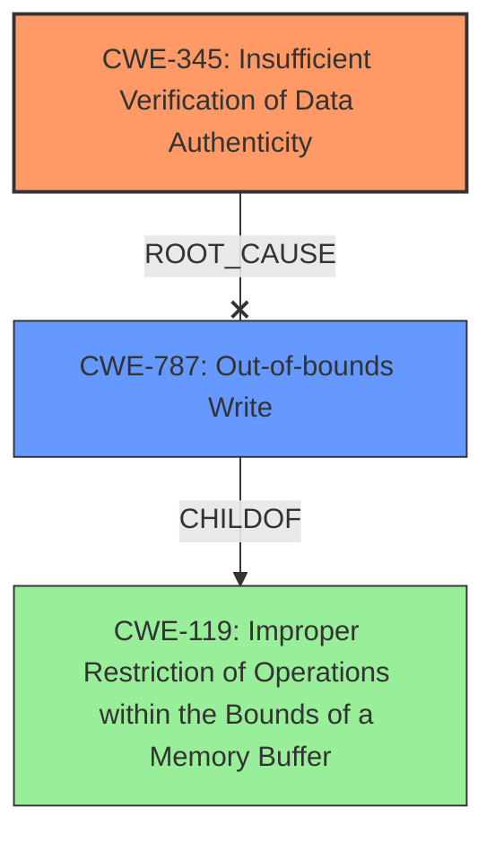

# Analysis Report for CVE-2022-30315

# Vulnerability Analysis Report: CVE-2022-30315

## Description


## Analysis (with Relationship Data)

# Summary
| CWE ID | CWE Name | Confidence | CWE Abstraction Level | CWE Vulnerability Mapping Label | CWE-Vulnerability Mapping Notes |
|---|---|---|---|---|---|
| CWE-345 | Insufficient Verification of Data Authenticity | 1.0 | Class | Primary | Allowed with Review|
| CWE-787 | Out-of-bounds Write | 0.6 | Base | Secondary | Allowed |

## Evidence and Confidence

*   **Confidence Score:** 0.8
*   **Evidence Strength:** HIGH

## Relationship Analysis
The primary CWE is CWE-345, which indicates a lack of proper data authenticity verification. CWE-345 is a Class-level CWE. While it is preferable to map to Base or Variant levels, in this case, the description directly states **insufficient verification of data authenticity** as the **rootcause**, making CWE-345 the most appropriate fit. CWE-787 is added because the lack of verification leads to the potential for writing arbitrary code which is an Out-of-bounds Write.



## Vulnerability Chain
The vulnerability chain begins with the **insufficient verification of data authenticity (CWE-345)**. This allows an attacker to inject arbitrary code, which leads to an **out-of-bounds write (CWE-787)**. The final impact is remote code execution and denial of service.

## Summary of Analysis
Initially, the analysis focused on identifying the **rootcause** weakness, which is explicitly stated as **insufficient verification of data authenticity**. The retriever results also highlighted CWE-345 as the top candidate. Further analysis confirmed that the vulnerability involves a **lack of cryptographic authentication** of control logic downloaded to the controller. This aligns perfectly with the description of CWE-345. The ability to execute arbitrary machine code points to CWE-787.

The relationship analysis showed that while CWE-345 is a Class-level CWE, it is the most appropriate choice because the vulnerability description directly mentions the **insufficient verification of data authenticity**.

The decision to include CWE-787 is based on the vulnerability description, indicating that an attacker can execute arbitrary code, implying an out-of-bounds write.

Relevant CWE Information:

# Enhanced Context (25 CWEs)
The following CWEs were identified as potentially relevant to this vulnerability:

## CWE-345: Insufficient Verification of Data Authenticity
**Abstraction Level**: Class
**Similarity Score**: 0.79
**Source**: dense

**Description**:
The product does not sufficiently verify the origin or authenticity of data, in a way that causes it to accept invalid data.

**Mapping Guidance**:
- Usage: Discouraged
- Rationale: This CWE entry is a level-1 Class (i.e., a child of a Pillar). It might have lower-level children that would be more appropriate

## CWE-347: Improper Verification of Cryptographic Signature
**Abstraction Level**: Base
**Similarity Score**: 4817.16
**Source**: sparse

**Description**:
The product does not verify, or incorrectly verifies, the cryptographic signature for data.

**Mapping Guidance**:
- Usage: Allowed
- Rationale: This CWE entry is at the Base level of abstraction, which is a preferred level of abstraction for mapping to the root causes of vulnerabilities.

## CWE-787: Out-of-bounds Write
**Abstraction Level**: base
**Similarity Score**: 4.33
**Source**: graph

**Description**:
CWE-787: Out-of-bounds Write

**Mapping Guidance**:
- Usage: Allowed
- Rationale: This CWE entry is at the Base level of abstraction, which is a preferred level of abstraction for mapping to the root causes of vulnerabilities.

### Other CWEs Considered

*   **CWE-347 Improper Verification of Cryptographic Signature:** While related, the description indicates a general lack of data authenticity verification rather than specifically a cryptographic signature issue. Therefore, CWE-345 is a broader and more accurate fit.
*   **CWE-119 Improper Restriction of Operations within the Bounds of a Memory Buffer:** This is a more general description and the vulnerability specifics allow for a more precise CWE.
*   **CWE-306 Missing Authentication for Critical Function and CWE-287 Improper Authentication:** Authentication is part of Data Authenticity.

I am confident that the selected CWEs accurately represent the vulnerability based on the available evidence and CWE definitions.


## CWE Relationship Analysis

Current CWEs represent these abstraction levels: .


### Vulnerability Chain Analysis

**Chain starting from CWE-306:**
- 306 (Missing Authentication for Critical Function) - ROOT


**Chain starting from CWE-347:**
- 347 (Improper Verification of Cryptographic Signature) - ROOT


### CWE Relationship Diagram

```mermaid
graph TD
    classDef primary fill:#f96,stroke:#333,stroke-width:2px
    classDef secondary fill:#69f,stroke:#333
    classDef tertiary fill:#9e9,stroke:#333
```


*Report generated on 2025-03-31 10:24:35*
