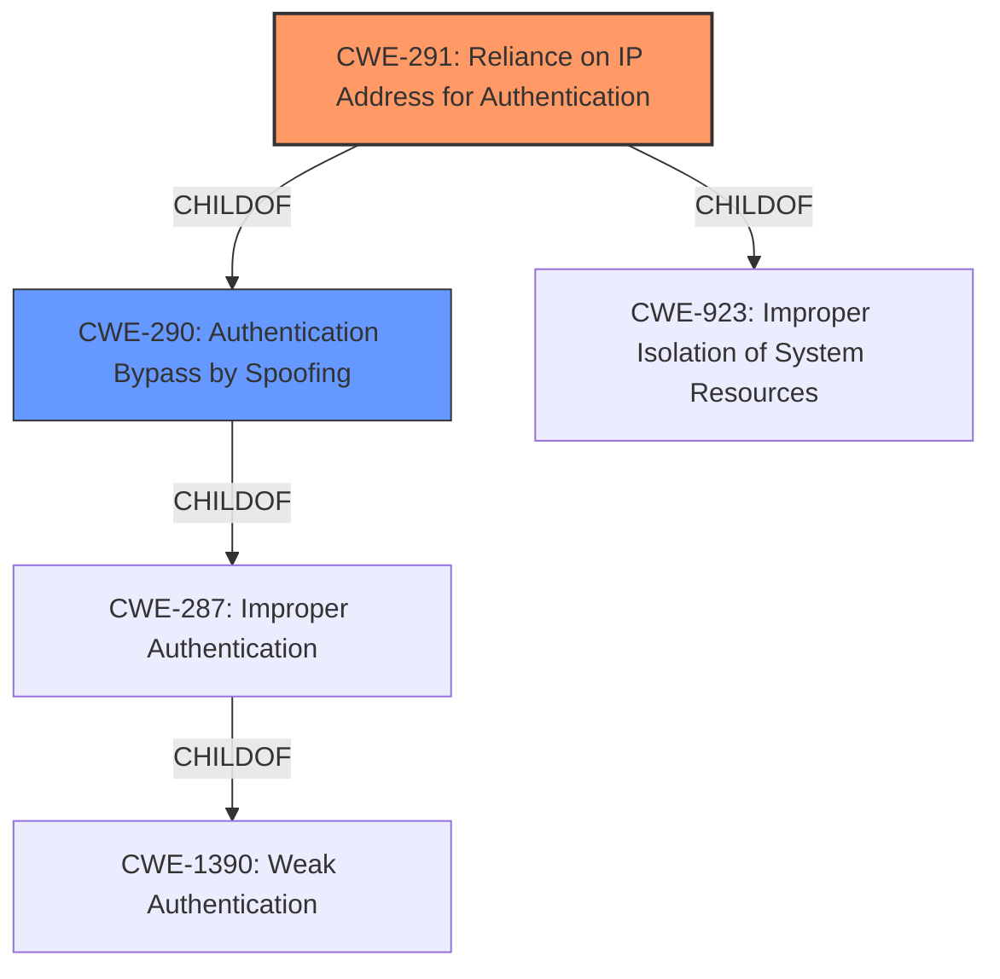

# Raw Analyzer Response for CVE-2022-30319

# Summary
| CWE ID | CWE Name | Confidence | CWE Abstraction Level | CWE Vulnerability Mapping Label | CWE-Vulnerability Mapping Notes |
|---|---|---|---|---|---|
| CWE-291 | Reliance on IP Address for Authentication | 1.0 | Variant | Allowed | Primary CWE. The vulnerability relies on IP address for authentication, which can be easily spoofed.|
| CWE-290 | Authentication Bypass by Spoofing | 0.8 | Base | Allowed | Secondary CWE. The vulnerability allows authentication bypass by spoofing the MAC/IP address of an authenticated client.|

## Evidence and Confidence

*   **Confidence Score:** 1.0
*   **Evidence Strength:** HIGH

## Relationship Analysis
The primary CWE is CWE-291, which is a variant of CWE-290 (Authentication Bypass by Spoofing) and CWE-923 (Improper Isolation of System Resources). CWE-290 is a child of CWE-287 (Improper Authentication). The vulnerability involves relying on IP addresses for authentication, which makes it susceptible to spoofing attacks, thus bypassing authentication.

## Vulnerability Chain
The vulnerability chain starts with the **reliance on IP addresses for authentication (CWE-291)**. This leads to the possibility of **authentication bypass by spoofing (CWE-290)**, because UDP traffic can be spoofed.

## Summary of Analysis
The vulnerability description clearly indicates that the system relies on the client's MAC and IP addresses for authentication. Due to the stateless nature of UDP, an attacker can spoof these addresses and bypass the authentication mechanism.
The key phrase "**authentication bypass**" highlights the main weakness. The CVE Reference Links Content Summary confirms that **authentication bypass (CWE-288)** is a core weakness.
The "Retriever Results" list CWE-291 (Reliance on IP Address for Authentication) as the top match, and CWE-290 (Authentication Bypass by Spoofing) as the third match.

CWE-291 is selected as the primary CWE because the **root cause** is the reliance on IP addresses for authentication. The vulnerability description specifically mentions that the "authentication functions on the basis of a MAC/IP whitelist", and that "UDP traffic can be spoofed to bypass the whitelist-based access control." This aligns perfectly with the description of CWE-291.
CWE-290 is selected as a secondary CWE because the **impact** of the vulnerability is that an attacker can bypass authentication by spoofing their MAC/IP address.

CWE-327 (Use of a Broken or Risky Cryptographic Algorithm) was considered because the summary mentions "CRC-16 based hashing algorithm", however, this is for a different CVE (CVE-2022-30320), and not relevant to the current CVE (CVE-2022-30319).

The selected CWEs are at the optimal level of specificity. CWE-291 is a Variant, and CWE-290 is a Base. Both are preferred levels of abstraction.