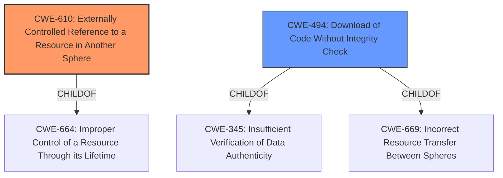

# Analysis Report for CVE-2022-3032

# Vulnerability Analysis Report: CVE-2022-3032

## Description


## Analysis (with Relationship Data)

# Summary
| CWE ID | CWE Name | Confidence | CWE Abstraction Level | CWE Vulnerability Mapping Label | CWE-Vulnerability Mapping Notes |
|---|---|---|---|---|---|
| CWE-610 | Externally Controlled Reference to a Resource in Another Sphere | 0.75 | Class | Primary | Allowed-with-Review |
| CWE-494 | Download of Code Without Integrity Check | 0.5 | Base | Secondary | Allowed |

## Evidence and Confidence

*   **Confidence Score:** 0.7
*   **Evidence Strength:** MEDIUM

## Relationship Analysis
The primary relationship considered was the ChildOf relationship, particularly in evaluating the abstraction level. CWE-610 is a Class, and the guidance suggests considering more specific children. However, none of the children were a better fit. CWE-494 relates to downloading code without integrity checks, which can be seen as a related aspect given the loading of remote objects, although it doesn't fully capture the vulnerability. The abstraction levels influenced the decision, with preference given to the more abstract Class level for CWE-610 due to the absence of a more specific match.



## Vulnerability Chain
The vulnerability chain involves receiving an HTML email, the email containing an iframe with a srcdoc attribute, the srcdoc attribute defining inner HTML with remote objects, and the failure to block those remote objects, leading to network access and display.

## Summary of Analysis
The initial analysis focused on identifying the **root cause** of the vulnerability, which is the **failure to block remote content** within an iframe's srcdoc attribute, leading to the loading and display of remote objects.

CWE-610 (Externally Controlled Reference to a Resource in Another Sphere) was selected as the primary CWE because it accurately describes the scenario where the iframe's srcdoc allows referencing external resources (the remote objects) without proper control. The "CVE Reference Links Content Summary" supports this, stating, "The vulnerability arises from the way Thunderbird handles HTML emails containing an `iframe` element with a `srcdoc` attribute. Specifically, remote objects specified within the HTML document defined by the `srcdoc` attribute were not being blocked." The weakness lies in Thunderbird's **improper control** over these externally referenced resources.

CWE-494 (Download of Code Without Integrity Check) was considered because loading remote objects can be viewed as downloading code without integrity checks. While not a perfect fit, it captures a related aspect of the vulnerability, as the loaded remote objects aren't being properly validated.

CWE-79 (Improper Neutralization of Input During Web Page Generation ('Cross-site Scripting')) was also considered because the iframe with the srcdoc attribute allows for injecting HTML, but it was determined that the **root cause** is not the injection itself, but the **lack of control over externally referenced resources**.

The selected CWEs are at an appropriate level of specificity. While CWE-610 is a Class, no more specific child CWE adequately captures the essence of the vulnerability. The decision is primarily based on the "CVE Reference Links Content Summary" and the descriptions of the CWEs.

Relevant CWE Information:

# Enhanced Context (25 CWEs)
The following CWEs were identified as potentially relevant to this vulnerability:

## CWE-404: Improper Resource Shutdown or Release
**Abstraction Level**: Class
**Similarity Score**: 0.78
**Source**: dense

**Description**:
The product does not release or incorrectly releases a resource before it is made available for re-use.

**Mapping Guidance**:
- Usage: Allowed-with-Review
- Rationale: This CWE entry is a Class and might have Base-level children that would be more appropriate

*Not selected because:* This CWE doesn't fit the vulnerability, as it's not about resource shutdown or release, but about the access of external resources.

## CWE-667: Improper Locking
**Abstraction Level**: Class
**Similarity Score**: 0.78
**Source**: dense

**Description**:
The product does not properly acquire or release a lock on a resource, leading to unexpected resource state changes and behaviors.

**Mapping Guidance**:
- Usage: Allowed-with-Review
- Rationale: This CWE entry is a Class and might have Base-level children that would be more appropriate

*Not selected because:* This CWE doesn't fit the vulnerability, which has nothing to do with locking mechanisms.

## CWE-226: Sensitive Information in Resource Not Removed Before Reuse
**Abstraction Level**: Base
**Similarity Score**: 0.78
**Source**: dense

**Description**:
The product releases a resource such as memory or a file so that it can be made available for reuse, but it does not clear or "zeroize" the information contained in the resource before the product performs a critical state transition or makes the resource available for reuse by other entities.

**Mapping Guidance**:
- Usage: Allowed
- Rationale: This CWE entry is at the Base level of abstraction, which is a preferred level of abstraction for mapping to the root causes of vulnerabilities.

*Not selected because:* This CWE is about sensitive information not being cleared before reuse, which doesn't align with the vulnerability.

## CWE-610: Externally Controlled Reference to a Resource in Another Sphere
**Abstraction Level**: Class
**Similarity Score**: 0.77
**Source**: dense

**Description**:
The product uses an externally controlled name or reference that resolves to a resource that is outside of the intended control sphere.

**Mapping Guidance**:
- Usage: Discouraged
- Rationale: This CWE entry is a level-1 Class (i.e., a child of a Pillar). It might have lower-level children that would be more appropriate

*Selected because:* This accurately describes the vulnerability where the `srcdoc` attribute allows referencing external resources without proper control.

## CWE-41: Improper Resolution of Path Equivalence
**Abstraction Level**: Base
**Similarity Score**: 0.77
**Source**: dense

**Description**:
The product is vulnerable to file system contents disclosure through path equivalence. Path equivalence involves the use of special characters in file and directory names. The associated manipulations are intended to generate multiple names for the same object.

**Mapping Guidance**:
- Usage: Allowed
- Rationale: This CWE entry is at the Base level of abstraction, which is a preferred level of abstraction for mapping to the root causes of vulnerabilities.

*Not selected because:* This CWE is specific to file system path equivalence, which is not the case in this vulnerability.

## CWE-451: User Interface (UI) Misrepresentation of Critical Information
**Abstraction Level**: Class
**Similarity Score**: 0.77
**Source**: dense

**Description**:
The user interface (UI) does not properly represent critical information to the user, allowing the information - or its source - to be obscured or spoofed. This is often a component in phishing attacks.

**Mapping Guidance**:
- Usage: Allowed-with-Review
- Rationale: This CWE entry is a Class and might have Base-level children that would be more appropriate

*Not selected because:* While displaying remote content could be seen as a misrepresentation, the **root cause** is the **lack of control** over external resources, not the misrepresentation itself.

## CWE-125: Out-of-bounds Read
**Abstraction Level**: Base
**Similarity Score**: 0.76
**Source**: dense

**Description**:
The product reads data past the end, or before the beginning, of the intended buffer.

**Mapping Guidance**:
- Usage: Allowed
- Rationale: This CWE entry is at the Base level of abstraction, which is a preferred level of abstraction for mapping to the root causes of vulnerabilities.

*Not selected because:* The vulnerability is not related to out-of-bounds reads.

## CWE-1289: Improper Validation of Unsafe Equivalence in Input
**Abstraction Level**: Base
**Similarity Score**: 0.76
**Source**: dense

**Description**:
The product receives an input value that is used as a resource identifier or other type of reference, but it does not validate or incorrectly validates that the input is equivalent to a potentially-unsafe value.

**Mapping Guidance**:
- Usage: Allowed
- Rationale: This CWE entry is at the Base level of abstraction, which is a preferred level of abstraction for mapping to the root causes of vulnerabilities.

*Not selected because:* Although input isn't properly


## CWE Relationship Analysis

Current CWEs represent these abstraction levels: .


### Vulnerability Chain Analysis

**Chain starting from CWE-41:**
- 41 (Improper Resolution of Path Equivalence) - ROOT


**Chain starting from CWE-669:**
- 669 (Incorrect Resource Transfer Between Spheres) - ROOT


### CWE Relationship Diagram

```mermaid
graph TD
    classDef primary fill:#f96,stroke:#333,stroke-width:2px
    classDef secondary fill:#69f,stroke:#333
    classDef tertiary fill:#9e9,stroke:#333
```


*Report generated on 2025-03-31 05:54:24*
