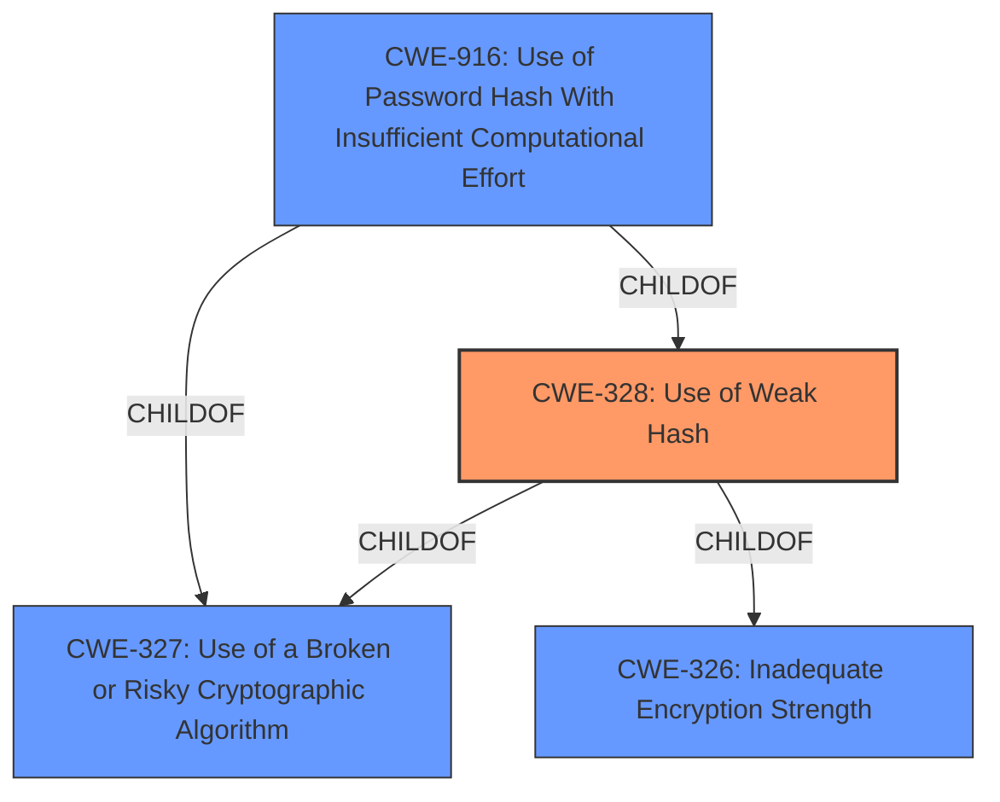

# Analysis Report for CVE-2022-30320

# Vulnerability Analysis Report: CVE-2022-30320

## Description


## Analysis (with Relationship Data)

# Summary
| CWE ID  | CWE Name                                                    | Confidence | CWE Abstraction Level | CWE Vulnerability Mapping Label | CWE-Vulnerability Mapping Notes |
| :-------- | :---------------------------------------------------------- | :--------- | :-------------------- | :------------------------------ | :------------------------------ |
| CWE-328 | Use of Weak Hash                                            | 1          | Base                  | Primary CWE                     | Allowed                       |
| CWE-327 | Use of a Broken or Risky Cryptographic Algorithm            | 0.8        | Class                 | Secondary CWE                     | Allowed-with-Review             |
| CWE-916 | Use of Password Hash With Insufficient Computational Effort | 0.7        | Base                  | Secondary CWE                     | Allowed                       |

## Evidence and Confidence

*   **Confidence Score:** 0.9
*   **Evidence Strength:** HIGH

## Relationship Analysis
The primary CWE is CWE-328, which is a Base level weakness describing the use of a weak hash algorithm. CWE-328 is a child of CWE-327 (Class) and CWE-326 (Class). CWE-327 is "Use of a Broken or Risky Cryptographic Algorithm" which is a broader classification. CWE-916 (Base) "Use of Password Hash With Insufficient Computational Effort" is also a child of CWE-327 and CWE-328. The vulnerability uses CRC-16 as the hashing algorithm, which is not cryptographically secure and easily allows for collision attacks.



## Vulnerability Chain
The vulnerability chain starts with the **use of an insecure hashing algorithm** (CRC-16), which leads to **weak credential hashing scheme**, and finally results in authentication bypass, which allows attackers to manipulate controller configurations.

## Summary of Analysis
The initial assessment identified CWE-328 as the primary weakness due to the explicit mention of an insecure hashing algorithm (CRC-16) being used for password authentication. This aligns directly with the description of CWE-328, which focuses on the use of algorithms that do not meet security expectations for a hash function.

The vulnerability description states: "The hashing algorithm used is based on CRC-16 and as such not cryptographically secure. An **insecure hashing algorithm** is used." This statement directly supports the selection of CWE-328.

The retriever results also support this selection, with CWE-328 being a top match. The evidence is strong, and the confidence in this mapping is high.

CWE-327 is considered as a secondary weakness. The vulnerability description mentions "Broken or Risky Cryptographic Algorithm". CWE-327 is a more general class of weakness and "might have Base-level children that would be more appropriate". Since CWE-328 provides a more specific classification, it is selected as the primary weakness and CWE-327 as a secondary weakness.

CWE-916 is considered as a secondary weakness since the hashing algorithm used doesn't provide a sufficient level of computational effort that would make password cracking attacks infeasible or expensive.

The selected CWEs are at the optimal level of specificity, with CWE-328 being a Base level weakness that accurately reflects the **root cause** of the vulnerability.


## CWE Relationship Analysis

Current CWEs represent these abstraction levels: .


### Vulnerability Chain Analysis

**Chain starting from CWE-916:**
- 916 (Use of Password Hash With Insufficient Computational Effort) - ROOT


**Chain starting from CWE-327:**
- 327 (Use of a Broken or Risky Cryptographic Algorithm) - ROOT


### CWE Relationship Diagram

```mermaid
graph TD
    classDef primary fill:#f96,stroke:#333,stroke-width:2px
    classDef secondary fill:#69f,stroke:#333
    classDef tertiary fill:#9e9,stroke:#333
```


*Report generated on 2025-03-30 14:54:37*
