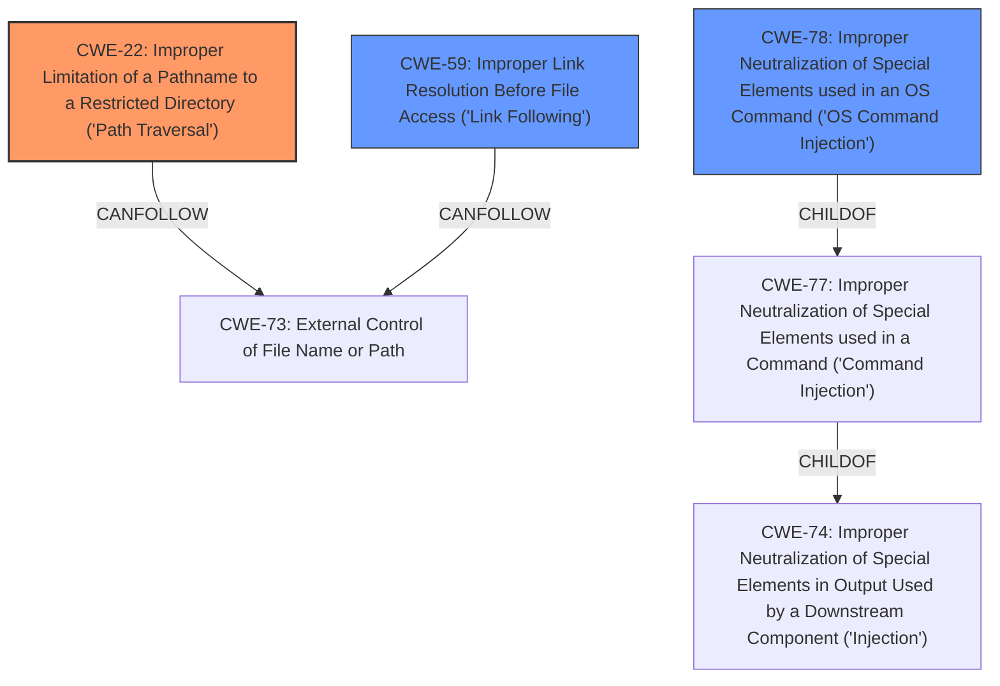

# Raw Analyzer Response for CVE-2022-30321

# Summary
| CWE ID   | CWE Name                                                                  | Confidence | CWE Abstraction Level | CWE-Vulnerability Mapping Label | CWE-Vulnerability Mapping Notes |
| -------- | ------------------------------------------------------------------------- | ---------- | --------------------- | ------------------------------- | ----------------------------- |
| CWE-22   | Improper Limitation of a Pathname to a Restricted Directory ('Path Traversal') | 0.90       | Base                  | Primary                         | Allowed                       |
| CWE-59   | Improper Link Resolution Before File Access ('Link Following')             | 0.80       | Base                  | Secondary                       | Allowed                       |
| CWE-78   | Improper Neutralization of Special Elements used in an OS Command ('OS Command Injection') | 0.75       | Base                  | Secondary                       | Allowed                       |

## Evidence and Confidence

*   **Confidence Score:** 0.85
*   **Evidence Strength:** HIGH

## Relationship Analysis
The primary weakness is **CWE-22 Improper Limitation of a Pathname to a Restricted Directory ('Path Traversal')**, as the vulnerability description explicitly mentions **path traversal**. **CWE-59 Improper Link Resolution Before File Access ('Link Following')** is also present because of **symlink processing**. **CWE-78 Improper Neutralization of Special Elements used in an OS Command ('OS Command Injection')** is included due to **command injection** flaws. These weaknesses are all at the Base level of abstraction, which is appropriate.

## Vulnerability Chain
The vulnerability chain starts with the **improper handling of pathnames**, which leads to both **path traversal** and **symlink following**. The **command injection** is a separate but related flaw stemming from **insufficient neutralization** of input used to construct commands. This combination of weaknesses allows for **arbitrary host access**.

## Summary of Analysis
The analysis is based on the provided vulnerability description, which clearly states the presence of **path traversal**, **symlink processing**, and **command injection** flaws in go-getter.

*   **CWE-22 (Improper Limitation of a Pathname to a Restricted Directory ('Path Traversal'))** is selected as the primary CWE because the description explicitly mentions "**path traversal**". This aligns with the CWE's description: "The product uses external input to construct a pathname that is intended to identify a file or directory that is located underneath a restricted parent directory, but the product does not properly neutralize special elements within the pathname that can cause the pathname to resolve to a location that is outside of the restricted directory."
*   **CWE-59 (Improper Link Resolution Before File Access ('Link Following'))** is selected as a secondary CWE because the description also mentions "**symlink processing**". This aligns with the CWE's description: "The product attempts to access a file based on the filename, but it does not properly prevent that filename from identifying a link or shortcut that resolves to an unintended resource."
*   **CWE-78 (Improper Neutralization of Special Elements used in an OS Command ('OS Command Injection'))** is selected as a secondary CWE because the description mentions "**command injection** flaws." This aligns with the CWE's description: "The product constructs all or part of an OS command using externally-influenced input from an upstream component, but it does not neutralize or incorrectly neutralizes special elements that could modify the intended OS command when it is sent to a downstream component."

The selected CWEs are at the optimal level of specificity (Base) and directly reflect the weaknesses described in the vulnerability.

**CWEs Considered but Not Used:**

*   **CWE-77 (Improper Neutralization of Special Elements used in a Command ('Command Injection'))**: While related to command injection, CWE-78 is more specific as it explicitly refers to OS commands.
*   **CWE-74 (Improper Neutralization of Special Elements in Output Used by a Downstream Component ('Injection'))**: This is a more general injection CWE and less specific than CWE-78.
*   **CWE-61 (UNIX Symbolic Link (Symlink) Following)**: While related to symlink processing, it's a compound CWE. CWE-59 is more direct and preferred.

Relevant CWE Information: