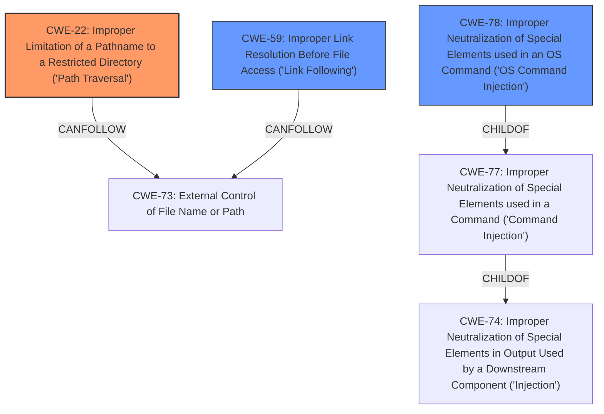

# Analysis for CVE-2022-30321

# Summary
| CWE ID   | CWE Name                                                                  | Confidence | CWE Abstraction Level | CWE-Vulnerability Mapping Label | CWE-Vulnerability Mapping Notes |
| -------- | ------------------------------------------------------------------------- | ---------- | --------------------- | ------------------------------- | ----------------------------- |
| CWE-22   | Improper Limitation of a Pathname to a Restricted Directory ('Path Traversal') | 0.90       | Base                  | Primary                         | Allowed                       |
| CWE-59   | Improper Link Resolution Before File Access ('Link Following')             | 0.80       | Base                  | Secondary                       | Allowed                       |
| CWE-78   | Improper Neutralization of Special Elements used in an OS Command ('OS Command Injection') | 0.75       | Base                  | Secondary                       | Allowed                       |

## Evidence and Confidence

*   **Confidence Score:** 0.85
*   **Evidence Strength:** HIGH

## Relationship Analysis
The primary weakness is **CWE-22 Improper Limitation of a Pathname to a Restricted Directory ('Path Traversal')**, as the vulnerability description explicitly mentions **path traversal**. **CWE-59 Improper Link Resolution Before File Access ('Link Following')** is also present because of **symlink processing**. **CWE-78 Improper Neutralization of Special Elements used in an OS Command ('OS Command Injection')** is included due to **command injection** flaws. These weaknesses are all at the Base level of abstraction, which is appropriate.

## Vulnerability Chain
The vulnerability chain starts with the **improper handling of pathnames**, which leads to both **path traversal** and **symlink following**. The **command injection** is a separate but related flaw stemming from **insufficient neutralization** of input used to construct commands. This combination of weaknesses allows for **arbitrary host access**.

## Summary of Analysis
The analysis is based on the provided vulnerability description, which clearly states the presence of **path traversal**, **symlink processing**, and **command injection** flaws in go-getter.

*   **CWE-22 (Improper Limitation of a Pathname to a Restricted Directory ('Path Traversal'))** is selected as the primary CWE because the description explicitly mentions "**path traversal**". This aligns with the CWE's description: "The product uses external input to construct a pathname that is intended to identify a file or directory that is located underneath a restricted parent directory, but the product does not properly neutralize special elements within the pathname that can cause the pathname to resolve to a location that is outside of the restricted directory."
*   **CWE-59 (Improper Link Resolution Before File Access ('Link Following'))** is selected as a secondary CWE because the description also mentions "**symlink processing**". This aligns with the CWE's description: "The product attempts to access a file based on the filename, but it does not properly prevent that filename from identifying a link or shortcut that resolves to an unintended resource."
*   **CWE-78 (Improper Neutralization of Special Elements used in an OS Command ('OS Command Injection'))** is selected as a secondary CWE because the description mentions "**command injection** flaws." This aligns with the CWE's description: "The product constructs all or part of an OS command using externally-influenced input from an upstream component, but it does not neutralize or incorrectly neutralizes special elements that could modify the intended OS command when it is sent to a downstream component."

The selected CWEs are at the optimal level of specificity (Base) and directly reflect the weaknesses described in the vulnerability.

**CWEs Considered but Not Used:**

*   **CWE-77 (Improper Neutralization of Special Elements used in a Command ('Command Injection'))**: While related to command injection, CWE-78 is more specific as it explicitly refers to OS commands.
*   **CWE-74 (Improper Neutralization of Special Elements in Output Used by a Downstream Component ('Injection'))**: This is a more general injection CWE and less specific than CWE-78.
*   **CWE-61 (UNIX Symbolic Link (Symlink) Following)**: While related to symlink processing, it's a compound CWE. CWE-59 is more direct and preferred.

Relevant CWE Information:

# Enhanced Query for CVE-2022-30321

# Vulnerability Description

    go-getter up to 1.5.11 and 2.0.2 allowed arbitrary host access via go-getter **path traversal**, **symlink processing**, and **command injection** flaws. Fixed in 1.6.1 and 2.1.0.

    # Keyphrase-Specific CWE Analysis
    This vulnerability contains multiple keyphrases that may map to different CWEs. 
    Please analyze each keyphrase separately and determine the most appropriate CWE(s) for each.

    ## ROOTCAUSE: 'path traversal'

Relevant CWEs for this ROOTCAUSE:

### 1. CWE-23: Relative Path Traversal (Score: 242.12)

The product uses external input to construct a pathname that should be within a restricted directory, but it does not properly neutralize sequences such as ".." that can resolve to a location that is outside of that directory....

### 2. CWE-22: Improper Limitation of a Pathname to a Restricted Directory ('Path Traversal') (Score: 232.42)

The product uses external input to construct a pathname that is intended to identify a file or directory that is located underneath a restricted parent directory, but the product does not properly neutralize special elements within the pathname that can cause the pathname to resolve to a location th...

### 3. CWE-59: Improper Link Resolution Before File Access ('Link Following') (Score: 226.24)

The product attempts to access a file based on the filename, but it does not properly prevent that filename from identifying a link or shortcut that resolves to an unintended resource....

### 4. CWE-36: Absolute Path Traversal (Score: 197.44)

The product uses external input to construct a pathname that should be within a restricted directory, but it does not properly neutralize absolute path sequences such as "/abs/path" that can resolve to a location that is outside of that directory....

### 5. CWE-73: External Control of File Name or Path (Score: 196.83)

The product allows user input to control or influence paths or file names that are used in filesystem operations....

## ROOTCAUSE: 'symlink processing'

Relevant CWEs for this ROOTCAUSE:

### 1. CWE-23: Relative Path Traversal (Score: 242.12)

The product uses external input to construct a pathname that should be within a restricted directory, but it does not properly neutralize sequences such as ".." that can resolve to a location that is outside of that directory....

### 2. CWE-22: Improper Limitation of a Pathname to a Restricted Directory ('Path Traversal') (Score: 232.42)

The product uses external input to construct a pathname that is intended to identify a file or directory that is located underneath a restricted parent directory, but the product does not properly neutralize special elements within the pathname that can cause the pathname to resolve to a location th...

### 3. CWE-61: UNIX Symbolic Link (Symlink) Following (Score: 230.67)

The product, when opening a file or directory, does not sufficiently account for when the file is a symbolic link that resolves to a target outside of the intended control sphere. This could allow an attacker to cause the product to operate on unauthorized files....

### 4. CWE-59: Improper Link Resolution Before File Access ('Link Following') (Score: 226.24)

The product attempts to access a file based on the filename, but it does not properly prevent that filename from identifying a link or shortcut that resolves to an unintended resource....

### 5. CWE-367: Time-of-check Time-of-use (TOCTOU) Race Condition (Score: 193.17)

The product checks the state of a resource before using that resource, but the resource's state can change between the check and the use in a way that invalidates the results of the check. This can cause the product to perform invalid actions when the resource is in an unexpected state....

## ROOTCAUSE: 'command injection'

Relevant CWEs for this ROOTCAUSE:

### 1. CWE-23: Relative Path Traversal (Score: 242.12)

The product uses external input to construct a pathname that should be within a restricted directory, but it does not properly neutralize sequences such as ".." that can resolve to a location that is outside of that directory....

### 2. CWE-22: Improper Limitation of a Pathname to a Restricted Directory ('Path Traversal') (Score: 232.42)

The product uses external input to construct a pathname that is intended to identify a file or directory that is located underneath a restricted parent directory, but the product does not properly neutralize special elements within the pathname that can cause the pathname to resolve to a location th...

### 3. CWE-77: Improper Neutralization of Special Elements used in a Command ('Command Injection') (Score: 211.38)

The product constructs all or part of a command using externally-influenced input from an upstream component, but it does not neutralize or incorrectly neutralizes special elements that could modify the intended command when it is sent to a downstream component....

### 4. CWE-78: Improper Neutralization of Special Elements used in an OS Command ('OS Command Injection') (Score: 206.77)

The product constructs all or part of an OS command using externally-influenced input from an upstream component, but it does not neutralize or incorrectly neutralizes special elements that could modify the intended OS command when it is sent to a downstream component....

### 5. CWE-138: Improper Neutralization of Special Elements (Score: 194.94)

The product receives input from an upstream component, but it does not neutralize or incorrectly neutralizes special elements that could be interpreted as control elements or syntactic markers when they are sent to a downstream component....

## IMPACT: 'arbitrary host access'

Relevant CWEs for this IMPACT:

### 1. CWE-23: Relative Path Traversal (Score: 242.12)

The product uses external input to construct a pathname that should be within a restricted directory, but it does not properly neutralize sequences such as ".." that can resolve to a location that is outside of that directory....

### 2. CWE-22: Improper Limitation of a Pathname to a Restricted Directory ('Path Traversal') (Score: 232.42)

The product uses external input to construct a pathname that is intended to identify a file or directory that is located underneath a restricted parent directory, but the product does not properly neutralize special elements within the pathname that can cause the pathname to resolve to a location th...

### 3. CWE-61: UNIX Symbolic Link (Symlink) Following (Score: 230.67)

The product, when opening a file or directory, does not sufficiently account for when the file is a symbolic link that resolves to a target outside of the intended control sphere. This could allow an attacker to cause the product to operate on unauthorized files....

### 4. CWE-59: Improper Link Resolution Before File Access ('Link Following') (Score: 226.24)

The product attempts to access a file based on the filename, but it does not properly prevent that filename from identifying a link or shortcut that resolves to an unintended resource....

### 5. CWE-74: Improper Neutralization of Special Elements in Output Used by a Downstream Component ('Injection') (Score: 66.87)

The product constructs all or part of a command, data structure, or record using externally-influenced input from an upstream component, but it does not neutralize or incorrectly neutralizes special elements that could modify how it is parsed or interpreted when it is sent to a downstream component....

## PRODUCT: 'go-getter'

Relevant CWEs for this PRODUCT:

### 1. CWE-23: Relative Path Traversal (Score: 242.12)

The product uses external input to construct a pathname that should be within a restricted directory, but it does not properly neutralize sequences such as ".." that can resolve to a location that is outside of that directory....

### 2. CWE-22: Improper Limitation of a Pathname to a Restricted Directory ('Path Traversal') (Score: 232.42)

The product uses external input to construct a pathname that is intended to identify a file or directory that is located underneath a restricted parent directory, but the product does not properly neutralize special elements within the pathname that can cause the pathname to resolve to a location th...

### 3. CWE-61: UNIX Symbolic Link (Symlink) Following (Score: 230.67)

The product, when opening a file or directory, does not sufficiently account for when the file is a symbolic link that resolves to a target outside of the intended control sphere. This could allow an attacker to cause the product to operate on unauthorized files....

### 4. CWE-59: Improper Link Resolution Before File Access ('Link Following') (Score: 226.24)

The product attempts to access a file based on the filename, but it does not properly prevent that filename from identifying a link or shortcut that resolves to an unintended resource....

### 5. CWE-77: Improper Neutralization of Special Elements used in a Command ('Command Injection') (Score: 211.38)

The product constructs all or part of a command using externally-influenced input from an upstream component, but it does not neutralize or incorrectly neutralizes special elements that could modify the intended command when it is sent to a downstream component....

## VERSION: 'up to 1.5.11 and 2.0.2'

Relevant CWEs for this VERSION:

### 1. CWE-23: Relative Path Traversal (Score: 242.12)

The product uses external input to construct a pathname that should be within a restricted directory, but it does not properly neutralize sequences such as ".." that can resolve to a location that is outside of that directory....

### 2. CWE-22: Improper Limitation of a Pathname to a Restricted Directory ('Path Traversal') (Score: 232.42)

The product uses external input to construct a pathname that is intended to identify a file or directory that is located underneath a restricted parent directory, but the product does not properly neutralize special elements within the pathname that can cause the pathname to resolve to a location th...

### 3. CWE-61: UNIX Symbolic Link (Symlink) Following (Score: 230.67)

The product, when opening a file or directory, does not sufficiently account for when the file is a symbolic link that resolves to a target outside of the intended control sphere. This could allow an attacker to cause the product to operate on unauthorized files....

### 4. CWE-59: Improper Link Resolution Before File Access ('Link Following') (Score: 226.24)

The product attempts to access a file based on the filename, but it does not properly prevent that filename from identifying a link or shortcut that resolves to an unintended resource....

### 5. CWE-77: Improper Neutralization of Special Elements used in a Command ('Command Injection') (Score: 211.38)

The product constructs all or part of a command using externally-influenced input from an upstream component, but it does not neutralize or incorrectly neutralizes special elements that could modify the intended command when it is sent to a downstream component....

    # Analysis Instructions
    1. For each keyphrase, identify the most appropriate CWE(s) that represent the weakness.
    2. Consider how the different keyphrases might relate to each other in the vulnerability chain.
    3. Provide a final determination of primary CWE(s) and any secondary CWEs.
    4. Format your response using the standard analysis template.

    Please analyze how these different weaknesses interact and provide a comprehensive CWE classification.
    