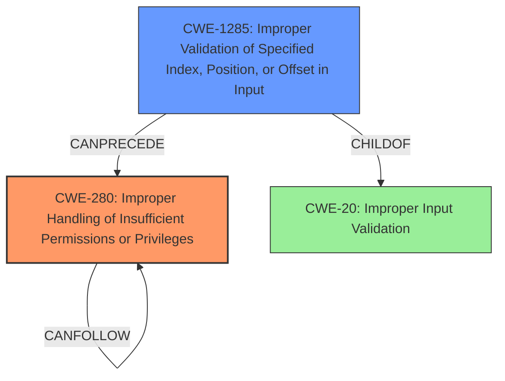

# Analysis Report for CVE-2022-30330

# Vulnerability Analysis Report: CVE-2022-30330

## Description


## Analysis (with Relationship Data)

# Summary
| CWE ID | CWE Name | Confidence | CWE Abstraction Level | CWE Vulnerability Mapping Label | CWE-Vulnerability Mapping Notes |
|---|---|---|---|---|---|
| CWE-280 | Improper Handling of Insufficient Permissions or Privileges | 0.9 | Base | Allowed | Primary CWE |
| CWE-1285 | Improper Validation of Specified Index, Position, or Offset in Input | 0.7 | Base | Allowed | Secondary CWE |

## Evidence and Confidence

*   **Confidence Score:** 0.8
*   **Evidence Strength:** HIGH

## Relationship Analysis
The primary CWE is CWE-280, which deals with improper handling of insufficient privileges. This is a base-level CWE. The secondary CWE is CWE-1285, which deals with improper validation of specified index, position, or offset in input. This vulnerability can be considered as a prerequisite for privilege escalation.



## Vulnerability Chain
The vulnerability chain starts with **flaws in the supervisor interface**. These flaws lead to insufficient checks on flash sector erase and block write functionalities, and unrestricted memory and flash overwrite, ultimately leading to privilege escalation, device inoperability, and bootloader compromise.
  - The **flaws in the supervisor interface** (root cause)
  - **Insufficient protection of flash sector erase functionality** (CWE-1285)
  - **Insufficient protection of flash block write functionality**
  - Unrestricted memory and flash overwrite via supervisor functions (CWE-280)
  - Privilege escalation and device inoperability (impact)

## Summary of Analysis
The initial analysis pointed to privilege escalation due to **flaws in the supervisor interface**, indicating a problem with how permissions and privileges are managed. The retriever results highlighted several potentially relevant CWEs, including CWE-280 (Improper Handling of Insufficient Permissions or Privileges), CWE-1285 (Improper Validation of Specified Index, Position, or Offset in Input), and CWE-284 (Improper Access Control).

Based on the detailed information in the CVE Reference Links Content Summary, the **root cause** lies in **insufficient protection mechanisms** within the KeepKey hardware wallet's supervisor code. This leads to vulnerabilities such as insufficient protection of flash sector erase functionality, insufficient protection of flash block write functionality, and unrestricted memory and flash overwrite via supervisor functions.

Given the specific details, CWE-280 (Improper Handling of Insufficient Permissions or Privileges) is the most appropriate primary CWE. It accurately captures the **root cause** where the product doesn't handle insufficient privileges correctly, leading to unexpected code paths and an invalid state. The supervisor interface, which should restrict access to certain functionalities, fails to do so properly, allowing for privilege escalation. The evidence supporting this includes the ability to bypass security restrictions, overwrite the trusted bootloader code, and compromise the hardware wallet.

CWE-1285 (Improper Validation of Specified Index, Position, or Offset in Input) is also relevant as a secondary CWE. The vulnerability description mentions the use of a 32-bit integer for the sector number when an 8-bit integer is expected, leading to bypassing of the blocklist of restricted sectors. This indicates an improper validation of the specified index, position, or offset in input.

CWE-284 (Improper Access Control) was considered but deemed too broad. While the vulnerability involves access control issues, CWE-280 is more specific to the **improper handling of insufficient privileges**.

The selected CWEs are at the optimal level of specificity. They accurately represent the weaknesses described in the vulnerability description and are supported by the provided evidence.

Relevant CWE Information:

# Enhanced Context (25 CWEs)
The following CWEs were identified as potentially relevant to this vulnerability:

## CWE-1289: Improper Validation of Unsafe Equivalence in Input
**Abstraction Level**: Base
**Similarity Score**: 0.78
**Source**: dense

**Description**:
The product receives an input value that is used as a resource identifier or other type of reference, but it does not validate or incorrectly validates that the input is equivalent to a potentially-unsafe value.

**Mapping Guidance**:
- Usage: Allowed
- Rationale: This CWE entry is at the Base level of abstraction, which is a preferred level of abstraction for mapping to the root causes of vulnerabilities.

## CWE-807: Reliance on Untrusted Inputs in a Security Decision
**Abstraction Level**: Base
**Similarity Score**: 0.78
**Source**: dense

**Description**:
The product uses a protection mechanism that relies on the existence or values of an input, but the input can be modified by an untrusted actor in a way that bypasses the protection mechanism.

**Mapping Guidance**:
- Usage: Allowed
- Rationale: This CWE entry is at the Base level of abstraction, which is a preferred level of abstraction for mapping to the root causes of vulnerabilities.

## CWE-345: Insufficient Verification of Data Authenticity
**Abstraction Level**: Class
**Similarity Score**: 0.77
**Source**: dense

**Description**:
The product does not sufficiently verify the origin or authenticity of data, in a way that causes it to accept invalid data.

**Mapping Guidance**:
- Usage: Discouraged
- Rationale: This CWE entry is a level-1 Class (i.e., a child of a Pillar). It might have lower-level children that would be more appropriate

## CWE-303: Incorrect Implementation of Authentication Algorithm
**Abstraction Level**: Base
**Similarity Score**: 0.76
**Source**: dense

**Description**:
The requirements for the product dictate the use of an established authentication algorithm, but the implementation of the algorithm is incorrect.

**Mapping Guidance**:
- Usage: Allowed
- Rationale: This CWE entry is at the Base level of abstraction, which is a preferred level of abstraction for mapping to the root causes of vulnerabilities.

## CWE-657: Violation of Secure Design Principles
**Abstraction Level**: Class
**Similarity Score**: 0.76
**Source**: dense

**Description**:
The product violates well-established principles for secure design.

**Mapping Guidance**:
- Usage: Discouraged
- Rationale: This CWE entry is a level-1 Class (i.e., a child of a Pillar). It might have lower-level children that would be more appropriate

## CWE-1391: Use of Weak Credentials
**Abstraction Level**: Class
**Similarity Score**: 0.75
**Source**: dense

**Description**:
The product uses weak credentials (such as a default key or hard-coded password) that can be calculated, derived, reused, or guessed by an attacker.

**Mapping Guidance**:
- Usage: Allowed-with-Review
- Rationale: This CWE entry is a Class and might have Base-level children that would be more appropriate

## CWE-274: Improper Handling of Insufficient Privileges
**Abstraction Level**: Base
**Similarity Score**: 0.75
**Source**: dense

**Description**:
The product does not handle or incorrectly handles when it has insufficient privileges to perform an operation, leading to resultant weaknesses.

**Mapping Guidance**:
- Usage: Discouraged
- Rationale: This CWE entry could be deprecated in a future version of CWE.

## CWE-1390: Weak Authentication
**Abstraction Level**: Class
**Similarity Score**: 0.75
**Source**: dense

**Description**:
The product uses an authentication mechanism to restrict access to specific users or identities, but the mechanism does not sufficiently prove that the claimed identity is correct.

**Mapping Guidance**:
- Usage: Allowed-with-Review
- Rationale: This CWE entry is a Class and might have Base-level children that would be more appropriate

## CWE-703: Improper Check or Handling of Exceptional Conditions
**Abstraction Level**: Pillar
**Similarity Score**: 0.75
**Source**: dense

**Description**:
The product does not properly anticipate or handle exceptional conditions that rarely occur during normal operation of the product.

**Mapping Guidance**:
- Usage: Discouraged
- Rationale: This CWE entry is extremely high-level, a Pillar.

## CWE-280: Improper Handling of Insufficient Permissions or Privileges
**Abstraction Level**: Base
**Similarity Score**: 0.75
**Source**: dense

**Description**:
The product does not handle or incorrectly handles when it has insufficient privileges to access resources or functionality as specified by their permissions.


## CWE Relationship Analysis

Current CWEs represent these abstraction levels: .


### Vulnerability Chain Analysis

**Chain starting from CWE-280:**
- 280 (Improper Handling of Insufficient Permissions or Privileges ) - ROOT


**Chain starting from CWE-807:**
- 807 (Reliance on Untrusted Inputs in a Security Decision) - ROOT


### CWE Relationship Diagram

```mermaid
graph TD
    classDef primary fill:#f96,stroke:#333,stroke-width:2px
    classDef secondary fill:#69f,stroke:#333
    classDef tertiary fill:#9e9,stroke:#333
```


*Report generated on 2025-03-31 13:35:21*
