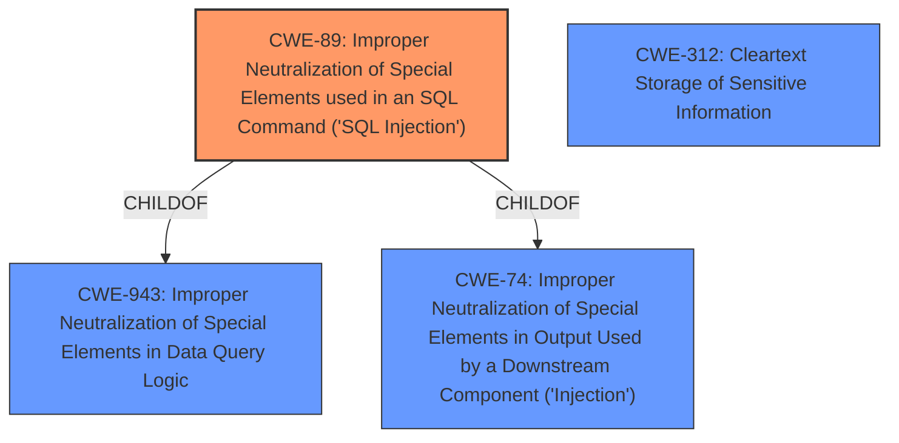

# Raw Analyzer Response for CVE-2022-30335

# Summary
| CWE ID | CWE Name | Confidence | CWE Abstraction Level | CWE Vulnerability Mapping Label | CWE-Vulnerability Mapping Notes |
|---|---|---|---|---|---|
| CWE-89 | Improper Neutralization of Special Elements used in an SQL Command ('SQL Injection') | 1.0 | Base | Primary | Allowed |
| CWE-312 | Cleartext Storage of Sensitive Information | 0.4 | Base | Secondary | Allowed |

## Evidence and Confidence

*   **Confidence Score:** 0.9
*   **Evidence Strength:** HIGH

## Relationship Analysis
The primary CWE is CWE-89, which represents the **SQL Injection** vulnerability directly. CWE-89 is a base-level CWE, providing a specific classification. CWE-89 is a child of CWE-943 (Improper Neutralization of Special Elements in Data Query Logic) and CWE-74 (Improper Neutralization of Special Elements in Output Used by a Downstream Component ('Injection')), placing it within the broader context of injection vulnerabilities.

## Vulnerability Chain
The vulnerability chain starts with **improper neutralization of special elements** in the user-supplied input. This allows an attacker to inject SQL commands. As a result, the attacker can **collect all passwords in encrypted format** from the Microsoft SQL Server component. The chain is as follows:
1.  **Improper Neutralization of Input:** User input is not properly sanitized. (CWE-89)
2.  **SQL Injection:** Malicious SQL code is injected into the query. (CWE-89)
3.  **Information Disclosure:** Encrypted passwords are retrieved from the database. (Potential link to CWE-312 if encryption is weak or improperly handled).

## Summary of Analysis
The initial analysis identified the **SQL Injection** vulnerability. The vulnerability description clearly states that the application is vulnerable to **SQL injection** via the login form. The **root cause** is the **failure to properly sanitize user input**, allowing an attacker to inject malicious SQL code. The impact is that an attacker can retrieve all passwords in encrypted format from the Microsoft SQL Server database.

The "CVE Reference Links Content Summary" confirms the **SQL injection** in the login form due to the application's **failure to properly sanitize user input** in the "User Name" field. This allows an attacker to inject malicious SQL code and retrieve all encrypted passwords.

CWE-89 (Improper Neutralization of Special Elements used in an SQL Command ('SQL Injection')) is the most appropriate CWE because it directly addresses the **SQL injection** vulnerability described. The CWE description matches the vulnerability details, and the mapping guidance allows its usage.

CWE-312 (Cleartext Storage of Sensitive Information) was considered because the vulnerability description mentions that the attacker can retrieve "all passwords in encrypted format." While the passwords are encrypted, the vulnerability lies in the ability to retrieve them due to the SQL injection. If the passwords were not properly encrypted or if the encryption method was weak, CWE-312 might be more relevant. However, based on the provided information, the primary issue is the **SQL injection** that allows access to the encrypted passwords, making CWE-89 the more appropriate primary CWE. The confidence in adding CWE-312 as a secondary CWE is low.

Other CWEs considered but not selected:

*   CWE-79 (Improper Neutralization of Input During Web Page Generation ('Cross-site Scripting')): This CWE is not applicable because the vulnerability is related to **SQL injection**, not cross-site scripting.
*   CWE-94 (Improper Control of Generation of Code ('Code Injection')): While **SQL injection** can lead to code execution in some cases, the primary issue here is the **improper neutralization of special elements** in the SQL command, making CWE-89 more relevant.
*   CWE-502 (Deserialization of Untrusted Data): This CWE is not applicable as the vulnerability does not involve deserialization of untrusted data.

Relevant CWE Information:

## CWE-943: Improper Neutralization of Special Elements in Data Query Logic
**Abstraction Level**: Class
**Similarity Score**: 0.81
**Source**: dense

**Description**:
The product generates a query intended to access or manipulate data in a data store such as a database, but it does not neutralize or incorrectly neutralizes special elements that can modify the intended logic of the query.

**Mapping Guidance**:
- Usage: Allowed-with-Review
- Rationale: This CWE entry is a Class and might have Base-level children that would be more appropriate

## CWE-74: Improper Neutralization of Special Elements in Output Used by a Downstream Component ('Injection')
**Abstraction Level**: Class
**Similarity Score**: 0.76
**Source**: dense

**Description**:
The product constructs all or part of a command, data structure, or record using externally-influenced input from an upstream component, but it does not neutralize or incorrectly neutralizes special elements that could modify how it is parsed or interpreted when it is sent to a downstream component.

**Mapping Guidance**:
- Usage: Discouraged
- Rationale: CWE-74 is high-level and often misused when lower-level weaknesses are more appropriate.

## CWE-89: Improper Neutralization of Special Elements used in an SQL Command ('SQL Injection')
**Abstraction Level**: Base
**Similarity Score**: 7761.63
**Source**: sparse

**Description**:
The product constructs all or part of an SQL command using externally-influenced input from an upstream component, but it does not neutralize or incorrectly neutralizes special elements that could modify the intended SQL command when it is sent to a downstream component. Without sufficient removal or quoting of SQL syntax in user-controllable inputs, the generated SQL query can cause those inputs to be interpreted as SQL instead of ordinary user data.

**Mapping Guidance**:
- Usage: Allowed
- Rationale: This CWE entry is at the Base level of abstraction, which is a preferred level of abstraction for mapping to the root causes of vulnerabilities.

## CWE-312: Cleartext Storage of Sensitive Information
**Abstraction Level**: Base
**Similarity Score**: 0.208
**Source**: sparse

**Description**:
The product stores sensitive information in cleartext within a resource that might be accessible to another control sphere.

**Mapping Guidance**:
- Usage: Allowed
- Rationale: This CWE entry is at the Base level of abstraction, which is a preferred level of abstraction for mapping to the root causes of vulnerabilities.