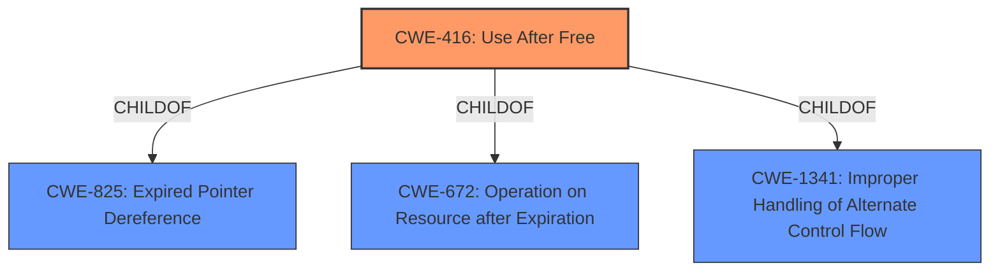

# Enhanced Analysis for CVE-2022-3039

# Summary
| CWE ID | CWE Name | Confidence | CWE Abstraction Level | CWE Vulnerability Mapping Label | CWE-Vulnerability Mapping Notes |
|---|---|---|---|---|---|
| CWE-416 | Use After Free | 1 | Variant | Primary | Allowed |

## Evidence and Confidence

*   **Confidence Score:** 1
*   **Evidence Strength:** HIGH

## Relationship Analysis
The primary identified weakness is CWE-416 Use After Free, which is a variant-level CWE. This CWE is a child of CWE-825 Expired Pointer Dereference, as well as CWE-672, and CWE-1341. The description of CWE-416 directly aligns with the vulnerability description, making it an appropriate and specific choice.



## Vulnerability Chain
The vulnerability chain starts with a **use after free** (CWE-416) in WebSQL within Google Chrome, which leads to potential **heap corruption**. The attack vector is a crafted HTML page, allowing a remote attacker to exploit the vulnerability.

## Summary of Analysis
The primary weakness is a **use after free** vulnerability. The vulnerability description explicitly mentions "use after free" as the root cause, and the CVE Reference Links Content Summary confirms this. The description states "Use after free in WebSQL in Google Chrome prior to 105.0.5195.52 allowed a remote attacker to potentially exploit **heap corruption** via a crafted HTML page." The primary CWE match from similar CVE descriptions is also CWE-416.

CWE-416 is a variant-level CWE, which is the preferred level of abstraction. Therefore, no further refinement is necessary. The "Mapping Guidance" for CWE-416 states "This CWE entry is at the Variant level of abstraction, which is a preferred level of abstraction for mapping to the root causes of vulnerabilities."

The other CWEs were considered, but not chosen:
*   CWE-366 (Race Condition within a Thread): While race conditions can sometimes lead to use-after-free vulnerabilities, there is no explicit mention of a race condition in the vulnerability description.
*   CWE-843 (Access of Resource Using Incompatible Type ('Type Confusion')): This CWE is not directly related to the **use after free** condition described.
*   CWE-122 (Heap-based Buffer Overflow): While **heap corruption** is mentioned, the root cause is the **use after free**, not a buffer overflow.
*   CWE-415 (Double Free): This CWE is similar to **use after free**, but the vulnerability description specifically mentions a **use after free**, not a double free.
*   CWE-1022 (Use of Web Link to Untrusted Target with window.opener Access): This CWE is specific to web link vulnerabilities, which is not the case here.
*   CWE-123 (Write-what-where Condition): While this could be a consequence of **heap corruption**, the root cause is the **use after free**.
*   CWE-362 (Concurrent Execution using Shared Resource with Improper Synchronization ('Race Condition'))
*   CWE-911 (Improper Update of Reference Count): This is not directly mentioned in the description, so is not appropriate.
*   CWE-358 (Improperly Implemented Security Check for Standard): This is not directly mentioned in the description, so is not appropriate.


## CWE Relationship Analysis

Current CWEs represent these abstraction levels: .


### Vulnerability Chain Analysis

**Chain starting from CWE-825:**
- 825 (Expired Pointer Dereference) - ROOT


**Chain starting from CWE-672:**
- 672 (Operation on a Resource after Expiration or Release) - ROOT


### CWE Relationship Diagram

```mermaid
graph TD
    classDef primary fill:#f96,stroke:#333,stroke-width:2px
    classDef secondary fill:#69f,stroke:#333
    classDef tertiary fill:#9e9,stroke:#333
```