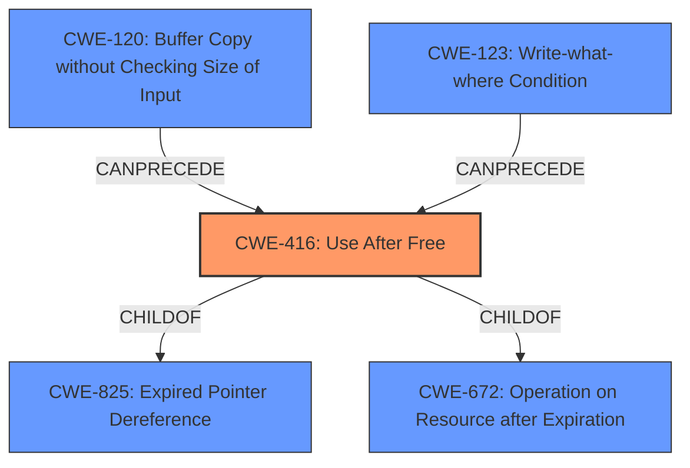

# Analysis Report for CVE-2022-3041

# Vulnerability Analysis Report: CVE-2022-3041

## Description


## Analysis (with Relationship Data)

# Summary
| CWE ID | CWE Name | Confidence | CWE Abstraction Level | CWE Vulnerability Mapping Label | CWE-Vulnerability Mapping Notes |
|---|---|---|---|---|---|
| CWE-416 | Use After Free | 1.0 | Variant | Primary | Allowed |

## Evidence and Confidence

*   **Confidence Score:** 1.0
*   **Evidence Strength:** HIGH

## Relationship Analysis
The primary CWE is CWE-416 (**Use After Free**). The CWE-416 is a variant and a child of CWE-825 (**Expired Pointer Dereference**) and CWE-672 (**Operation on Resource after Expiration**). It can be preceded by CWE-120 (**Buffer Copy without Checking Size of Input**) and CWE-123 (**Write-what-where Condition**).



## Vulnerability Chain
The vulnerability chain starts with a **use after free** (CWE-416) which leads to heap corruption. The attacker can potentially exploit this heap corruption by crafting a malicious HTML page.

## Summary of Analysis
The vulnerability description clearly states that the **rootcause** of the vulnerability is a **use after free** in WebSQL in Google Chrome. This directly corresponds to CWE-416 (**Use After Free**). The CVE Reference Links Content Summary also confirms the **root cause** as **use-after-free** and states that a **use-after-free** vulnerability occurs when a program attempts to access memory that has already been freed, leading to unpredictable behavior.

The retriever results also lists CWE-416 as the top candidate.

The CWE-416 is at the Variant level of abstraction, which is the preferred level. The usage is Allowed.

Other CWEs considered:
*   CWE-366 (**Race Condition within a Thread**): This CWE was considered because concurrent execution can sometimes lead to use-after-free vulnerabilities. However, there is no explicit mention of threads or concurrency in the vulnerability description.
*   CWE-843 (**Access of Resource Using Incompatible Type ('Type Confusion')**): This CWE was considered because type confusion can also lead to memory corruption. However, the vulnerability description clearly points to a use-after-free condition, not type confusion.
*   CWE-415 (**Double Free**): While related to memory management issues, the specific **rootcause** is **use after free**, not a double free.
*   CWE-122 (**Heap-based Buffer Overflow**): The impact of the vulnerability is heap corruption, but the **rootcause** is a **use after free**, not a buffer overflow.
*   CWE-123 (**Write-what-where Condition**): This could be a consequence of the UAF, but it is not the **rootcause** itself.
*   CWE-911 (**Improper Update of Reference Count**): This is also related to memory management, but the **rootcause** is not related to reference counting.

Therefore, CWE-416 is the most accurate and specific mapping for this vulnerability.


## CWE Relationship Analysis

Current CWEs represent these abstraction levels: .


### Vulnerability Chain Analysis

**Chain starting from CWE-825:**
- 825 (Expired Pointer Dereference) - ROOT


**Chain starting from CWE-672:**
- 672 (Operation on a Resource after Expiration or Release) - ROOT


### CWE Relationship Diagram

```mermaid
graph TD
    classDef primary fill:#f96,stroke:#333,stroke-width:2px
    classDef secondary fill:#69f,stroke:#333
    classDef tertiary fill:#9e9,stroke:#333
```


*Report generated on 2025-03-30 21:12:11*
