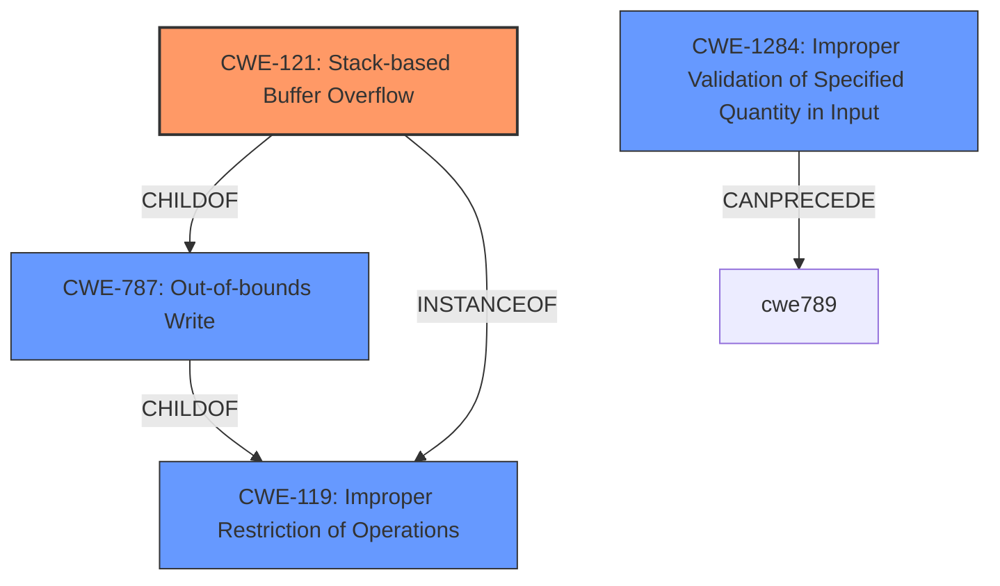

# Enhanced Analysis for CVE-2022-30426

# Summary
| CWE ID | CWE Name | Confidence | CWE Abstraction Level | CWE Vulnerability Mapping Label | CWE-Vulnerability Mapping Notes |
|---|---|---|---|---|---|
| CWE-121 | Stack-based Buffer Overflow | 1.0 | Variant | Primary CWE | Allowed |
| CWE-1284 | Improper Validation of Specified Quantity in Input | 0.7 | Base | Secondary Candidate | Allowed |
| CWE-787 | Out-of-bounds Write | 0.6 | Base | Secondary Candidate | Allowed |
| CWE-119 | Improper Restriction of Operations within the Bounds of a Memory Buffer | 0.4 | Class | Secondary Candidate | Discouraged |

## Evidence and Confidence

*   **Confidence Score:** 0.8
*   **Evidence Strength:** HIGH

## Relationship Analysis
The primary CWE, CWE-121 Stack-based Buffer Overflow, is a variant of CWE-787 Out-of-bounds Write and CWE-119 Improper Restriction of Operations within the Bounds of a Memory Buffer. The vulnerability involves a stack buffer overflow, making CWE-121 the most specific and appropriate choice. CWE-1284 Improper Validation of Specified Quantity in Input, could precede CWE-789 Memory Allocation with Excessive Size Value, which is a way a stack buffer overflow can happen.



## Vulnerability Chain
The vulnerability chain involves the following steps:
1.  **Improper Input Validation (CWE-1284):** The application **fails to validate the size** of the data being read from NVRAM variables.
2.  **Stack-based Buffer Overflow (CWE-121):** Due to the lack of validation, a large value is used, leading to a **stack buffer overflow** when `gRT->GetVariable` is called.
3.  **Out-of-bounds Write (CWE-787):** The overflow results in writing data beyond the allocated buffer on the stack, leading to **arbitrary code execution.**

## Summary of Analysis
The initial analysis focused on identifying the root cause of the vulnerability. The description clearly states a "**stack buffer overflow**" vulnerability, which directly corresponds to CWE-121. The "CVE Reference Links Content Summary" section provides further details, emphasizing the **improper handling of NVRAM variables** and the **potential for arbitrary code execution** due to the overflow.

The relationship analysis confirms that CWE-121 is a specific type of buffer overflow that occurs on the stack, making it a more precise match than its parent CWEs, CWE-787 and CWE-119. While CWE-119 is a broader category, CWE-121 provides more specific information about the location of the buffer. CWE-1284, Improper Validation of Specified Quantity in Input, highlights the **failure to validate the size of the NVRAM data**, which is a contributing factor to the overflow.

The decision to prioritize CWE-121 is based on the clear description of a "stack buffer overflow" and the supporting evidence from the "CVE Reference Links Content Summary" section. This level of specificity is preferred over more general CWEs like CWE-119.

Relevant CWE Information:

# Enhanced Context (25 CWEs)
The following CWEs were identified as potentially relevant to this vulnerability:

## CWE-668: Exposure of Resource to Wrong Sphere
**Abstraction Level**: Class
**Similarity Score**: 0.77

## CWE-754: Improper Check for Unusual or Exceptional Conditions
**Abstraction Level**: Class
**Similarity Score**: 0.77

## CWE-667: Improper Locking
**Abstraction Level**: Class
**Similarity Score**: 0.77

## CWE-755: Improper Handling of Exceptional Conditions
**Abstraction Level**: Class
**Similarity Score**: 0.77

## CWE-345: Insufficient Verification of Data Authenticity
**Abstraction Level**: Class
**Similarity Score**: 0.77

## CWE-807: Reliance on Untrusted Inputs in a Security Decision
**Abstraction Level**: Base
**Similarity Score**: 0.77

## CWE-252: Unchecked Return Value
**Abstraction Level**: Base
**Similarity Score**: 0.77

## CWE-226: Sensitive Information in Resource Not Removed Before Reuse
**Abstraction Level**: Base
**Similarity Score**: 0.77

## CWE-119: Improper Restriction of Operations within the Bounds of a Memory Buffer
**Abstraction Level**: Class
**Similarity Score**: 0.77

## CWE-41: Improper Resolution of Path Equivalence
**Abstraction Level**: Base
**Similarity Score**: 0.76

## CWE-190: Integer Overflow or Wraparound
**Abstraction Level**: Base
**Similarity Score**: 7080.58

## CWE-1284: Improper Validation of Specified Quantity in Input
**Abstraction Level**: Base
**Similarity Score**: 6755.40

## CWE-125: Out-of-bounds Read
**Abstraction Level**: Base
**Similarity Score**: 6695.73

## CWE-119: Improper Restriction of Operations within the Bounds of a Memory Buffer
**Abstraction Level**: Class
**Similarity Score**: 6642.43

## CWE-121: Stack-based Buffer Overflow
**Abstraction Level**: Variant
**Similarity Score**: 6601.52

## CWE-128: Wrap-around Error
**Abstraction Level**: base
**Similarity Score**: 5.03

## CWE-190: Integer Overflow or Wraparound
**Abstraction Level**: base
**Similarity Score**: 5.03

## CWE-1284: Improper Validation of Specified Quantity in Input
**Abstraction Level**: base
**Similarity Score**: 4.33

## CWE-681: Incorrect Conversion between Numeric Types
**Abstraction Level**: base
**Similarity Score**: 4.33

## CWE-123: Write-what-where Condition
**Abstraction Level**: base
**Similarity Score**: 3.89

## CWE-1339: Insufficient Precision or Accuracy of a Real Number
**Abstraction Level**: base
**Similarity Score**: 3.57

## CWE-787: Out-of-bounds Write
**Abstraction Level**: base
**Similarity Score**: 3.30

## CWE-789: Memory Allocation with Excessive Size Value
**Abstraction Level**: variant
**Similarity Score**: 3.24

## CWE-416: Use After Free
**Abstraction Level**: variant
**Similarity Score**: 3.00

## CWE-20: Improper Input Validation
**Abstraction Level**: class
**Similarity Score**: 2.92

### Considerations and Justifications for not Using Other CWEs:

*   **CWE-20 (Improper Input Validation)**: While the vulnerability involves **improper input validation** regarding the size of NVRAM variables, CWE-1284 is more specific to the validation of quantity, making it a better fit as a secondary CWE. CWE-20 is too broad and discouraged for use.
*   **CWE-119 (Improper Restriction of Operations within the Bounds of a Memory Buffer)**: Although relevant as a parent of CWE-121, it's less specific than CWE-121, which explicitly describes a stack-based buffer overflow. The mapping guidance discourages the use of CWE-119 when more specific CWEs are available.
*   **CWE-787 (Out-of-bounds Write)**: This is a parent of CWE-121. It could be considered a secondary CWE since the stack buffer overflow leads to writing outside the bounds of the allocated buffer.
*   **CWE-190 (Integer Overflow or Wraparound)**: Although an integer overflow could potentially be involved in calculating the buffer size, the primary issue is the overflow itself, not the integer overflow. Therefore, it is not included.
*   **CWE-1284 (Improper Validation of Specified Quantity in Input)**: The vulnerability involves the **failure to validate the size** of the NVRAM variable, which leads to


## CWE Relationship Analysis

Current CWEs represent these abstraction levels: .


### Vulnerability Chain Analysis

**Chain starting from CWE-41:**
- 41 (Improper Resolution of Path Equivalence) - ROOT


**Chain starting from CWE-807:**
- 807 (Reliance on Untrusted Inputs in a Security Decision) - ROOT


### CWE Relationship Diagram

```mermaid
graph TD
    classDef primary fill:#f96,stroke:#333,stroke-width:2px
    classDef secondary fill:#69f,stroke:#333
    classDef tertiary fill:#9e9,stroke:#333
```