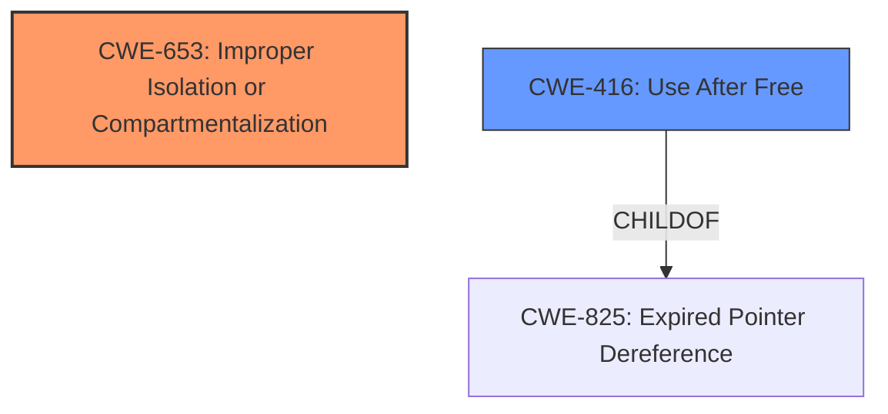

# Analysis for CVE-2022-3044

# Summary
| CWE ID | CWE Name | Confidence | CWE Abstraction Level | CWE Vulnerability Mapping Label | CWE-Vulnerability Mapping Notes |
|---|---|---|---|---|---|
| CWE-653 | Improper Isolation or Compartmentalization | 0.7 | Class | Allowed | Primary CWE |
| CWE-416 | Use After Free | 0.5 | Variant | Allowed | Secondary Candidate |

## Evidence and Confidence

*   **Confidence Score:** 0.7
*   **Evidence Strength:** MEDIUM

## Relationship Analysis
The primary CWE selected is CWE-653, which is a Class-level weakness related to **improper isolation**. The secondary CWE is CWE-416, a Variant-level weakness, **Use After Free**. While not directly related as parent and child, both can stem from memory management or state management issues, which might occur in a complex system like Site Isolation.

## Vulnerability Chain
The vulnerability chain starts with an **inappropriate implementation** in the Site Isolation feature, leading to a bypass of site isolation. A possible secondary issue may involve memory being freed prematurely, leading to a **use-after-free** condition.

## Summary of Analysis
The initial assessment focused on the **improper implementation in Site Isolation**, which directly points to CWE-653 (**Improper Isolation or Compartmentalization**). The vulnerability description key phrases highlight this **rootcause**. The CVE Reference Links Content Summary supports this by specifying "**Inappropriate implementation** in the Site Isolation component of the Chromium browser."

CWE-416 (**Use After Free**) was considered as a secondary CWE because memory management issues can sometimes be present in isolation-related vulnerabilities. However, evidence for this is weak and only inferred.

The final decision primarily relies on the explicit statement of **improper implementation in Site Isolation**. The selection of CWE-653 is at the Class level, which seems appropriate given the available information. More specific base or variant level CWEs could be selected if more technical details were known, but the current description lacks the necessary details.

Relevant CWE Information:

# Enhanced Context (25 CWEs)

## CWE-653: Improper Isolation or Compartmentalization
**Abstraction Level**: Class
**Similarity Score**: 0.78
**Source**: dense

**Description**:
The product does not properly compartmentalize or isolate functionality, processes, or resources that require different privilege levels, rights, or permissions.

**Mapping Guidance**:
- Usage: Allowed
- Rationale: This CWE entry is at the Base level of abstraction, which is a preferred level of abstraction for mapping to the root causes of vulnerabilities.

## CWE-416: Use After Free
**Abstraction Level**: variant
**Similarity Score**: 4.33
**Source**: graph

**Description**:
CWE-416: Use After Free

**Mapping Guidance**:
- Usage: Allowed
- Rationale: This CWE entry is at the Variant level of abstraction, which is a preferred level of abstraction for mapping to the root causes of vulnerabilities.