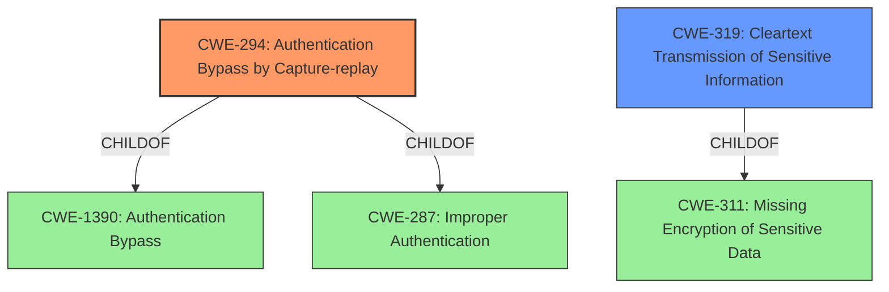

# Enhanced Analysis for CVE-2022-30466

# Summary
| CWE ID  | CWE Name                                            | Confidence | CWE Abstraction Level | CWE Vulnerability Mapping Label | CWE-Vulnerability Mapping Notes |
| :-------- | :-------------------------------------------------- | :--------- | :---------------------- | :------------------------------ | :------------------------------ |
| CWE-294 | Authentication Bypass by Capture-replay           | 1.0        | Base                    | Allowed                         | Primary CWE                     |
| CWE-319 | Cleartext Transmission of Sensitive Information | 0.6        | Base                    | Allowed                         | Secondary Candidate           |

## Evidence and Confidence

*   **Confidence Score:** 0.8
*   **Evidence Strength:** HIGH

## Relationship Analysis
The primary CWE is CWE-294, which is a Base level CWE. It is related to CWE-1390 and CWE-287 as a ChildOf. The secondary CWE is CWE-319. CWE-319 is related to CWE-311 as a ChildOf.


## Vulnerability Chain
The vulnerability chain starts with the **lack of proper authentication or replay protection** (CWE-294), leading to the **ability to unlock and drive the ebike by replaying a previously captured command**, resulting in **Authentication Bypass**.

## Summary of Analysis
The primary weakness identified is CWE-294, Authentication Bypass by Capture-replay. This is directly supported by the vulnerability description stating "joyebike Joy ebike Wolf Manufacturing year 2022 is vulnerable to Authentication Bypass by Capture-replay." and the "Root cause of vulnerability": "The Joy ebike Wolf 2022 model uses a key fob to lock and unlock the scooter. The unlock/drive command sent by the key fob is vulnerable to replay attacks.". This is a base level CWE and the description matches the observed behavior.

The secondary weakness to consider is CWE-319, Cleartext Transmission of Sensitive Information. This is based on the fact that the attack is possible by sniffing the radio frequency communication. This is somewhat implied from the attack vector in the "CVE Reference Links Content Summary": "The attacker uses a Hackrf device to sniff the radio frequency communication between the key fob and the ebike, capturing the unlock/drive command, and then replaying the command.". I have reduced the confidence since the cleartext transmission is only implied, not directly stated.

CWE-1392, Use of Default Credentials was considered but not used. While it is possible that the key fob uses a default key, there is no evidence of that in the description, so it was not used.

CWE-1269, Product Released in Non-Release Configuration was considered but not used. There is no evidence of that in the description, so it was not used.

Relevant CWE Information:

# Enhanced Context (25 CWEs)
The following CWEs were identified as potentially relevant to this vulnerability:

## CWE-319: Cleartext Transmission of Sensitive Information
**Abstraction Level**: Base
**Similarity Score**: 0.79
**Source**: dense

**Description**:
The product transmits sensitive or security-critical data in cleartext in a communication channel that can be sniffed by unauthorized actors.

**Mapping Guidance**:
- Usage: Allowed
- Rationale: This CWE entry is at the Base level of abstraction, which is a preferred level of abstraction for mapping to the root causes of vulnerabilities.

## CWE-614: Sensitive Cookie in HTTPS Session Without 'Secure' Attribute
**Abstraction Level**: Variant
**Similarity Score**: 0.79
**Source**: dense

**Description**:
The Secure attribute for sensitive cookies in HTTPS sessions is not set, which could cause the user agent to send those cookies in plaintext over an HTTP session.

## CWE-1391: Use of Weak Credentials
**Abstraction Level**: Class
**Similarity Score**: 0.78
**Source**: dense

**Description**:
The product uses weak credentials (such as a default key or hard-coded password) that can be calculated, derived, reused, or guessed by an attacker.

## CWE-807: Reliance on Untrusted Inputs in a Security Decision
**Abstraction Level**: Base
**Similarity Score**: 0.78
**Source**: dense

**Description**:
The product uses a protection mechanism that relies on the existence or values of an input, but the input can be modified by an untrusted actor in a way that bypasses the protection mechanism.

## CWE-312: Cleartext Storage of Sensitive Information
**Abstraction Level**: Base
**Similarity Score**: 0.77
**Source**: dense

**Description**:
The product stores sensitive information in cleartext within a resource that might be accessible to another control sphere.

## CWE-294: Authentication Bypass by Capture-replay
**Abstraction Level**: Base
**Similarity Score**: 0.77
**Source**: dense

**Description**:
A capture-replay flaw exists when the design of the product makes it possible for a malicious user to sniff network traffic and bypass authentication by replaying it to the server in question to the same effect as the original message (or with minor changes).

## CWE-345: Insufficient Verification of Data Authenticity
**Abstraction Level**: Class
**Similarity Score**: 0.77
**Source**: dense

**Description**:
The product does not sufficiently verify the origin or authenticity of data, in a way that causes it to accept invalid data.

## CWE-668: Exposure of Resource to Wrong Sphere
**Abstraction Level**: Class
**Similarity Score**: 0.77
**Source**: dense

**Description**:
The product exposes a resource to the wrong control sphere, providing unintended actors with inappropriate access to the resource.

## CWE-303: Incorrect Implementation of Authentication Algorithm
**Abstraction Level**: Base
**Similarity Score**: 0.77
**Source**: dense

**Description**:
The requirements for the product dictate the use of an established authentication algorithm, but the implementation of the algorithm is incorrect.

## CWE-311: Missing Encryption of Sensitive Data
**Abstraction Level**: Class
**Similarity Score**: 0.76
**Source**: dense

**Description**:
The product does not encrypt sensitive or critical information before storage or transmission.

## CWE-319: Cleartext Transmission of Sensitive Information
**Abstraction Level**: Base
**Similarity Score**: 5059.84
**Source**: sparse

**Description**:
The product transmits sensitive or security-critical data in cleartext in a communication channel that can be sniffed by unauthorized actors.

## CWE-1269: Product Released in Non-Release Configuration
**Abstraction Level**: Base
**Similarity Score**: 5032.34
**Source**: sparse

**Description**:
The product released to market is released in pre-production or manufacturing configuration.

## CWE-1392: Use of Default Credentials
**Abstraction Level**: Base
**Similarity Score**: 4832.78
**Source**: sparse

**Description**:
The product uses default credentials (such as passwords or cryptographic keys) for potentially critical functionality.

## CWE-611: Improper Restriction of XML External Entity Reference
**Abstraction Level**: Base
**Similarity Score**: 4824.52
**Source**: sparse

**Description**:
The product processes an XML document that can contain XML entities with URIs that resolve to documents outside of the intended sphere of control, causing the product to embed incorrect documents into its output.

## CWE-1391: Use of Weak Credentials
**Abstraction Level**: Class
**Similarity Score**: 4793.04
**Source**: sparse

**Description**:
The product uses weak credentials (such as a default key or hard-coded password) that can be calculated, derived, reused, or guessed by an attacker.

## CWE-611: Improper Restriction of XML External Entity Reference
**Abstraction Level**: base
**Similarity Score**: 3.64
**Source**: graph

**Description**:
CWE-611: Improper Restriction of XML External Entity Reference

## CWE-441: Unintended Proxy or Intermediary ('Confused Deputy')
**Abstraction Level**: class
**Similarity Score**: 2.54
**Source**: graph

**Description**:
CWE-4


## CWE Relationship Analysis

Current CWEs represent these abstraction levels: .


### Vulnerability Chain Analysis

**Chain starting from CWE-319:**
- 319 (Cleartext Transmission of Sensitive Information) - ROOT


**Chain starting from CWE-294:**
- 294 (Authentication Bypass by Capture-replay) - ROOT


### CWE Relationship Diagram

```mermaid
graph TD
    classDef primary fill:#f96,stroke:#333,stroke-width:2px
    classDef secondary fill:#69f,stroke:#333
    classDef tertiary fill:#9e9,stroke:#333
```