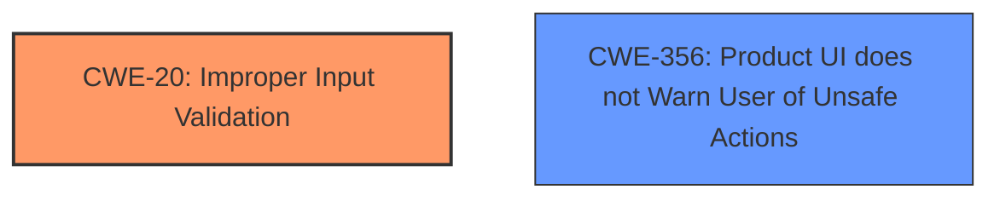

# Enhanced Analysis for CVE-2022-3047

# Summary
| CWE ID | CWE Name | Confidence | CWE Abstraction Level | CWE Vulnerability Mapping Label | CWE-Vulnerability Mapping Notes |
|---|---|---|---|---|---|
| CWE-20 | Improper Input Validation | 0.75 | Class | Primary | Allowed-with-Review |
| CWE-356 | Product UI does not Warn User of Unsafe Actions | 0.5 | Base | Secondary | Allowed |

## Evidence and Confidence

*   **Confidence Score:** 0.7
*   **Evidence Strength:** MEDIUM

## Relationship Analysis
The primary relationship that influenced the decision was the parent-child relationship between CWE-20 and more specific input validation CWEs. While the description mentions "Insufficient policy enforcement," which could imply a broader range of issues, the core problem appears to be that a crafted HTML page was able to bypass download policies. This suggests that the input (the HTML page) was not properly validated against the expected policies, leading to the vulnerability.
CWE-356 relates to the UI not warning the user about unsafe actions.



## Vulnerability Chain
The vulnerability chain starts with the **insufficient policy enforcement** (root cause). This leads to a bypass of download policies when a user is convinced to install a malicious extension and visits a crafted HTML page, which is the attack vector. The final impact is that an attacker can bypass the intended security mechanisms.

## Summary of Analysis
The initial assessment focused on the **insufficient policy enforcement** in the Extensions API. The evidence from "Vulnerability Description Key Phrases" confirms this as the **rootcause**. The CVE Reference Links Content Summary also highlights that the "vulnerability stems from inadequate policy enforcement within the Chrome Extensions API".

Given that the vulnerability involves a crafted HTML page bypassing download policies, CWE-20 (Improper Input Validation) seems like a more accurate fit than the noinfo match from similar CVEs. The weakness here is not that there is no information, but rather that the input from the crafted HTML page is not being properly validated against the download policies.

CWE-356 (Product UI does not Warn User of Unsafe Actions) is a secondary candidate as the UI could be improved to warn the user about installing extensions from untrusted sources, although the primary issue is the lack of input validation.

The chosen CWEs are at the optimal level of specificity because they directly address the root cause (improper input validation) and a possible mitigation (warning users).

Relevant CWE Information:

# Enhanced Context (25 CWEs)

## CWE-20: Improper Input Validation

The product receives input or data, but it does not validate or incorrectly validates that the input has the properties that are required to process the data safely and correctly.

This is a very broad weakness, and it is frequently used as a parent for more specific weaknesses. The key is that the product is not verifying some critical property.

**CWE-356: Product UI does not Warn User of Unsafe Actions**

The product's user interface does not warn the user before undertaking an unsafe action on behalf of that user. This makes it easier for attackers to trick users into inflicting damage to their system.

## CWE-20 Improper Input Validation
*   **How the vulnerability's details match the CWE's characteristics:** The crafted HTML page represents an input that is not properly validated against the download policies. This lack of validation allows the attacker to bypass the intended security mechanisms.
*   **The security implications and potential impact:** The impact is that malicious extensions can bypass download policies, potentially leading to data leakage, privilege escalation, or other malicious activities.
*   **Any parent-child relationships or chain patterns that influenced your mapping:** CWE-20 is a parent CWE, and there may be more specific child CWEs that could apply. However, without more information, it is difficult to determine which child CWE is the most appropriate.
*   **Whether the weakness is primary or secondary in the vulnerability:** This is the primary weakness.
*   **How the official MITRE mapping guidance influenced your decision:** The CWE-20 is a Class and might have Base-level children that would be more appropriate.

## CWE-356 Product UI does not Warn User of Unsafe Actions
*   **How the vulnerability's details match the CWE's characteristics:** The extension installation process might not adequately warn users about the risks associated with installing extensions from untrusted sources.
*   **The security implications and potential impact:** Users may be more likely to install malicious extensions if they are not properly warned about the risks.
*   **Any parent-child relationships or chain patterns that influenced your mapping:** CWE-356 is a Base level CWE and a child of CWE-221
*   **Whether the weakness is primary or secondary in the vulnerability:** This is a secondary weakness.
*   **How the official MITRE mapping guidance influenced your decision:** The CWE-356 is at the Base level of abstraction, which is a preferred level of abstraction for mapping to the root causes of vulnerabilities.

CWE-NVD-noinfo, CWE-276, CWE-451, CWE-416, CWE-366, CWE-358, CWE-64, CWE-123, CWE-138, CWE-156 and CWE-863 were considered but not used. CWE-NVD-noinfo was not selected because the description had more information than just 'no info'. CWE-276 was not selected because it refers to incorrect default permissions. The rest of the CWEs were not selected because they didn't match the description closely enough.


## CWE Relationship Analysis

Current CWEs represent these abstraction levels: .


### Vulnerability Chain Analysis

**Chain starting from CWE-356:**
- 356 (Product UI does not Warn User of Unsafe Actions) - ROOT


**Chain starting from CWE-221:**
- 221 (Information Loss or Omission) - ROOT


### CWE Relationship Diagram

```mermaid
graph TD
    classDef primary fill:#f96,stroke:#333,stroke-width:2px
    classDef secondary fill:#69f,stroke:#333
    classDef tertiary fill:#9e9,stroke:#333
```