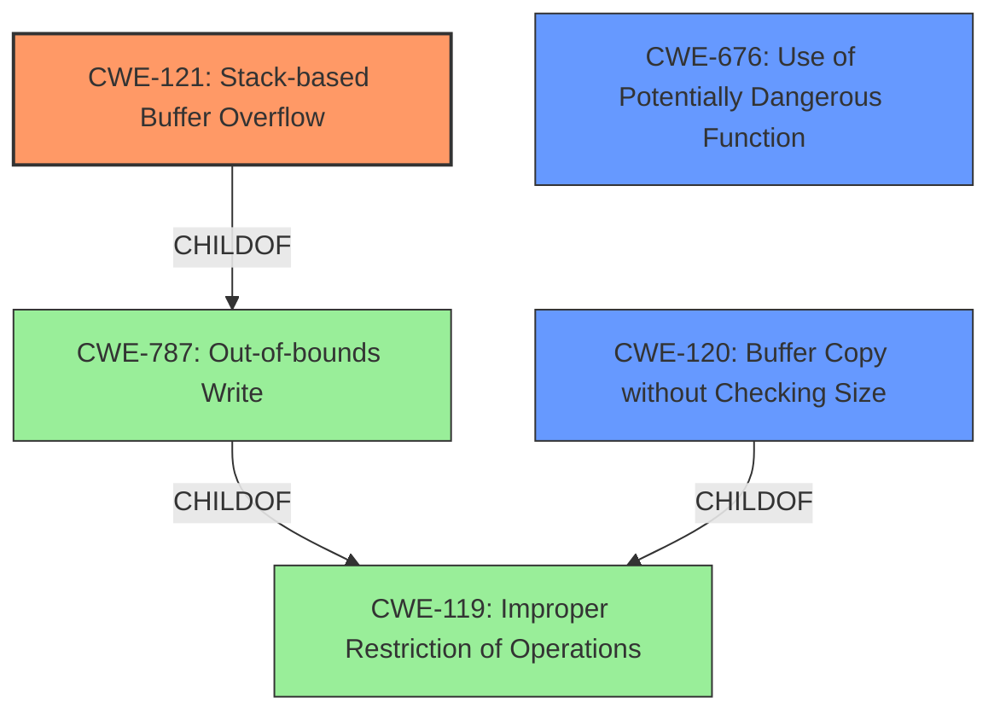

# Analysis for CVE-2022-30472

# Summary
| CWE ID | CWE Name | Confidence | CWE Abstraction Level | CWE Vulnerability Mapping Label | CWE-Vulnerability Mapping Notes |
|---|---|---|---|---|---|
| CWE-121 | Stack-based Buffer Overflow | 1.0 | Variant | Primary | Allowed |
| CWE-120 | Buffer Copy without Checking Size of Input ('Classic Buffer Overflow') | 0.7 | Base | Secondary | Allowed-with-Review |
| CWE-676 | Use of Potentially Dangerous Function | 0.6 | Base | Secondary | Allowed |

## Evidence and Confidence

*   **Confidence Score:** 0.9
*   **Evidence Strength:** HIGH

## Relationship Analysis
The primary CWE identified is CWE-121 (Stack-based Buffer Overflow), which is a variant of CWE-787 (Out-of-bounds Write). CWE-787 is a child of CWE-119 (Improper Restriction of Operations within the Bounds of a Memory Buffer). The relationship analysis influenced the decision to choose the most specific CWE, CWE-121, as it directly matches the vulnerability description. CWE-120, while relevant, is a more general case of a buffer overflow. CWE-676 is included because `sprintf` is a potentially dangerous function that is misused.

## Vulnerability Chain
The vulnerability chain starts with the use of `sprintf` without length checks. This leads to a **stack-based buffer overflow** (CWE-121) when processing the `entrys` and `mitInterface` parameters. The overflow can then lead to denial of service (DoS) or remote code execution (RCE).

## Summary of Analysis
The analysis is primarily based on the provided evidence, specifically the "**stack-based buffer overflow** vulnerability in function fromAddressNat" and "The function `sprintf` copies user-provided parameters (`entrys` and `mitInterface`) into a stack-based buffer `s` without any length checks." The graph relationships helped to refine the selection to the most specific CWE, CWE-121. The choice of CWE-121 is at the optimal level of specificity because the vulnerability is explicitly a stack-based buffer overflow.

Relevant CWE Information:

# Enhanced Context (25 CWEs)

## CWE-191: Integer Underflow (Wrap or Wraparound)
**Abstraction Level**: Base
**Similarity Score**: 0.78
**Source**: dense
This was considered but not chosen because the vulnerability is clearly a buffer overflow, not an integer underflow.

## CWE-131: Incorrect Calculation of Buffer Size
**Abstraction Level**: Base
**Similarity Score**: 0.78
**Source**: dense
This was considered but not chosen because the **root cause** isn't an incorrect calculation, but a complete lack of size checking with `sprintf`.

## CWE-193: Off-by-one Error
**Abstraction Level**: Base
**Similarity Score**: 0.77
**Source**: dense
This was considered but not chosen because the **root cause** is not an off-by-one error, but the lack of any bounds checking when copying the buffer.

## CWE-126: Buffer Over-read
**Abstraction Level**: Variant
**Similarity Score**: 0.76
**Source**: dense
This was considered but not chosen because the issue is a buffer overflow, not a buffer over-read.

## CWE-125: Out-of-bounds Read
**Abstraction Level**: Base
**Similarity Score**: 0.76
**Source**: dense
This was considered but not chosen because the issue is a buffer overflow, not an out-of-bounds read.

## CWE-676: Use of Potentially Dangerous Function
**Abstraction Level**: Base
**Similarity Score**: 0.76
**Source**: dense
This was chosen as a secondary CWE because the vulnerability involves the use of `sprintf`, a potentially dangerous function.

## CWE-119: Improper Restriction of Operations within the Bounds of a Memory Buffer
**Abstraction Level**: Class
**Similarity Score**: 0.76
**Source**: dense
This was considered but not chosen as the primary CWE because CWE-121 provides a more specific classification.

## CWE-124: Buffer Underwrite ('Buffer Underflow')
**Abstraction Level**: Base
**Similarity Score**: 0.75
**Source**: dense
This was considered but not chosen because the vulnerability is a buffer overflow, not an underflow.

## CWE-252: Unchecked Return Value
**Abstraction Level**: Base
**Similarity Score**: 0.75
**Source**: dense
This was considered but not chosen because the vulnerability isn't related to an unchecked return value.

## CWE-805: Buffer Access with Incorrect Length Value
**Abstraction Level**: Base
**Similarity Score**: 0.75
**Source**: dense
This was considered but not chosen because the **root cause** is the complete lack of length validation with `sprintf`.

## CWE-190: Integer Overflow or Wraparound
**Abstraction Level**: Base
**Similarity Score**: 7360.01
**Source**: sparse
This was considered but not chosen because the vulnerability is a buffer overflow, not an integer overflow.

## CWE-193: Off-by-one Error
**Abstraction Level**: Base
**Similarity Score**: 6816.69
**Source**: sparse
This was considered but not chosen because the vulnerability is a buffer overflow, not an off-by-one error.

## CWE-125: Out-of-bounds Read
**Abstraction Level**: Base
**Similarity Score**: 6814.36
**Source**: sparse
This was considered but not chosen because the issue is a buffer overflow, not an out-of-bounds read.

## CWE-119: Improper Restriction of Operations within the Bounds of a Memory Buffer
**Abstraction Level**: Class
**Similarity Score**: 6669.10
**Source**: sparse
This was considered but not chosen as the primary CWE because CWE-121 provides a more specific classification.

## CWE-197: Numeric Truncation Error
**Abstraction Level**: Base
**Similarity Score**: 6594.38
**Source**: sparse
This was considered but not chosen because the vulnerability is a buffer overflow, not a numeric truncation error.

## CWE-128: Wrap-around Error
**Abstraction Level**: base
**Similarity Score**: 5.03
**Source**: graph
This was considered but not chosen because the vulnerability is a buffer overflow, not a wrap-around error.

## CWE-120: Buffer Copy without Checking Size of Input ('Classic Buffer Overflow')
**Abstraction Level**: base
**Similarity Score**: 4.82
**Source**: graph
This was chosen as a secondary CWE because the vulnerability involves a buffer copy without checking the size of the input.

## CWE-195: Signed to Unsigned Conversion Error
**Abstraction Level**: variant
**Similarity Score**: 4.53
**Source**: graph
This was considered but not chosen because the vulnerability is a buffer overflow, not a signed to unsigned conversion error.

## CWE-123: Write-what-where Condition
**Abstraction Level**: base
**Similarity Score**: 4.33
**Source**: graph
This was considered but not chosen because, while the overflow can lead to write-what-where, the direct vulnerability is a buffer overflow.

## CWE-170: Improper Null Termination
**Abstraction Level**: base
**Similarity Score**: 4.33
**Source**: graph
This was considered but not chosen because the vulnerability is not related to improper null termination.

## CWE-1284: Improper Validation of Specified Quantity in Input
**Abstraction Level**: base
**Similarity Score**: 4.33
**Source**: graph
This was considered but not chosen because the vulnerability is due to the lack of size validation, not the validation of the quantity.

## CWE-617: Reachable Assertion
**Abstraction Level**: base
**Similarity Score**: 4.33
**Source**: graph
This was considered but not chosen because the vulnerability