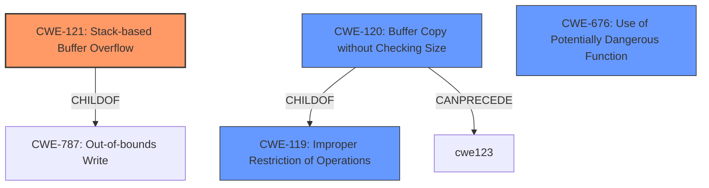

# Analysis Report for CVE-2022-30473

# Vulnerability Analysis Report: CVE-2022-30473

## Description


## Analysis (with Relationship Data)

# Summary
| CWE ID  | CWE Name                                                                  | Confidence | CWE Abstraction Level | CWE Vulnerability Mapping Label | CWE-Vulnerability Mapping Notes |
| :-------- | :------------------------------------------------------------------------ | :--------- | :---------------------- | :------------------------------ | :-------------------------------- |
| CWE-121   | Stack-based Buffer Overflow                                               | 1.0        | Variant               | Primary                         | Allowed                           |
| CWE-120   | Buffer Copy without Checking Size of Input ('Classic Buffer Overflow') | 0.7        | Base                    | Secondary                       | Allowed-with-Review             |
| CWE-676   | Use of Potentially Dangerous Function                                   | 0.6        | Base                    | Secondary                       | Allowed                           |

## Evidence and Confidence

*   **Confidence Score:** 0.9
*   **Evidence Strength:** HIGH

## Relationship Analysis
The primary CWE is CWE-121, which is a Variant of CWE-788 (Allocation of Memory Without Limits or Throttling) and CWE-787 (Out-of-bounds Write). CWE-120 is a Base CWE and a ChildOf CWE-119 (Improper Restriction of Operations within the Bounds of a Memory Buffer), which is a Class CWE. The tool marks CWE-119 as discouraged. CWE-120 can precede CWE-123 (Write-what-where Condition). CWE-676 is related to the use of functions like strcpy, which is related to this vulnerability.



## Vulnerability Chain
The chain of root cause and weaknesses for the Vulnerability Description is:
1.  **Root Cause:** The code uses `strcpy` without checking the size of the input `ssid` parameter.
2.  The input `ssid` is copied to a stack-based buffer.
3.  If the input is larger than the buffer, a stack-based buffer overflow occurs.
4.  The buffer overflow leads to a denial of service.

## Summary of Analysis
The initial assessment focused on identifying the root cause of the vulnerability, which is a stack-based buffer overflow due to the use of `strcpy` without input validation. The evidence from the vulnerability description and CVE Reference Links Content Summary clearly points to this weakness.

*   The "**weakness:** **stack-based buffer overflow**" key phrase directly indicates the nature of the vulnerability.
*   The CVE Reference Links Content Summary provides further evidence: "The code reads user-provided input for the `ssid` parameter into a buffer (`src`) and then copies this data to a smaller stack-based buffer (`s`) using `strcpy` without performing any length check. This can lead to a buffer overflow if the `ssid` parameter is longer than the buffer `s`..."

The Retriever Results also support this assessment, with CWE-121 (Stack-based Buffer Overflow) being a relevant match. The relationship analysis highlights that CWE-121 is a variant of CWE-787 (Out-of-bounds Write), providing a more specific classification than its parent.

The selected CWEs are at the optimal level of specificity, with CWE-121 accurately representing the stack-based nature of the buffer overflow. CWE-120 is a related CWE, because it is a buffer copy without checking the size of the input. CWE-676 covers functions that can be dangerous if not used properly, such as strcpy. These functions are safe if the size of the destination is larger than the source but if not it leads to a buffer overflow.


## CWE Relationship Analysis

Current CWEs represent these abstraction levels: .


### Vulnerability Chain Analysis

**Chain starting from CWE-121:**
- 121 (Stack-based Buffer Overflow) - ROOT


**Chain starting from CWE-120:**
- 120 (Buffer Copy without Checking Size of Input ('Classic Buffer Overflow')) - ROOT


### CWE Relationship Diagram

```mermaid
graph TD
    classDef primary fill:#f96,stroke:#333,stroke-width:2px
    classDef secondary fill:#69f,stroke:#333
    classDef tertiary fill:#9e9,stroke:#333
```


*Report generated on 2025-03-31 11:34:24*
