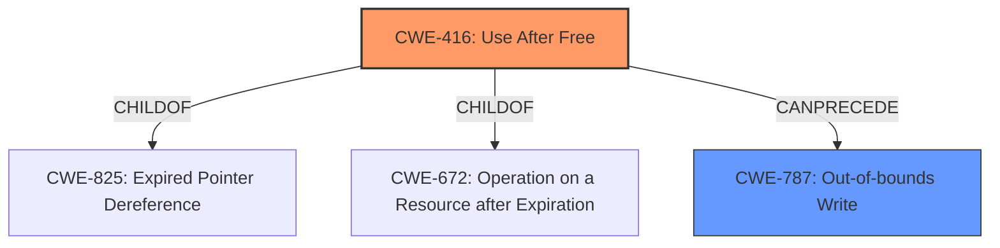

# Analysis for CVE-2022-3055

```markdown
# Summary 
| CWE ID    | CWE Name                                                                 | Confidence | CWE Abstraction Level | CWE Vulnerability Mapping Label | CWE-Vulnerability Mapping Notes |
| --------- | ------------------------------------------------------------------------ | ---------- | ----------------------- | ------------------------------- | ----------------------------- |
| CWE-416   | Use After Free                                                           | 1.0        | Variant                 | Primary                         | Allowed                       |
| CWE-787   | Out-of-bounds Write                                                      | 0.5        | Base                  | Secondary                       | Allowed                       |

## Evidence and Confidence

*   **Confidence Score:** 0.9
*   **Evidence Strength:** HIGH

## Relationship Analysis
The primary identified weakness is CWE-416, Use After Free, which is a Variant level CWE. The retriever results and similar CVE descriptions strongly support this classification. CWE-416 is a child of CWE-825 (Expired Pointer Dereference) and CWE-672 (Operation on a Resource after Expiration). A potential consequence of CWE-416 is CWE-787 (Out-of-bounds Write).



## Vulnerability Chain
The vulnerability chain starts with a **use after free** condition (CWE-416). This can lead to **heap corruption**. If an attacker can control the memory that is re-allocated after the free, they may be able to perform an out-of-bounds write (CWE-787) to achieve arbitrary code execution. The initial flaw is the **use after free**, and the potential impact is **heap corruption** leading to code execution.

## Summary of Analysis
The initial analysis strongly points to CWE-416 (Use After Free) as the primary weakness. The vulnerability description explicitly mentions "**use after free**" and "**heap corruption**," and the CVE Reference Links Content Summary confirms the root cause as "**Use-after-free** in the Passwords component of Chromium." The retriever results also list CWE-416 as a top candidate. The relationship analysis shows that CWE-416 can precede CWE-787 (Out-of-bounds Write), which aligns with the potential for **heap corruption** due to the **use after free**.

I considered other CWEs from the Retriever Results, such as CWE-366 (Race Condition within a Thread), CWE-122 (Heap-based Buffer Overflow), and CWE-843 (Access of Resource Using Incompatible Type ('Type Confusion')), but these were not as directly supported by the provided evidence. While a race condition could potentially lead to a **use after free**, there's no explicit mention of concurrency issues in the vulnerability description. Similarly, while **heap corruption** is mentioned, it's a consequence of the **use after free**, not necessarily a heap-based buffer overflow in itself. Type confusion is also possible but not explicitly stated.

The selection of CWE-416 is at the optimal level of specificity because it directly addresses the **root cause** of the vulnerability, as evidenced by the vulnerability description and CVE Reference Links Content Summary. It is a Variant level CWE, which is the most specific applicable level based on the available information. I also included CWE-787 (Out-of-bounds Write) as a secondary issue since this is the usual impact of the primary issue in this case.

Relevant CWE Information:

# Enhanced Context (25 CWEs)
The following CWEs were identified as potentially relevant to this vulnerability:

## CWE-404: Improper Resource Shutdown or Release
**Abstraction Level**: Class
**Similarity Score**: 0.80
**Source**: dense

**Description**:
The product does not release or incorrectly releases a resource before it is made available for re-use.

**Mapping Guidance**:
- Usage: Allowed-with-Review
- Rationale: This CWE entry is a Class and might have Base-level children that would be more appropriate

## CWE-226: Sensitive Information in Resource Not Removed Before Reuse
**Abstraction Level**: Base
**Similarity Score**: 0.78
**Source**: dense

**Description**:
The product releases a resource such as memory or a file so that it can be made available for reuse, but it does not clear or "zeroize" the information contained in the resource before the product performs a critical state transition or makes the resource available for reuse by other entities.

**Mapping Guidance**:
- Usage: Allowed
- Rationale: This CWE entry is at the Base level of abstraction, which is a preferred level of abstraction for mapping to the root causes of vulnerabilities.

## CWE-366: Race Condition within a Thread
**Abstraction Level**: Base
**Similarity Score**: 0.76
**Source**: dense

**Description**:
If two threads of execution use a resource simultaneously, there exists the possibility that resources may be used while invalid, in turn making the state of execution undefined.

**Mapping Guidance**:
- Usage: Allowed
- Rationale: This CWE entry is at the Base level of abstraction, which is a preferred level of abstraction for mapping to the root causes of vulnerabilities.

## CWE-667: Improper Locking
**Abstraction Level**: Class
**Similarity Score**: 0.75
**Source**: dense

**Description**:
The product does not properly acquire or release a lock on a resource, leading to unexpected resource state changes and behaviors.

**Mapping Guidance**:
- Usage: Allowed-with-Review
- Rationale: This CWE entry is a Class and might have Base-level children that would be more appropriate

## CWE-772: Missing Release of Resource after Effective Lifetime
**Abstraction Level**: Base
**Similarity Score**: 0.74
**Source**: dense

**Description**:
The product does not release a resource after its effective lifetime has ended, i.e., after the resource is no longer needed.

**Mapping Guidance**:
- Usage: Allowed
- Rationale: This CWE entry is at the Base level of abstraction, which is a preferred level of abstraction for mapping to the root causes of vulnerabilities.

## CWE-664: Improper Control of a Resource Through its Lifetime
**Abstraction Level**: Pillar
**Similarity Score**: 0.74
**Source**: dense

**Description**:
The product does not maintain or incorrectly maintains control over a resource throughout its lifetime of creation, use, and release.

**Mapping Guidance**:
- Usage: Discouraged
- Rationale: This CWE entry is high-level when lower-level children are available.

## CWE-662: Improper Synchronization
**Abstraction Level**: Class
**Similarity Score**: 0.74
**Source**: dense

**Description**:
The product utilizes multiple threads or processes to allow temporary access to a shared resource that can only be exclusive to one process at a time, but it does not properly synchronize these actions, which might cause simultaneous accesses of this resource by multiple threads or processes.

**Mapping Guidance**:
- Usage: Discouraged
- Rationale: This CWE entry is a level-1 Class (i.e., a child of a Pillar). It might have lower-level children that would be more appropriate

## CWE-362: Concurrent Execution using Shared Resource with Improper Synchronization ('Race Condition')
**Abstraction Level**: Class
**Similarity Score**: 0.74
**Source**: dense

**Description**:
The product contains a concurrent code sequence that requires temporary, exclusive access to a shared resource, but a timing window exists in which the shared resource can be modified by another code sequence operating concurrently.

**Mapping Guidance**:
- Usage: Allowed-with-Review
- Rationale: This CWE entry is a Class and might have Base-level children that would be more appropriate

## CWE-826: Premature Release of Resource During Expected Lifetime
**Abstraction Level**: Base
**Similarity Score**: 0.73
**Source**: dense

**Description**:
The product releases a resource that is still intended to be used by itself or another actor.

**Mapping Guidance**:
- Usage: Allowed
- Rationale: This CWE entry is at the Base level of abstraction, which is a preferred level of abstraction for mapping to the root causes of vulnerabilities.

## CWE-415: Double Free
**Abstraction Level**: Variant
**Similarity Score**: 0.73
**Source**: dense

**Description**:
The product calls free() twice on the same memory address, potentially leading to modification of unexpected memory locations.

**Mapping Guidance**:
- Usage: Allowed
- Rationale: This CWE entry is at the Variant level of abstraction, which is a preferred level of abstraction for mapping to the