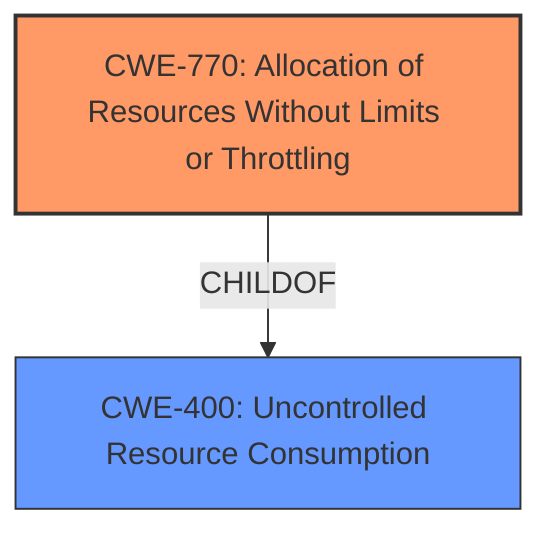

# Analysis for CVE-2022-30551

# Summary
| CWE ID | CWE Name | Confidence | CWE Abstraction Level | CWE Vulnerability Mapping Label | CWE-Vulnerability Mapping Notes |
|---|---|---|---|---|---|
| CWE-770 | Allocation of Resources Without Limits or Throttling | 0.9 | Base | Allowed | Primary CWE |
| CWE-400 | Uncontrolled Resource Consumption | 0.7 | Class | Discouraged | Secondary Candidate |

## Evidence and Confidence

*   **Confidence Score:** 0.9
*   **Evidence Strength:** HIGH

## Relationship Analysis
The primary CWE selected is CWE-770, which is a base-level CWE and a child of CWE-400. While CWE-400 is more general, CWE-770 more precisely describes the **root cause** of the vulnerability, that the software allocates resources without proper limits or throttling.

## Vulnerability Chain
The vulnerability chain starts with **allocation of resources without limits or throttling** (CWE-770) leading to **resource exhaustion** and finally a **denial of service**.
  - Root Cause: CWE-770 Allocation of Resources Without Limits or Throttling
  - Impact: Denial of Service.

## Summary of Analysis
The analysis is based on the provided evidence, which includes the vulnerability description and CVE reference links content summary. The vulnerability description states that the software allows a remote attacker to **exhaust available resources**. The CVE reference links content summary confirms that the **root cause** is uncontrolled resource consumption.

The graph relationships indicate that CWE-770 is a child of CWE-400, meaning it's a more specific type of uncontrolled resource consumption. While CWE-400 could be considered, CWE-770 more accurately captures the **root cause**, which is the lack of limits or throttling on resource allocation.

The selection of CWE-770 is at the optimal level of specificity because it describes the exact mechanism by which the attacker can **exhaust available resources**. The software allocates resources without proper limits, allowing the attacker to consume an excessive amount of resources and cause a denial of service.

Relevant CWE Information:

# Enhanced Context (25 CWEs)

## CWE-770: Allocation of Resources Without Limits or Throttling
**Abstraction:** Base
**Similarity Score**: 5958.21
**Source**: sparse

**Description**:
The product allocates a reusable resource or group of resources on behalf of an actor without imposing any restrictions on the size or number of resources that can be allocated, in violation of the intended security policy for that actor.

**Mapping Guidance**:
- Usage: Allowed
- Rationale: This CWE entry is at the Base level of abstraction, which is a preferred level of abstraction for mapping to the root causes of vulnerabilities.

### Technical Explanation for CWE-770
The vulnerability's details match the characteristics of CWE-770 because the OPC UA Legacy Java Stack allocates resources without limiting the size or number of resources that can be allocated.
The security implication is a denial of service, as an attacker can consume all available resources and prevent valid users from accessing the server.

### Technical Explanation for CWE-400
While CWE-400 (Uncontrolled Resource Consumption) is a broader category, the more specific CWE-770 (Allocation of Resources Without Limits or Throttling) is a better fit because it describes the precise mechanism of the vulnerability.

The CWE-400 is not as precise because the description is too broad and states: The product does not properly control the allocation and maintenance of a limited resource, thereby enabling an actor to influence the amount of resources consumed, eventually leading to the exhaustion of available resources.

### Other CWEs Considered But Not Used
- CWE-401: Missing Release of Memory after Effective Lifetime: This CWE focuses on memory leaks, which is not the primary issue described in the vulnerability.
- CWE-789: Memory Allocation with Excessive Size Value: While related to resource consumption, this CWE focuses on allocating memory based on an untrusted size value, which is not the main weakness in this vulnerability.
- CWE-1284: Improper Validation of Specified Quantity in Input: While input validation is important, the **root cause** here is the lack of limits on resource allocation, not necessarily the validation of input quantities.
- CWE-410: Insufficient Resource Pool: This describes a situation where the resource pool is too small to handle demand, whereas the described vulnerability is more related to the lack of limits on allocating from the pool.