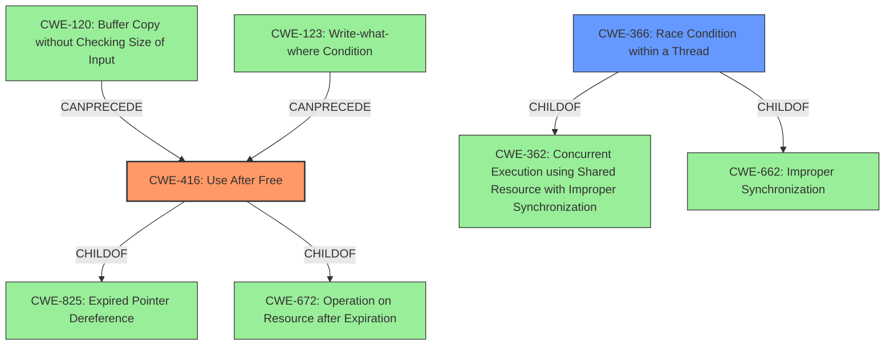

# Raw Analyzer Response for CVE-2022-3058

# Summary
| CWE ID | CWE Name | Confidence | CWE Abstraction Level | CWE Vulnerability Mapping Label | CWE-Vulnerability Mapping Notes |
|---|---|---|---|---|---|
| CWE-416 | Use After Free | 1.0 | Variant | Allowed | Primary CWE |
| CWE-366 | Race Condition within a Thread | 0.5 | Base | Allowed | Secondary CWE |

## Evidence and Confidence

*   **Confidence Score:** 0.75
*   **Evidence Strength:** HIGH

## Relationship Analysis
The primary CWE selected is CWE-416 (**Use After Free**), a Variant-level CWE. CWE-416 is a child of CWE-825 (**Expired Pointer Dereference**) and CWE-672 (**Operation on Resource after Expiration**). It can be preceded by CWE-120 (**Buffer Copy without Checking Size of Input ('Classic Buffer Overflow')**) or CWE-123 (**Write-what-where Condition**).
CWE-366 (**Race Condition within a Thread**) is a Base-level CWE and is a child of CWE-362 (**Concurrent Execution using Shared Resource with Improper Synchronization ('Race Condition')**) and CWE-662 (**Improper Synchronization**).

## Vulnerability Chain
The vulnerability chain starts with a **use after free** (CWE-416), which occurs when a program attempts to access memory after it has been freed. This can lead to heap corruption and potentially remote code execution. A possible concurrent execution using a shared resource with improper synchronization (CWE-366) might lead to the use after free (CWE-416).

## Summary of Analysis
The vulnerability is a **use after free** in the Sign-In Flow of Google Chrome. The vulnerability occurs when the program reuses or references memory after it has been freed. The provided description and the summary of CVE reference links content provides clear evidence for the **rootcause** being a **use after free**.

The selection of CWE-416 is further supported by the "Retriever Results" which lists CWE-416 as the second best match. The evidence provided explicitly states "**rootcause: use after free**". The "**impact**" is heap corruption which can lead to remote code execution. The "**vector**" is crafted UI interaction.

CWE-366 was considered because **use-after-free** vulnerabilities can often be triggered by race conditions. Although there is no explicit mention of a race condition in the provided vulnerability description, it is plausible that a race condition could contribute to the vulnerability, but it has a lower confidence value.

The primary CWE, CWE-416, is at the Variant level of abstraction, which is the preferred level.