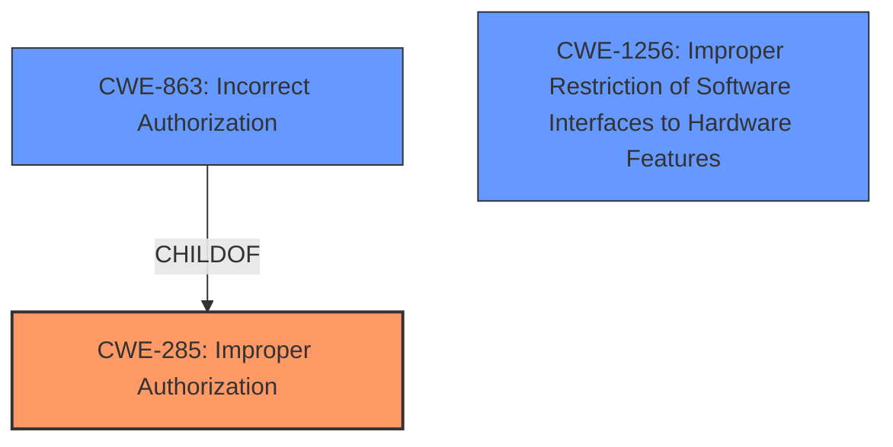

# Analysis Report for CVE-2022-30594

# Vulnerability Analysis Report: CVE-2022-30594

## Description


## Analysis (with Relationship Data)

# Summary
| CWE ID | CWE Name | Confidence | CWE Abstraction Level | CWE Vulnerability Mapping Label | CWE-Vulnerability Mapping Notes |
|---|---|---|---|---|---|
| CWE-285 | Improper Authorization | 0.7 | Class | Primary | Allowed-with-Review |
| CWE-863 | Incorrect Authorization | 0.6 | Class | Secondary | Allowed-with-Review |
| CWE-1256 | Improper Restriction of Software Interfaces to Hardware Features | 0.5 | Base | Secondary | Allowed |

## Evidence and Confidence

*   **Confidence Score:** 0.7
*   **Evidence Strength:** HIGH

## Relationship Analysis
The primary relationship considered was that CWE-863 "Incorrect Authorization" and CWE-285 "Improper Authorization" are related, with CWE-863 being a child of CWE-285. While CWE-863 is more specific, the description notes the product "does not perform or incorrectly performs an authorization check," which encompasses both scenarios. CWE-1256 "Improper Restriction of Software Interfaces to Hardware Features" was considered due to the seccomp restrictions being bypassed, but it is less directly related to the authorization **rootcause**.



## Vulnerability Chain
The vulnerability chain starts with a **mishandling of seccomp permissions**, leading to a bypass of intended restrictions. The **rootcause** is a **missing permission check** in the `PTRACE_SEIZE` code path, allowing attackers to bypass `seccomp` restrictions by setting the `PT_SUSPEND_SECCOMP` flag.

## Summary of Analysis
Initially, the **mishandling of seccomp permissions** pointed towards an authorization issue, particularly since the vulnerability allows attackers to bypass intended restrictions. The CVE reference links confirm the **rootcause** is a **missing permission check** in the `PTRACE_SEIZE` path related to `PTRACE_O_SUSPEND_SECCOMP`.

The primary mapping is CWE-285 "Improper Authorization" because the Linux kernel does not properly perform authorization checks in the `PTRACE_SEIZE` code path. This allows attackers to bypass intended restrictions on setting the `PT_SUSPEND_SECCOMP` flag. The evidence is in the "CVE Reference Links Content Summary" section, which states that the vulnerability stems from **missing permission checks** in the Linux kernel's `ptrace` subsystem when using `PTRACE_SEIZE`. Confidence is high because the description explicitly mentions bypassing restrictions, which is a direct consequence of **improper authorization**.

CWE-863 "Incorrect Authorization" was considered because it is a child of CWE-285 and represents a more specific case where an authorization check is performed but is incorrect. However, the **missing permission check** leans more towards CWE-285 since no check was performed. It is a secondary candidate because the authorization was implemented, just incorrectly.

CWE-1256 "Improper Restriction of Software Interfaces to Hardware Features" was also considered because it relates to software control over hardware features, and the seccomp restrictions are intended to limit access to certain hardware functionalities. The vulnerability allows bypassing these restrictions, making CWE-1256 relevant. However, the core issue is more fundamentally related to authorization, making CWE-1256 a secondary consideration.

The selection of CWE-285 is at the optimal level of specificity because it directly addresses the **rootcause** of the vulnerability: the **lack of proper authorization** in the `PTRACE_SEIZE` code path. This is a Class-level CWE, which is appropriate given the available evidence. The evidence explicitly states that the vulnerability stems from **missing permission checks**, directly aligning with the definition of **improper authorization**.


## CWE Relationship Analysis

Current CWEs represent these abstraction levels: .


### Vulnerability Chain Analysis

**Chain starting from CWE-285:**
- 285 (Improper Authorization) - ROOT


**Chain starting from CWE-863:**
- 863 (Incorrect Authorization) - ROOT


### CWE Relationship Diagram

```mermaid
graph TD
    classDef primary fill:#f96,stroke:#333,stroke-width:2px
    classDef secondary fill:#69f,stroke:#333
    classDef tertiary fill:#9e9,stroke:#333
```


*Report generated on 2025-03-30 21:58:52*
