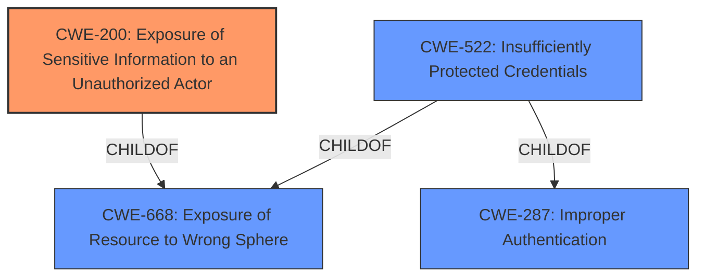

# Analysis for CVE-2022-30607

# Summary

| CWE ID | CWE Name | Confidence | CWE Abstraction Level | CWE Vulnerability Mapping Label | CWE-Vulnerability Mapping Notes |
|---|---|---|---|---|---|
| CWE-200 | Exposure of Sensitive Information to an Unauthorized Actor | 0.8 | Class | Primary | Discouraged |
| CWE-522 | Insufficiently Protected Credentials | 0.6 | Class | Secondary | Allowed-with-Review |

## Evidence and Confidence

*   **Confidence Score:** 0.7
*   **Evidence Strength:** MEDIUM

## Relationship Analysis
The primary relationship influencing the decision is the parent-child relationship between CWE-668 (Exposure of Resource to Wrong Sphere) and CWE-200 (Exposure of Sensitive Information to an Unauthorized Actor), with CWE-200 being a child of CWE-668. There is also the child relationship of CWE-522 (Insufficiently Protected Credentials) to CWE-668, but the relationship between CWE-522 and CWE-287 (Improper Authentication) is also present, suggesting authentication issues.

## Vulnerability Chain
The vulnerability chain starts with **information not properly masked** in the control center UI, leading to the impact of sensitive information exposure.
  - Root Cause: **Information not properly masked** in the control center UI.
  - Weakness: Exposure of sensitive information due to **improper masking**.
  - Impact: An attacker could obtain sensitive information, specifically user IDs across different tenants.

## Summary of Analysis
The analysis focuses on identifying the root cause and impact of the vulnerability based on the provided description and CVE reference. The primary CWE is CWE-200, as the main issue is the exposure of sensitive information due to **improper masking**. However, the MITRE guidance discourages using CWE-200, but the description matches the weakness. The weakness might also involve credentials, leading to the inclusion of CWE-522 as a secondary candidate.

The selection of CWE-200 is based on the vulnerability description stating that a user can obtain sensitive information due to **information not properly masked** in the control center UI. This aligns with CWE-200's description of exposing sensitive information to unauthorized actors. While MITRE discourages the use of CWE-200, the specifics of this vulnerability directly involve the mishandling of sensitive information, making it a relevant choice.

CWE-522 is included as a secondary CWE because the exposed information could potentially include credentials, as the description mentions sensitive information being obtained. However, without explicit mention of credentials, it remains a secondary consideration.

The selected CWEs are at the optimal level of specificity, given the information provided. CWE-200 is a class-level CWE, but it directly addresses the **information exposure** aspect. More specific CWEs could be considered if more details about the exact type of information and the mechanism of exposure were available.

Relevant CWE Information:

# Enhanced Context (25 CWEs)

## CWE-807: Reliance on Untrusted Inputs in a Security Decision
**Abstraction Level**: Base
**Similarity Score**: 0.76
**Source**: dense

**Description**:
The product uses a protection mechanism that relies on the existence or values of an input, but the input can be modified by an untrusted actor in a way that bypasses the protection mechanism.

**Mapping Guidance**:
- Usage: Allowed
- Rationale: This CWE entry is at the Base level of abstraction, which is a preferred level of abstraction for mapping to the root causes of vulnerabilities.

*Rationale for Exclusion:* This CWE is not applicable because the vulnerability is not related to reliance on untrusted inputs in a security decision.

## CWE-1220: Insufficient Granularity of Access Control
**Abstraction Level**: Base
**Similarity Score**: 0.76
**Source**: dense

**Description**:
The product implements access controls via a policy or other feature with the intention to disable or restrict accesses (reads and/or writes) to assets in a system from untrusted agents. However, implemented access controls lack required granularity, which renders the control policy too broad because it allows accesses from unauthorized agents to the security-sensitive assets.

**Mapping Guidance**:
- Usage: Allowed
- Rationale: This CWE entry is at the Base level of abstraction, which is a preferred level of abstraction for mapping to the root causes of vulnerabilities.

*Rationale for Exclusion:* This CWE is not applicable because the vulnerability is not explicitly related to insufficient granularity of access control.

## CWE-274: Improper Handling of Insufficient Privileges
**Abstraction Level**: Base
**Similarity Score**: 0.75
**Source**: dense

**Description**:
The product does not handle or incorrectly handles when it has insufficient privileges to perform an operation, leading to resultant weaknesses.

**Mapping Guidance**:
- Usage: Discouraged
- Rationale: This CWE entry could be deprecated in a future version of CWE.

*Rationale for Exclusion:* This CWE is not applicable because the vulnerability is not related to improper handling of insufficient privileges.

## CWE-1289: Improper Validation of Unsafe Equivalence in Input
**Abstraction Level**: Base
**Similarity Score**: 0.75
**Source**: dense

**Description**:
The product receives an input value that is used as a resource identifier or other type of reference, but it does not validate or incorrectly validates that the input is equivalent to a potentially-unsafe value.

**Mapping Guidance**:
- Usage: Allowed
- Rationale: This CWE entry is at the Base level of abstraction, which is a preferred level of abstraction for mapping to the root causes of vulnerabilities.

*Rationale for Exclusion:* This CWE is not applicable because the vulnerability is not related to improper validation of unsafe equivalence in input.

## CWE-653: Improper Isolation or Compartmentalization
**Abstraction Level**: Class
**Similarity Score**: 0.74
**Source**: dense

**Description**:
The product does not properly compartmentalize or isolate functionality, processes, or resources that require different privilege levels, rights, or permissions.

**Mapping Guidance**:
- Usage: Allowed
- Rationale: This CWE entry is at the Base level of abstraction, which is a preferred level of abstraction for mapping to the root causes of vulnerabilities.

*Rationale for Exclusion:* While cross-tenant disclosure is mentioned, the core issue is **information masking**, not isolation.

## CWE-280: Improper Handling of Insufficient Permissions or Privileges
**Abstraction Level**: Base
**Similarity Score**: 0.74
**Source**: dense

**Description**:
The product does not handle or incorrectly handles when it has insufficient privileges to access resources or functionality as specified by their permissions. This may cause it to follow unexpected code paths that may leave the product in an invalid state.

**Mapping Guidance**:
- Usage: Allowed
- Rationale: This CWE entry is at the Base level of abstraction, which is a preferred level of abstraction for mapping to the root causes of vulnerabilities.

*Rationale for Exclusion:* This CWE is not applicable because the vulnerability is not related to improper handling of insufficient permissions or privileges.

## CWE-639: Authorization Bypass Through User-Controlled Key
**Abstraction Level**: Base
**Similarity Score**: 0.74
**Source**: dense

**Description**:
The system's authorization functionality does not prevent one user from gaining access to another user's data or record by modifying the key value identifying the data.

**Mapping Guidance**:
- Usage: Allowed
- Rationale: This CWE entry is at the Base level of abstraction, which is a preferred level of abstraction for mapping to the root causes of vulnerabilities.

*Rationale for Exclusion:* This CWE is not directly related to authorization bypass through user-controlled keys.

## CWE-691: Insufficient Control Flow Management
**Abstraction Level**: Pillar
**Similarity Score**: 0.74
**Source**: dense

**Description**:
The code does not sufficiently manage its control flow during execution, creating conditions in which the control flow can be modified in unexpected ways.

**Mapping Guidance**:
- Usage: Discouraged
- Rationale: This CWE entry is extremely high-level, a Pillar. However, classification research is limited for weaknesses of this type, so there can be gaps or organizational difficulties within CWE that force use of this weakness, even at such a high level of abstraction.

*Rationale for Exclusion:* This CWE is too abstract and does not accurately represent the specific vulnerability.

## CWE-799: Improper Control of Interaction Frequency
**Abstraction Level**: Class
**Similarity Score**: