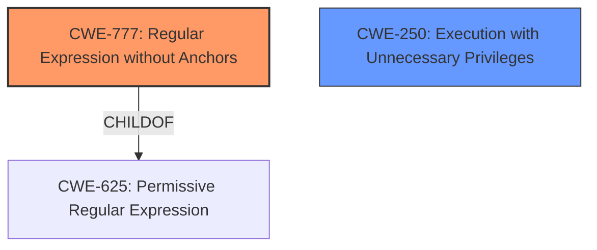

# Analysis for CVE-2022-30688

# Summary
| CWE ID | CWE Name | Confidence | CWE Abstraction Level | CWE Vulnerability Mapping Label | CWE-Vulnerability Mapping Notes |
|---|---|---|---|---|---|
| CWE-777 | Regular Expression without Anchors | 0.9 | Variant | Allowed | Primary CWE |
| CWE-250 | Execution with Unnecessary Privileges | 0.6 | Base | Allowed | Secondary CWE |

## Evidence and Confidence

*   **Confidence Score:** 0.75
*   **Evidence Strength:** HIGH

## Relationship Analysis
The primary relationship impacting the decision is that CWE-777 is a Variant of CWE-625 (Permissive Regular Expression), providing a more specific classification than its parent. CWE-777 directly addresses the **root cause** of the vulnerability, which involves the use of regular expressions without anchors. Additionally, since the **impact** is local privilege escalation, CWE-250 is a secondary consideration.

## Vulnerability Chain
The vulnerability chain begins with the **root cause**, the use of **unanchored regular expressions** (CWE-777). This leads to the **impact**, local privilege escalation. This is because the `needrestart` process runs with elevated privileges (potentially as root) and the flawed regexes allow it to be tricked into executing unintended code with those privileges.

## Summary of Analysis
The initial analysis focused on identifying the **root cause** described in the vulnerability description and CVE details. The key phrase "**Regexes to detect the Perl Python and Ruby interpreters are not anchored**" strongly suggests a problem with regular expression usage. The retriever results highlighted CWE-777 (Regular Expression without Anchors) as the top candidate.

CWE-777 directly addresses the specific weakness: "The product uses a regular expression to perform neutralization, but the regular expression is not anchored and may allow malicious or malformed data to slip through." This aligns perfectly with the vulnerability, where the unanchored regexes allow a local user to escalate privileges. The CVE reference summary confirms this, stating that "The core issue is that the regular expressions used to match interpreter paths did not include anchors."

The relationship analysis further supports this choice. CWE-777 is a Variant of CWE-625 (Permissive Regular Expression), which provides a broader classification. Since the vulnerability specifically involves missing anchors in the regex, CWE-777 is more appropriate.

CWE-250 (Execution with Unnecessary Privileges) was considered as a secondary CWE. This is because the `needrestart` process runs with elevated privileges, which exacerbates the impact of the unanchored regexes. However, the **root cause** lies in the flawed regex, not the privilege level itself. Therefore, CWE-777 is the primary CWE, and CWE-250 is a secondary consideration.

Other CWEs like CWE-95 (Improper Neutralization of Directives in Dynamically Evaluated Code ('Eval Injection')) and CWE-94 (Improper Control of Generation of Code ('Code Injection')) were considered but deemed less relevant. While the vulnerability does lead to code execution, the **root cause** is not in the code generation or dynamic evaluation process but rather in the flawed regular expression.

The selected CWEs are at the optimal level of specificity. CWE-777 is a Variant that directly addresses the use of unanchored regular expressions. More general CWEs like CWE-625 would not capture the specific nature of the weakness.

Relevant CWE Information:

# Enhanced Context (25 CWEs)

## CWE-777: Regular Expression without Anchors
**Abstraction Level**: Variant
**Similarity Score**: 0.651
**Source**: sparse

**Description**:
The product uses a regular expression to perform neutralization, but the regular expression is not anchored and may allow malicious or malformed data to slip through.

**Mapping Guidance**:
- Usage: Allowed
- Rationale: This CWE entry is at the Variant level of abstraction, which is a preferred level of abstraction for mapping to the root causes of vulnerabilities.

## CWE-250: Execution with Unnecessary Privileges
**Abstraction Level**: Base
**Status:** Draft

### Description
The product performs an operation at a privilege level that is higher than the minimum level required, which creates new weaknesses or amplifies the consequences of other weaknesses.

### Extended Description
New weaknesses can be exposed because running with extra privileges, such as root or Administrator, can disable the normal security checks being performed by the operating system or surrounding environment. Other pre-existing weaknesses can turn into security vulnerabilities if they occur while operating at raised privileges.

### Mapping Guidance
**Usage:** Allowed
**Rationale:** This CWE entry is at the Base level of abstraction, which is a preferred level of abstraction for mapping to the root causes of vulnerabilities.