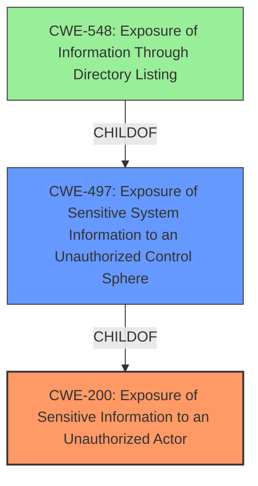

# Analysis Report for CVE-2022-30693

# Vulnerability Analysis Report: CVE-2022-30693

## Description


## Analysis (with Relationship Data)

# Summary
| CWE ID | CWE Name | Confidence | CWE Abstraction Level | CWE Vulnerability Mapping Label | CWE-Vulnerability Mapping Notes |
|---|---|---|---|---|---|
| CWE-200 | Exposure of Sensitive Information to an Unauthorized Actor | 0.9 | Class | Primary | Discouraged |
| CWE-497 | Exposure of Sensitive System Information to an Unauthorized Control Sphere | 0.7 | Base | Secondary | Allowed |

## Evidence and Confidence

*   **Confidence Score:** 0.8
*   **Evidence Strength:** MEDIUM

## Relationship Analysis
The primary relationship influencing the CWE selection is the hierarchical relationship between CWE-200 (Exposure of Sensitive Information to an Unauthorized Actor) and its child CWE-497 (Exposure of Sensitive System Information to an Unauthorized Control Sphere). While CWE-200 is a broader class, the vulnerability description specifies that the information disclosed is related to system configuration, making CWE-497 a more specific and potentially relevant option.



## Vulnerability Chain
The vulnerability chain consists of:
1.  **Root Cause:** **Information disclosure** due to unspecified vectors in the system configuration.
2.  **Weakness:** Improper handling or protection of system configuration data.
3.  **Impact:** Remote attacker obtains sensitive data of the product.

## Summary of Analysis
Initially, CWE-200 (Exposure of Sensitive Information to an Unauthorized Actor) was selected as the primary CWE because the **root cause** identified in the vulnerability description and CVE Reference Links Content Summary is **information disclosure**. The "Vulnerability Description Key Phrases" section also highlights "**Information disclosure**" as the root cause.

However, the "CVE Reference Links Content Summary" provides more context, specifying that the **information disclosure** occurs in the system configuration. This detail suggests that CWE-497 (Exposure of Sensitive System Information to an Unauthorized Control Sphere) could be a more precise mapping, as it focuses on the exposure of system-level information.

The decision to include CWE-497 as a secondary mapping is based on the additional context provided in the CVE summary and the hierarchical relationship between CWE-200 and CWE-497. While CWE-200 captures the general **information disclosure**, CWE-497 specifies the type of information being disclosed, making it a valuable addition.

CWE-200 is still used as the primary CWE because it is very common to use it when there is information disclosure.

The retriever results show that CWE-200 has the highest score.

Relevant CWE Information:

# Enhanced Context (25 CWEs)

## CWE-497: Exposure of Sensitive System Information to an Unauthorized Control Sphere
**Abstraction Level**: Base
**Similarity Score**: 0.78
**Source**: dense

**Description**:
The product does not properly prevent sensitive system-level information from being accessed by unauthorized actors who do not have the same level of access to the underlying system as the product does.

**Mapping Guidance**:
- Usage: Allowed
- Rationale: This CWE entry is at the Base level of abstraction, which is a preferred level of abstraction for mapping to the root causes of vulnerabilities.

## CWE-200: Exposure of Sensitive Information to an Unauthorized Actor
**Abstraction:** Class
**Status:** Draft

### Description
The product exposes sensitive information to an actor that is not explicitly authorized to have access to that information.

### Mapping Guidance
**Usage:** Discouraged
**Rationale:** CWE-200 is commonly misused to represent the loss of confidentiality in a vulnerability, but confidentiality loss is a technical impact - not a root cause error. As of CWE 4.9, over 400 CWE entries can lead to a loss of confidentiality. Other options are often available. [REF-1287].

## Other CWEs Considered but Not Used:

*   **CWE-284, CWE-285, CWE-862**: These CWEs relate to authorization issues. While there might be an authorization problem leading to the **information disclosure**, the primary weakness described is the **disclosure** itself, not the authorization failure.
*   **CWE-41**: This CWE focuses on path equivalence issues, which is not relevant to the described vulnerability.
*   **CWE-732**: This CWE is about incorrect permission assignments. While this could be a contributing factor, the main issue is the **information exposure**.
*   **CWE-548**: This CWE relates to directory listing exposure, which is not specified in the vulnerability description.
*   **CWE-321**: This CWE is for hard-coded cryptographic keys and is not relevant.
*   **CWE-1272**: This CWE is for Sensitive Information Uncleared Before Debug/Power State Transition and is not relevant.


## CWE Relationship Analysis

Current CWEs represent these abstraction levels: .


### Vulnerability Chain Analysis

**Chain starting from CWE-862:**
- 862 (Missing Authorization) - ROOT


**Chain starting from CWE-200:**
- 200 (Exposure of Sensitive Information to an Unauthorized Actor) - ROOT


### CWE Relationship Diagram

```mermaid
graph TD
    classDef primary fill:#f96,stroke:#333,stroke-width:2px
    classDef secondary fill:#69f,stroke:#333
    classDef tertiary fill:#9e9,stroke:#333
```


*Report generated on 2025-03-30 12:31:53*
