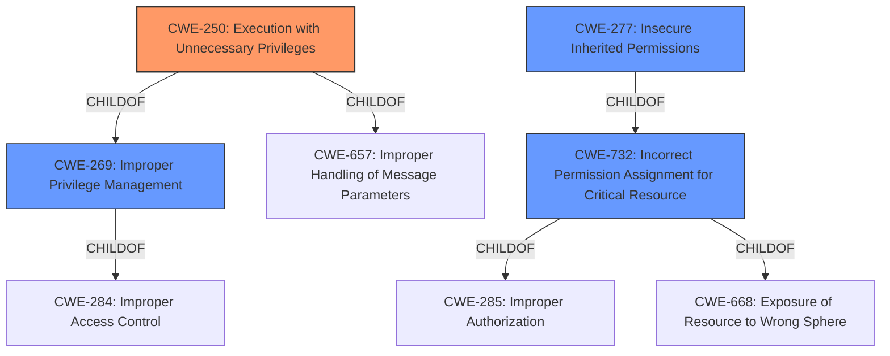

# Raw Analyzer Response for CVE-2022-30695

# Summary
| CWE ID  | CWE Name | Confidence | CWE Abstraction Level | CWE Vulnerability Mapping Label | CWE-Vulnerability Mapping Notes |
|------------------|-------------------------------------------------------|------------|-----------------------|------------------------------------|-----------------------------------|
| **CWE-250** | Execution with Unnecessary Privileges | 0.9 | Base | Allowed | Primary CWE |
| CWE-277 | Insecure Inherited Permissions | 0.7 | Variant | Allowed | Secondary Candidate |
| CWE-732 | Incorrect Permission Assignment for Critical Resource | 0.6 | Class | Allowed-with-Review | Secondary Candidate |
| CWE-269 | Improper Privilege Management | 0.5 | Class | Discouraged | Secondary Candidate |

## Evidence and Confidence

*   **Confidence Score:** 0.9
*   **Evidence Strength:** HIGH

## Relationship Analysis
The primary CWE selected is CWE-250, which is a Base level CWE. It is a child of CWE-269 and CWE-657. CWE-277 is a Variant of CWE-732, which is a Class. CWE-732 is a child of CWE-285 and CWE-668. CWE-269 is a child of CWE-284. The relationships show a hierarchy from general privilege management issues down to specific cases of unnecessary privileges. The Base level CWE-250 is the most specific and appropriate for this case, as it directly addresses the execution with unnecessary privileges.

## Vulnerability Chain
The vulnerability chain starts with **excessive permissions assigned to child processes**, leading to a local privilege escalation.
  - **Root Cause:** **Excessive permissions assigned to child processes** (CWE-250)
  - **Impact:** Local privilege escalation

## Summary of Analysis
The vulnerability description explicitly states the root cause as "**excessive permissions assigned to child processes**", which directly aligns with CWE-250 (Execution with Unnecessary Privileges). This is further supported by the fact that the impact is local privilege escalation, indicating that the **excessive permissions** are enabling unintended actions.

The retriever results also list CWE-250 as the top candidate.

CWE-277 (Insecure Inherited Permissions) was considered as a secondary candidate, but the description focuses on assigned permissions, not inherited ones.

CWE-732 (Incorrect Permission Assignment for Critical Resource) was also considered, but the problem is broader than just critical resources; it's about the **excessive permissions** given to child processes in general.

CWE-269 (Improper Privilege Management) is a high-level Class that is too general and is discouraged. The more specific CWE-250 is a better fit.

The choice of CWE-250 is at the optimal level of specificity because it directly addresses the **root cause** of the vulnerability as described. The evidence is strong due to the direct statement in the vulnerability description.