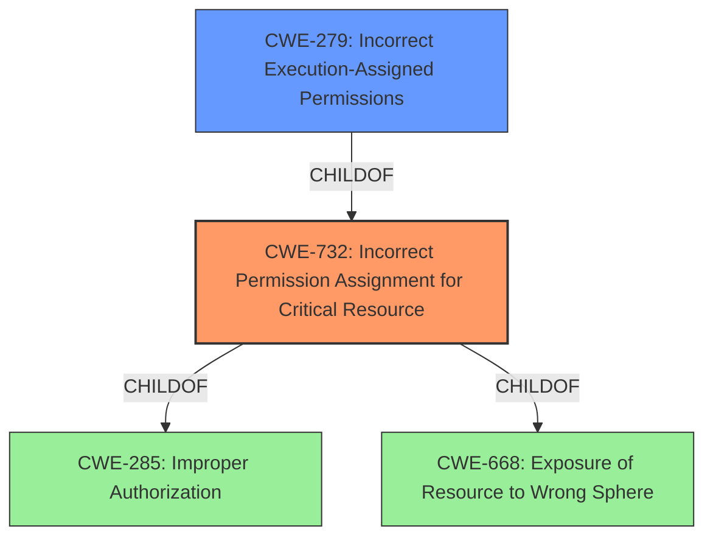

# Analysis for CVE-2022-30700

# Summary
| CWE ID | CWE Name | Confidence | CWE Abstraction Level | CWE Vulnerability Mapping Label | CWE-Vulnerability Mapping Notes |
|---|---|---|---|---|---|
| CWE-732 | Incorrect Permission Assignment for Critical Resource | 1.0 | Class | Allowed-with-Review | Primary CWE |
| CWE-279 | Incorrect Execution-Assigned Permissions | 0.7 | Variant | Allowed | Secondary Candidate |

## Evidence and Confidence

*   **Confidence Score:** 0.9
*   **Evidence Strength:** HIGH

## Relationship Analysis
The primary CWE selected is CWE-732 [CWE-732: Incorrect Permission Assignment for Critical Resource], which is a Class-level CWE. CWE-732 is child of CWE-285 and CWE-668. CWE-279 [CWE-279: Incorrect Execution-Assigned Permissions] is a considered secondary candidate as a Variant of CWE-732.

## Vulnerability Chain
The vulnerability chain starts with the **incorrect permission assignment** on a resource. This leads to a local attacker being able to load a DLL with escalated privileges, ultimately allowing for arbitrary code execution with SYSTEM privileges.

## Summary of Analysis
The initial analysis focused on the **incorrect permission assignment** which allows a local attacker to load a DLL with escalated privileges. The primary source of evidence is the "Vulnerability Description Key Phrases" which states "rootcause: **incorrect permission assignment**". The "CVE Reference Links Content Summary" section also supports this by stating "**Incorrect Permission Assignment**: The core issue is that a resource utilized by the Apex One Security Agent service has improperly configured permissions."

CWE-732 [CWE-732: Incorrect Permission Assignment for Critical Resource] is the primary CWE because it directly addresses the root cause, which is the **incorrect permission assignment** for a critical resource. The description of CWE-732, "The product specifies permissions for a security-critical resource in a way that allows that resource to be read or modified by unintended actors," aligns perfectly with the vulnerability description.

CWE-279 [CWE-279: Incorrect Execution-Assigned Permissions] was also considered, as the vulnerability involves the product setting permissions of an object (the DLL) in a way that violates the intended permissions. However, the primary issue is with the initial assignment of permissions, making CWE-732 the more appropriate choice.

CWE-284 [CWE-284: Improper Access Control] was not selected because it is too high-level (Pillar) and the mapping guidance discourages its use. The mapping guidance suggests using more specific descendants of CWE-284, such as CWE-732.

The selection of CWE-732 is at the optimal level of specificity, as it directly addresses the root cause of the vulnerability. The MITRE mapping guidance allows for the use of CWE-732 with review, which has been performed.
Based on the provided information, I am confident in the selection of CWE-732 as the primary CWE for this vulnerability.

Relevant CWE Information:
*   CWE-732 [CWE-732: Incorrect Permission Assignment for Critical Resource]
*   CWE-279 [CWE-279: Incorrect Execution-Assigned Permissions]