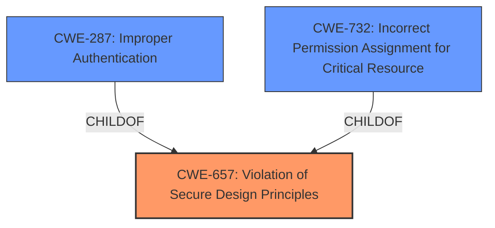

# Enhanced Analysis for CVE-2022-30707

# Summary
| CWE ID | CWE Name | Confidence | CWE Abstraction Level | CWE Vulnerability Mapping Label | CWE-Vulnerability Mapping Notes |
|---|---|---|---|---|---|
| CWE-657 | Violation of Secure Design Principles | 1.0 | Class | Allowed | Primary CWE |
| CWE-287 | Improper Authentication | 0.6 | Class | Discouraged | Secondary Candidate |
| CWE-732 | Incorrect Permission Assignment for Critical Resource | 0.5 | Class | Allowed-with-Review | Secondary Candidate |

## Evidence and Confidence

*   **Confidence Score:** 0.8
*   **Evidence Strength:** HIGH

## Relationship Analysis
The primary CWE selected is CWE-657 **Violation of Secure Design Principles**, which is a Class-level CWE. While it's generally preferred to map to Base or Variant level CWEs, in this case, the description focuses on a high-level design flaw rather than a specific implementation error. The retriever results also highlight CWE-657 as a top match.

CWE-287 **Improper Authentication** and CWE-732 **Incorrect Permission Assignment for Critical Resource** are considered as secondary candidates due to the potential for authentication and permission issues arising from the design violation. These are related as child concepts of higher-level pillars related to authorization.



## Vulnerability Chain
The vulnerability chain starts with the **violation of secure design principles** (CWE-657), leading to the possibility of compromised credentials being used to access data from other machines. This could also lead to a disabling of CAMS for HIS software functions or information disclosure/alteration. The chain can be summarized as:
CWE-657 -> Data Access, Denial of Service, Information Disclosure

## Summary of Analysis
The primary assessment is based on the provided evidence, especially the **rootcause** being a **violation of secure design principles**.

> **Vulnerability Description Key Phrases**
> - **rootcause:** **violation of secure design principles**

> **CVE Reference Links Content Summary**
> - **Violation of Secure Design Principles (CWE-657):** The core issue is that CAMS for HIS allows a compromised machine to leverage its credentials to access data from other machines running the same software. This indicates a lack of proper security boundaries between CAMS for HIS instances.

The graph relationships influenced the decision to include CWE-287 and CWE-732 as secondary considerations, although they are not the primary focus of the vulnerability.

CWE-657 is selected as it directly addresses the **rootcause**. While more specific CWEs exist, the current information does not pinpoint a specific implementation flaw. The details suggest a broader architectural or design problem.

Relevant CWE Information:

# Enhanced Context (25 CWEs)

## CWE-916: Use of Password Hash With Insufficient Computational Effort
CWE-916 was considered but ruled out. Although credential compromise is mentioned, the **rootcause** isn't directly related to weak password hashing, but to a broader **violation of secure design principles** enabling lateral movement with compromised credentials.

## CWE-1391: Use of Weak Credentials
CWE-1391 was considered but ruled out. The description highlights the usage of credentials from a compromised machine to access other machines rather than directly employing weak credentials.

## CWE-328: Use of Weak Hash
CWE-328 was considered but ruled out because it is not directly applicable to the **rootcause**. The vulnerability is not about the hashing algorithm itself but about the design flaw that permits credential misuse.

## CWE-668: Exposure of Resource to Wrong Sphere
CWE-668 was considered but ruled out. While the impact involves exposing resources, the underlying issue is a broader design flaw that allows for the exposure in the first place.

## CWE-405: Asymmetric Resource Consumption (Amplification)
CWE-405 was considered but ruled out as the **rootcause** is not resource consumption, but rather a design flaw that allows access to other machines with compromised credentials.

## CWE-798: Use of Hard-coded Credentials
CWE-798 was considered but ruled out as there is no indication of hard-coded credentials being the **rootcause**. The issue stems from the misuse of valid credentials due to a design flaw.

## CWE-303: Incorrect Implementation of Authentication Algorithm
CWE-303 was considered but ruled out as the vulnerability is not about an incorrect authentication algorithm implementation, but about a **violation of secure design principles**.

## CWE-345: Insufficient Verification of Data Authenticity
CWE-345 was considered but ruled out, as the **rootcause** is not related to data authenticity, but rather a design flaw that enables credential misuse for accessing other machines.

## CWE-226: Sensitive Information in Resource Not Removed Before Reuse
CWE-226 was considered but ruled out, as the **rootcause** is not related to resource reuse, but rather a design flaw that allows the misuse of credentials from compromised machines.

## CWE-287: Improper Authentication
CWE-287 was considered but marked as a secondary candidate. It is possible that the design flaw leads to **improper authentication** in how the system verifies the origin of requests from different machines, but this is a consequence of the broader design issue. Therefore, it is not the primary CWE.

## CWE-732: Incorrect Permission Assignment for Critical Resource
CWE-732 was considered but marked as a secondary candidate. The design flaw might lead to **incorrect permission assignments** that allow the compromised machine to access resources it should not have access to. However, this is a consequence of the broader design issue and not the primary **rootcause**.

## CWE-770: Allocation of Resources Without Limits or Throttling
CWE-770 was considered but ruled out, as the **rootcause** is not related to resource allocation, but rather a design flaw that allows the misuse of credentials from compromised machines.

## CWE-1284: Improper Validation of Specified Quantity in Input
CWE-1284 was considered but ruled out, as the **rootcause** is not related to improper validation of input quantity.

## CWE-410: Insufficient Resource Pool
CWE-410 was considered but ruled out, as the **rootcause** is not related to an insufficient resource pool.

## CWE-789: Memory Allocation with Excessive Size Value
CWE-789 was considered but ruled out, as the **rootcause** is not related to memory allocation size.

## CWE-603: Use of Client-Side Authentication
CWE-603 was considered but ruled out, as the **rootcause** is not related to client-side authentication.

## CWE-190: Integer Overflow or Wraparound
CWE-190 was considered but ruled out, as the **rootcause** is not related to integer overflow.

## CWE-1325: Improperly Controlled Sequential Memory Allocation
CWE-1325 was considered but ruled out, as the **rootcause** is not related to memory allocation.

## CWE-1339: Insufficient Precision or Accuracy of a Real Number
CWE-1339 was considered but ruled out, as the **rootcause** is not related to floating point precision.

## CWE-476: NULL Pointer Dereference
CWE-476 was considered but ruled out, as the **rootcause** is not related to null pointer dereference.

## CWE-471: Modification of Assumed-Immutable Data (MAID)
CWE-471 was considered but ruled out, as the **rootcause** is not related to immutable data modification.


## CWE Relationship Analysis

Current CWEs represent these abstraction levels: .


### Vulnerability Chain Analysis

**Chain starting from CWE-328:**
- 328 (Use of Weak Hash) - ROOT


**Chain starting from CWE-668:**
- 668 (Exposure of Resource to Wrong Sphere) - ROOT


### CWE Relationship Diagram

```mermaid
graph TD
    classDef primary fill:#f96,stroke:#333,stroke-width:2px
    classDef secondary fill:#69f,stroke:#333
    classDef tertiary fill:#9e9,stroke:#333
```