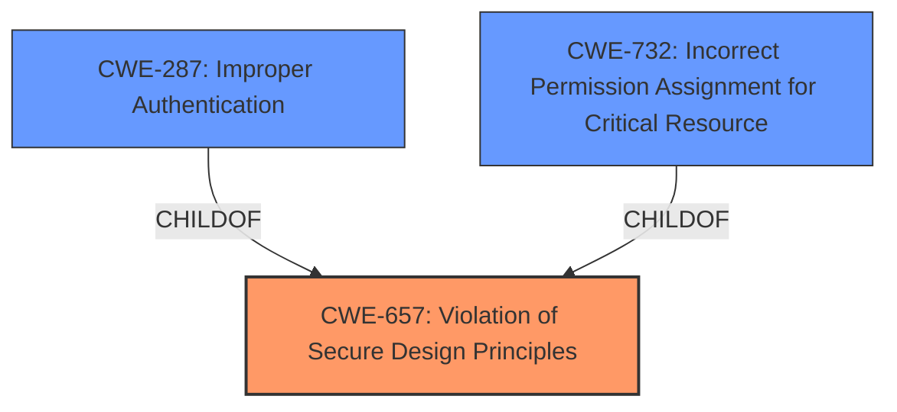

# Analysis for CVE-2022-30707

# Summary
| CWE ID | CWE Name | Confidence | CWE Abstraction Level | CWE Vulnerability Mapping Label | CWE-Vulnerability Mapping Notes |
|---|---|---|---|---|---|
| CWE-657 | Violation of Secure Design Principles | 1.0 | Class | Allowed | Primary CWE |
| CWE-287 | Improper Authentication | 0.6 | Class | Discouraged | Secondary Candidate |
| CWE-732 | Incorrect Permission Assignment for Critical Resource | 0.5 | Class | Allowed-with-Review | Secondary Candidate |

## Evidence and Confidence

*   **Confidence Score:** 0.8
*   **Evidence Strength:** HIGH

## Relationship Analysis
The primary CWE selected is CWE-657 **Violation of Secure Design Principles**, which is a Class-level CWE. While it's generally preferred to map to Base or Variant level CWEs, in this case, the description focuses on a high-level design flaw rather than a specific implementation error. The retriever results also highlight CWE-657 as a top match.

CWE-287 **Improper Authentication** and CWE-732 **Incorrect Permission Assignment for Critical Resource** are considered as secondary candidates due to the potential for authentication and permission issues arising from the design violation. These are related as child concepts of higher-level pillars related to authorization.

## Vulnerability Chain
The vulnerability chain starts with the **violation of secure design principles** (CWE-657), leading to the possibility of compromised credentials being used to access data from other machines. This could also lead to a disabling of CAMS for HIS software functions or information disclosure/alteration. The chain can be summarized as:
CWE-657 -> Data Access, Denial of Service, Information Disclosure

## Summary of Analysis
The primary assessment is based on the provided evidence, especially the **rootcause** being a **violation of secure design principles**.

> **Vulnerability Description Key Phrases**
> - **rootcause:** **violation of secure design principles**

> **CVE Reference Links Content Summary**
> - **Violation of Secure Design Principles (CWE-657):** The core issue is that CAMS for HIS allows a compromised machine to leverage its credentials to access data from other machines running the same software. This indicates a lack of proper security boundaries between CAMS for HIS instances.

The graph relationships influenced the decision to include CWE-287 and CWE-732 as secondary considerations, although they are not the primary focus of the vulnerability.

CWE-657 is selected as it directly addresses the **rootcause**. While more specific CWEs exist, the current information does not pinpoint a specific implementation flaw. The details suggest a broader architectural or design problem.

Relevant CWE Information:

# Enhanced Context (25 CWEs)

## CWE-916: Use of Password Hash With Insufficient Computational Effort
CWE-916 was considered but ruled out. Although credential compromise is mentioned, the **rootcause** isn't directly related to weak password hashing, but to a broader **violation of secure design principles** enabling lateral movement with compromised credentials.

## CWE-1391: Use of Weak Credentials
CWE-1391 was considered but ruled out. The description highlights the usage of credentials from a compromised machine to access other machines rather than directly employing weak credentials.

## CWE-328: Use of Weak Hash
CWE-328 was considered but ruled out because it is not directly applicable to the **rootcause**. The vulnerability is not about the hashing algorithm itself but about the design flaw that permits credential misuse.

## CWE-668: Exposure of Resource to Wrong Sphere
CWE-668 was considered but ruled out. While the impact involves exposing resources, the underlying issue is a broader design flaw that allows for the exposure in the first place.

## CWE-405: Asymmetric Resource Consumption (Amplification)
CWE-405 was considered but ruled out as the **rootcause** is not resource consumption, but rather a design flaw that allows access to other machines with compromised credentials.

## CWE-798: Use of Hard-coded Credentials
CWE-798 was considered but ruled out as there is no indication of hard-coded credentials being the **rootcause**. The issue stems from the misuse of valid credentials due to a design flaw.

## CWE-303: Incorrect Implementation of Authentication Algorithm
CWE-303 was considered but ruled out as the vulnerability is not about an incorrect authentication algorithm implementation, but about a **violation of secure design principles**.

## CWE-345: Insufficient Verification of Data Authenticity
CWE-345 was considered but ruled out, as the **rootcause** is not related to data authenticity, but rather a design flaw that enables credential misuse for accessing other machines.

## CWE-226: Sensitive Information in Resource Not Removed Before Reuse
CWE-226 was considered but ruled out, as the **rootcause** is not related to resource reuse, but rather a design flaw that allows the misuse of credentials from compromised machines.

## CWE-287: Improper Authentication
CWE-287 was considered but marked as a secondary candidate. It is possible that the design flaw leads to **improper authentication** in how the system verifies the origin of requests from different machines, but this is a consequence of the broader design issue. Therefore, it is not the primary CWE.

## CWE-732: Incorrect Permission Assignment for Critical Resource
CWE-732 was considered but marked as a secondary candidate. The design flaw might lead to **incorrect permission assignments** that allow the compromised machine to access resources it should not have access to. However, this is a consequence of the broader design issue and not the primary **rootcause**.

## CWE-770: Allocation of Resources Without Limits or Throttling
CWE-770 was considered but ruled out, as the **rootcause** is not related to resource allocation, but rather a design flaw that allows the misuse of credentials from compromised machines.

## CWE-1284: Improper Validation of Specified Quantity in Input
CWE-1284 was considered but ruled out, as the **rootcause** is not related to improper validation of input quantity.

## CWE-410: Insufficient Resource Pool
CWE-410 was considered but ruled out, as the **rootcause** is not related to an insufficient resource pool.

## CWE-789: Memory Allocation with Excessive Size Value
CWE-789 was considered but ruled out, as the **rootcause** is not related to memory allocation size.

## CWE-603: Use of Client-Side Authentication
CWE-603 was considered but ruled out, as the **rootcause** is not related to client-side authentication.

## CWE-190: Integer Overflow or Wraparound
CWE-190 was considered but ruled out, as the **rootcause** is not related to integer overflow.

## CWE-1325: Improperly Controlled Sequential Memory Allocation
CWE-1325 was considered but ruled out, as the **rootcause** is not related to memory allocation.

## CWE-1339: Insufficient Precision or Accuracy of a Real Number
CWE-1339 was considered but ruled out, as the **rootcause** is not related to floating point precision.

## CWE-476: NULL Pointer Dereference
CWE-476 was considered but ruled out, as the **rootcause** is not related to null pointer dereference.

## CWE-471: Modification of Assumed-Immutable Data (MAID)
CWE-471 was considered but ruled out, as the **rootcause** is not related to immutable data modification.

# Enhanced Query for CVE-2022-30707

## Vulnerability Description
Violation of secure design principles exists in the communication of CAMS for HIS. Affected products and versions are CENTUM series where LHS4800 is installed (CENTUM CS 3000 and CENTUM CS 3000 Small R3.08.10 to R3.09.00), CENTUM series where CAMS function is used (CENTUM VP, CENTUM VP Small, and CENTUM VP Basic R4.01.00 to R4.03.00), CENTUM series regardless of the use of CAMS function (CENTUM VP, CENTUM VP Small, and CENTUM VP Basic R5.01.00 to R5.04.20 and R6.01.00 to R6.09.00), Exaopc R3.72.00 to R3.80.00 (only if NTPF100-S6 For CENTUM VP Support CAMS for HIS is installed), B/M9000 CS R5.04.01 to R5.05.01, and B/M9000 VP R6.01.01 to R8.03.01). If an adjacent attacker successfully compromises a computer using CAMS for HIS software, they can use credentials from the compromised machine to access data from another machine using CAMS for HIS software. This can lead to a disabling of CAMS for HIS software functions on any affected machines, or information disclosure/alteration.

### Vulnerability Description Key Phrases
- **rootcause:** **violation of secure design principles**
- **impact:** information disclosure
- **attacker:** adjacent attacker
- **product:** CENTUM CS 3000 and CENTUM CS 3000 Small and CENTUM VP and CENTUM VP Small and CENTUM VP Basic and Exaopc and B/M9000 CS and B/M9000 VP
- **version:** R3.08.10 to R3.09.00 and R4.01.00 to R4.03.00 and R5.01.00 to R5.04.20 and R6.01.00 to R6.09.00 and R3.72.00 to R3.80.00 and R5.04.01 to R5.05.01 and R6.01.01 to R8.03.01
- **component:** CAMS for HIS

## CVE Reference Links Content Summary
Based on the provided content, here's an analysis of CVE-2022-30707:

**Root Cause of Vulnerability:**
The vulnerability stems from a violation of secure design principles within Yokogawa's Consolidation Alarm Management Software for Human Interface Station (CAMS for HIS). Specifically, it appears the software does not properly isolate credentials or session data between different instances or machines using the software.

**Weaknesses/Vulnerabilities Present:**
- **Violation of Secure Design Principles (CWE-657):** The core issue is that CAMS for HIS allows a compromised machine to leverage its credentials to access data from other machines running the same software. This indicates a lack of proper security boundaries between CAMS for HIS instances.

**Impact of Exploitation:**
- **Data Access:** A successful exploit allows an attacker to gain access to data from other machines using CAMS for HIS software.
- **Denial of Service:** The attacker can disable CAMS for HIS software functions on affected machines, causing a potential disruption of operations.

**Attack Vectors:**
- **Compromise of a CAMS for HIS machine:** The attacker must first compromise a machine running CAMS for HIS software. This is the initial point of entry for the attack.
- **Lateral Movement:** Once a machine is compromised, the attacker uses the compromised credentials to access other machines on the same network that are also running CAMS for HIS.

**Required Attacker Capabilities/Position:**
- **Initial Access:** The attacker needs to gain access to a system that is running the vulnerable version of CAMS for HIS.
- **Network Proximity:** The vulnerability is not remotely exploitable, implying that the attacker must be on the same network or have network access to the vulnerable systems.
- **Privilege:** It is implied that the attacker does not require user interaction to leverage the vulnerability once initial access is gained. The CVSS vector indicates no required privileges to exploit the vulnerability.

**Additional Notes:**
- The vulnerability has a CVSS v3 base score of 6.4 with a vector string of AV:A/AC:H/PR:N/UI:N/S:U/C:L/I:L/A:H, indicating an adjacent network attack with high complexity, no required privileges or user interaction, with low confidentiality and integrity impact, and a high availability impact.
- The affected products include various versions of Yokogawa's CENTUM CS 3000, CENTUM VP, Exaopc, B/M9000CS and B/M9000 VP.
- The advisory indicates that no public exploits are known, however, it also indicates it is not remotely exploitable, requiring the attacker to have adjacent access to the vulnerable machines.
- Mitigations include updating to the latest versions and applying security patches provided by Yokogawa, or upgrading to the latest version of CENTUM VP for end-of-life products.

This information provides more detail than the original CVE description, particularly in terms of the attack vector, required attacker capabilities and the impact of a successful attack.

## Retriever Results

### Top Combined Results

| Rank | CWE ID | Name | Abstraction | Usage  | Retrievers | Individual Scores |
|------|--------|------|-------------|-------|------------|-------------------|
| 1 | 657 | Violation of Secure Design Principles | Class | Discouraged | sparse | 3.247 |
| 2 | 302 | Authentication Bypass by Assumed-Immutable Data | Base | Allowed | sparse | 1.973 |
| 3 | 732 | Incorrect Permission Assignment for Critical Resource | Class | Allowed-with-Review | sparse | 1.141 |
| 4 | 287 | Improper Authentication | Class | Discouraged | sparse | 1.039 |
| 5 | 400 | Uncontrolled Resource Consumption | Class | Discouraged | sparse | 0.955 |
| 6 | 326 | Inadequate Encryption Strength | Class | Allowed-with-Review | dense | 0.588 |
| 7 | 410 | Insufficient Resource Pool | Base | Allowed | graph | 0.002 |
| 8 | 603 | Use of Client-Side Authentication | Base | Allowed | sparse | 0.947 |
| 9 | 294 | Authentication Bypass by Capture-replay | Base | Allowed | sparse | 0.892 |
| 10 | 916 | Use of Password Hash With Insufficient Computational Effort | Base | Allowed | sparse | 0.821 |

# Complete CWE Specifications

## CWE-657: Violation of Secure Design Principles
**Abstraction:** Class
**Status:** Draft

### Description
The product violates well-established principles for secure design.

### Extended Description
This can introduce resultant weaknesses or make it easier for developers to introduce related weaknesses during implementation. Because code is centered around design, it can be resource-intensive to fix design problems.

### Alternative Terms
None

### Relationships
ChildOf -> CWE-710

### Mapping Guidance
**Usage:** Discouraged
**Rationale:** This CWE entry is a level-1 Class (i.e., a child of a Pillar). It might have lower-level children that would be more appropriate
**Comments:** Examine children of this entry to see if there is a better fit
**Reasons:**
- Abstraction

### Additional Notes
**[Maintenance]** The Taxonomy_Mappings to ISA/IEC 62443 were added in CWE 4.10, but they are still under review and might change in future CWE versions. These draft mappings were performed by members of the "Mapping CWE to 62443" subgroup of the CWE-CAPEC ICS/OT Special Interest Group (SIG), and their work is incomplete as of CWE 4.10. The mappings are included to facilitate discussion and review by the broader ICS/OT community, and they are likely to change in future CWE versions.

### Observed Examples
- **CVE-2019-6260:** Baseboard Management Controller (BMC) device implements Advanced High-performance Bus (AHB) bridges that do not require authentication for arbitrary read and write access to the BMC's physical address space from the host, and possibly the network [REF-1138].
- **CVE-2007-5277:** The failure of connection attempts in a web browser resets DNS pin restrictions. An attacker can then bypass the same origin policy by rebinding a domain name to a different IP address. This was an attempt to "fail functional."
- **CVE-2006-7142:** Hard-coded cryptographic key stored in executable program.

## CWE-302: Authentication Bypass by Assumed-Immutable Data
**Abstraction:** Base
**Status:** Incomplete

### Description
The authentication scheme or implementation uses key data elements that are assumed to be immutable, but can be controlled or modified by the attacker.

### Extended Description
Not provided

### Alternative Terms
None

### Relationships
ChildOf -> CWE-1390
ChildOf -> CWE-807

### Mapping Guidance
**Usage:** Allowed
**Rationale:** This CWE entry is at the Base level of abstraction, which is a preferred level of abstraction for mapping to the root causes of vulnerabilities.
**Comments:** Carefully read both the name and description to ensure that this mapping is an appropriate fit. Do not try to 'force' a mapping to a lower-level Base/Variant simply to comply with this preferred level of abstraction.
**Reasons:**
- Acceptable-Use

### Observed Examples
- **CVE-2002-0367:** DebPloit
- **CVE-2004-0261:** Web auth
- **CVE-2002-1730:** Authentication bypass by setting certain cookies to "true".

## CWE-732: Incorrect Permission Assignment for Critical Resource
**Abstraction:** Class
**Status:** Draft

### Description
The product specifies permissions for a security-critical resource in a way that allows that resource to be read or modified by unintended actors.

### Extended Description
When a resource is given a permission setting that provides access to a wider range of actors than required, it could lead to the exposure of sensitive information, or the modification of that resource by unintended parties. This is especially dangerous when the resource is related to program configuration, execution, or sensitive user data. For example, consider a misconfigured storage account for the cloud that can be read or written by a public or anonymous user.

### Alternative Terms
None

### Relationships
ChildOf -> CWE-285
ChildOf -> CWE-668

### Mapping Guidance
**Usage:** Allowed-with-Review
**Rationale:** While the name itself indicates an assignment of permissions for resources, this is often misused for vulnerabilities in which "permissions" are not checked, which is an "authorization" weakness (CWE-285 or descendants) within CWE's model [REF-1287].
**Comments:** Closely analyze the specific mistake that is allowing the resource to be exposed, and perform a CWE mapping for that mistake.
**Reasons:**
- Frequent Misuse

### Additional Notes
**[Maintenance]** The relationships between privileges, permissions, and actors (e.g. users and groups) need further refinement within the Research view. One complication is that these concepts apply to two different pillars, related to control of resources (CWE-664) and protection mechanism failures (CWE-693).

### Observed Examples
- **CVE-2022-29527:** Go application for cloud management creates a world-writable sudoers file that allows local attackers to inject sudo rules and escalate privileges to root by winning a race condition.
- **CVE-2009-3482:** Anti-virus product sets insecure "Everyone: Full Control" permissions for files under the "Program Files" folder, allowing attackers to replace executables with Trojan horses.
- **CVE-2009-3897:** Product creates directories with 0777 permissions at installation, allowing users to gain privileges and access a socket used for authentication.

## CWE-287: Improper Authentication
**Abstraction:** Class
**Status:** Draft

### Description
When an actor claims to have a given identity, the product does not prove or insufficiently proves that the claim is correct.

### Extended Description
Not provided

### Alternative Terms
authentification: An alternate term is "authentification", which appears to be most commonly used by people from non-English-speaking countries.
AuthN: "AuthN" is typically used as an abbreviation of "authentication" within the web application security community. It is also distinct from "AuthZ," which is an abbreviation of "authorization." The use of "Auth" as an abbreviation is discouraged, since it could be used for either authentication or authorization.
AuthC: "AuthC" is used as an abbreviation of "authentication," but it appears to used less frequently than "AuthN."

### Relationships
ChildOf -> CWE-284
ChildOf -> CWE-284

### Mapping Guidance
**Usage:** Discouraged
**Rationale:** This CWE entry might be misused when lower-level CWE entries are likely to be applicable. It is a level-1 Class (i.e., a child of a Pillar).
**Comments:** Consider children or descendants, beginning with CWE-1390: Weak Authentication or CWE-306: Missing Authentication for Critical Function.
**Reasons:**
- Frequent Misuse
**Suggested Alternatives:**
- CWE-1390: Weak Authentication
- CWE-306: Missing Authentication for Critical Function

### Additional Notes
**[Relationship]** This can be resultant from SQL injection vulnerabilities and other issues.

**[Maintenance]** The Taxonomy_Mappings to ISA/IEC 62443 were added in CWE 4.10, but they are still under review and might change in future CWE versions. These draft mappings were performed by members of the "Mapping CWE to 62443" subgroup of the CWE-CAPEC ICS/OT Special Interest Group (SIG), and their work is incomplete as of CWE 4.10. The mappings are included to facilitate discussion and review by the broader ICS/OT community, and they are likely to change in future CWE versions.

### Observed Examples
- **CVE-2022-35248:** Chat application skips validation when Central Authentication Service (CAS) is enabled, effectively removing the second factor from two-factor authentication
- **CVE-2022-36436:** Python-based authentication proxy does not enforce password authentication during the initial handshake, allowing the client to bypass authentication by specifying a 'None' authentication type.
- **CVE-2022-30034:** Chain: Web UI for a Python RPC framework does not use regex anchors to validate user login emails (CWE-777), potentially allowing bypass of OAuth (CWE-1390).

## CWE-400: Uncontrolled Resource Consumption
**Abstraction:** Class
**Status:** Draft

### Description
The product does not properly control the allocation and maintenance of a limited resource, thereby enabling an actor to influence the amount of resources consumed, eventually leading to the exhaustion of available resources.

### Extended Description

Limited resources include memory, file system storage, database connection pool entries, and CPU. If an attacker can trigger the allocation of these limited resources, but the number or size of the resources is not controlled, then the attacker could cause a denial of service that consumes all available resources. This would prevent valid users from accessing the product, and it could potentially have an impact on the surrounding environment. For example, a memory exhaustion attack against an application could slow down the application as well as its host operating system.

There are at least three distinct scenarios which can commonly lead to resource exhaustion:

  - Lack of throttling for the number of allocated resources

  - Losing all references to a resource before reaching the shutdown stage

  - Not closing/returning a resource after processing

Resource exhaustion problems are often result due to an incorrect implementation of the following situations:

  - Error conditions and other exceptional circumstances.

  - Confusion over which part of the program is responsible for releasing the resource.

### Alternative Terms
Resource Exhaustion

### Relationships
ChildOf -> CWE-664

### Mapping Guidance
**Usage:** Discouraged
**Rationale:** CWE-400 is intended for incorrect behaviors in which the product is expected to track and restrict how many resources it consumes, but CWE-400 is often misused because it is conflated with the "technical impact" of vulnerabilities in which resource consumption occurs. It is sometimes used for low-information vulnerability reports. It is a level-1 Class (i.e., a child of a Pillar).
**Comments:** Closely analyze the specific mistake that is causing resource consumption, and perform a CWE mapping for that mistake. Consider children/descendants such as CWE-770: Allocation of Resources Without Limits or Throttling, CWE-771: Missing Reference to Active Allocated Resource, CWE-410: Insufficient Resource Pool, CWE-772: Missing Release of Resource after Effective Lifetime, CWE-834: Excessive Iteration, CWE-405: Asymmetric Resource Consumption (Amplification), and others.
**Reasons:**
- Frequent Misuse

### Additional Notes
**[Maintenance]** "Resource consumption" could be interpreted as a consequence instead of an insecure behavior, so this entry is being considered for modification. It appears to be referenced too frequently when more precise mappings are available. Some of its children, such as CWE-771, might be better considered as a chain.

**[Theoretical]** Vulnerability theory is largely about how behaviors and resources interact. "Resource exhaustion" can be regarded as either a consequence or an attack, depending on the perspective. This entry is an attempt to reflect the underlying weaknesses that enable these attacks (or consequences) to take place.

**[Other]** 

Database queries that take a long time to process are good DoS targets. An attacker would have to write a few lines of Perl code to generate enough traffic to exceed the site's ability to keep up. This would effectively prevent authorized users from using the site at all. Resources can be exploited simply by ensuring that the target machine must do much more work and consume more resources in order to service a request than the attacker must do to initiate a request.

A prime example of this can be found in old switches that were vulnerable to "macof" attacks (so named for a tool developed by Dugsong). These attacks flooded a switch with random IP and MAC address combinations, therefore exhausting the switch's cache, which held the information of which port corresponded to which MAC addresses. Once this cache was exhausted, the switch would fail in an insecure way and would begin to act simply as a hub, broadcasting all traffic on all ports and allowing for basic sniffing attacks.

**[Maintenance]** The Taxonomy_Mappings to ISA/IEC 62443 were added in CWE 4.10, but they are still under review and might change in future CWE versions. These draft mappings were performed by members of the "Mapping CWE to 62443" subgroup of the CWE-CAPEC ICS/OT Special Interest Group (SIG), and their work is incomplete as of CWE 4.10. The mappings are included to facilitate discussion and review by the broader ICS/OT community, and they are likely to change in future CWE versions.

### Observed Examples
- **CVE-2022-21668:** Chain: Python library does not limit the resources used to process images that specify a very large number of bands (CWE-1284), leading to excessive memory consumption (CWE-789) or an integer overflow (CWE-190).
- **CVE-2020-7218:** Go-based workload orchestrator does not limit resource usage with unauthenticated connections, allowing a DoS by flooding the service
- **CVE-2020-3566:** Resource exhaustion in distributed OS because of "insufficient" IGMP queue management, as exploited in the wild per CISA KEV.

## CWE-326: Inadequate Encryption Strength
**Abstraction:** Class
**Status:** Draft

### Description
The product stores or transmits sensitive data using an encryption scheme that is theoretically sound, but is not strong enough for the level of protection required.

### Extended Description
A weak encryption scheme can be subjected to brute force attacks that have a reasonable chance of succeeding using current attack methods and resources.

### Alternative Terms
None

### Relationships
ChildOf -> CWE-693

### Mapping Guidance
**Usage:** Allowed-with-Review
**Rationale:** This CWE entry is a Class and might have Base-level children that would be more appropriate
**Comments:** Examine children of this entry to see if there is a better fit
**Reasons:**
- Abstraction

### Observed Examples
- **CVE-2001-1546:** Weak encryption
- **CVE-2004-2172:** Weak encryption (chosen plaintext attack)
- **CVE-2002-1682:** Weak encryption

## CWE-410: Insufficient Resource Pool
**Abstraction:** Base
**Status:** Incomplete

### Description
The product's resource pool is not large enough to handle peak demand, which allows an attacker to prevent others from accessing the resource by using a (relatively) large number of requests for resources.

### Extended Description
Frequently the consequence is a "flood" of connection or sessions.

### Alternative Terms
None

### Relationships
ChildOf -> CWE-664
CanPrecede -> CWE-400

### Mapping Guidance
**Usage:** Allowed
**Rationale:** This CWE entry is at the Base level of abstraction, which is a preferred level of abstraction for mapping to the root causes of vulnerabilities.
**Comments:** Carefully read both the name and description to ensure that this mapping is an appropriate fit. Do not try to 'force' a mapping to a lower-level Base/Variant simply to comply with this preferred level of abstraction.
**Reasons:**
- Acceptable-Use

### Observed Examples
- **CVE-1999-1363:** Large number of locks on file exhausts the pool and causes crash.
- **CVE-2001-1340:** Product supports only one connection and does not disconnect a user who does not provide credentials.
- **CVE-2002-0406:** Large number of connections without providing credentials allows connection exhaustion.

## CWE-603: Use of Client-Side Authentication
**Abstraction:** Base
**Status:** Draft

### Description
A client/server product performs authentication within client code but not in server code, allowing server-side authentication to be bypassed via a modified client that omits the authentication check.

### Extended Description
Client-side authentication is extremely weak and may be breached easily. Any attacker may read the source code and reverse-engineer the authentication mechanism to access parts of the application which would otherwise be protected.

### Alternative Terms
None

### Relationships
ChildOf -> CWE-1390
ChildOf -> CWE-602
PeerOf -> CWE-300
PeerOf -> CWE-656

### Mapping Guidance
**Usage:** Allowed
**Rationale:** This CWE entry is at the Base level of abstraction, which is a preferred level of abstraction for mapping to the root causes of vulnerabilities.
**Comments:** Carefully read both the name and description to ensure that this mapping is an appropriate fit. Do not try to 'force' a mapping to a lower-level Base/Variant simply to comply with this preferred level of abstraction.
**Reasons:**
- Acceptable-Use

### Observed Examples
- **CVE-2022-33139:** SCADA system only uses client-side authentication, allowing adversaries to impersonate other users.
- **CVE-2006-0230:** Client-side check for a password allows access to a server using crafted XML requests from a modified client.

## CWE-294: Authentication Bypass by Capture-replay
**Abstraction:** Base
**Status:** Incomplete

### Description
A capture-replay flaw exists when the design of the product makes it possible for a malicious user to sniff network traffic and bypass authentication by replaying it to the server in question to the same effect as the original message (or with minor changes).

### Extended Description
Capture-replay attacks are common and can be difficult to defeat without cryptography. They are a subset of network injection attacks that rely on observing previously-sent valid commands, then changing them slightly if necessary and resending the same commands to the server.

### Alternative Terms
None

### Relationships
ChildOf -> CWE-1390
ChildOf -> CWE-287

### Mapping Guidance
**Usage:** Allowed
**Rationale:** This CWE entry is at the Base level of abstraction, which is a preferred level of abstraction for mapping to the root causes of vulnerabilities.
**Comments:** Carefully read both the name and description to ensure that this mapping is an appropriate fit. Do not try to 'force' a mapping to a lower-level Base/Variant simply to comply with this preferred level of abstraction.
**Reasons:**
- Acceptable-Use

### Observed Examples
- **CVE-2005-3435:** product authentication succeeds if user-provided MD5 hash matches the hash in its database; this can be subjected to replay attacks.
- **CVE-2007-4961:** Chain: cleartext transmission of the MD5 hash of password (CWE-319) enables attacks against a server that is susceptible to replay (CWE-294).

## CWE-916: Use of Password Hash With Insufficient Computational Effort
**Abstraction:** Base
**Status:** Incomplete

### Description
The product generates a hash for a password, but it uses a scheme that does not provide a sufficient level of computational effort that would make password cracking attacks infeasible or expensive.

### Extended Description

Many password storage mechanisms compute a hash and store the hash, instead of storing the original password in plaintext. In this design, authentication involves accepting an incoming password, computing its hash, and comparing it to the stored hash.

Many hash algorithms are designed to execute quickly with minimal overhead, even cryptographic hashes. However, this efficiency is a problem for password storage, because it can reduce an attacker's workload for brute-force password cracking. If an attacker can obtain the hashes through some other method (such as SQL injection on a database that stores hashes), then the attacker can store the hashes offline and use various techniques to crack the passwords by computing hashes efficiently. Without a built-in workload, modern attacks can compute large numbers of hashes, or even exhaust the entire space of all possible passwords, within a very short amount of time, using massively-parallel computing (such as cloud computing) and GPU, ASIC, or FPGA hardware. In such a scenario, an efficient hash algorithm helps the attacker.

There are several properties of a hash scheme that are relevant to its strength against an offline, massively-parallel attack:

  - The amount of CPU time required to compute the hash ("stretching")

  - The amount of memory required to compute the hash ("memory-hard" operations)

  - Including a random value, along with the password, as input to the hash computation ("salting")

  - Given a hash, there is no known way of determining an input (e.g., a password) that produces this hash value, other than by guessing possible inputs ("one-way" hashing)

  - Relative to the number of all possible hashes that can be generated by the scheme, there is a low likelihood of producing the same hash for multiple different inputs ("collision resistance")

Note that the security requirements for the product may vary depending on the environment and the value of the passwords. Different schemes might not provide all of these properties, yet may still provide sufficient security for the environment. Conversely, a solution might be very strong in preserving one property, which still being very weak for an attack against another property, or it might not be able to significantly reduce the efficiency of a massively-parallel attack.

### Alternative Terms
None

### Relationships
ChildOf -> CWE-328
ChildOf -> CWE-327

### Mapping Guidance
**Usage:** Allowed
**Rationale:** This CWE entry is at the Base level of abstraction, which is a preferred level of abstraction for mapping to the root causes of vulnerabilities.
**Comments:** Carefully read both the name and description to ensure that this mapping is an appropriate fit. Do not try to 'force' a mapping to a lower-level Base/Variant simply to comply with this preferred level of abstraction.
**Reasons:**
- Acceptable-Use

### Observed Examples
- **CVE-2008-1526:** Router does not use a salt with a hash, making it easier to crack passwords.
- **CVE-2006-1058:** Router does not use a salt with a hash, making it easier to crack passwords.
- **CVE-2008-4905:** Blogging software uses a hard-coded salt when calculating a password hash.

