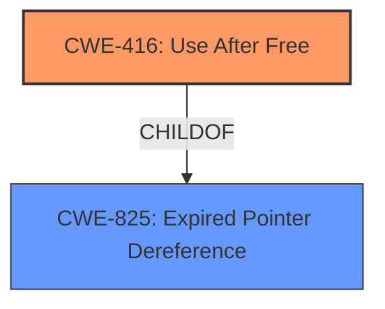

# Analysis for CVE-2022-3071

# Summary
| CWE ID  | CWE Name        | Confidence | CWE Abstraction Level | CWE Vulnerability Mapping Label | CWE-Vulnerability Mapping Notes |
| :------- | :-------------- | :--------- | :-------------------- | :------------------------------ | :---------------------------- |
| CWE-416 | Use After Free | 1.0        | Variant              | Allowed                       | Primary CWE                   |

## Evidence and Confidence

*   **Confidence Score:** 1.0
*   **Evidence Strength:** HIGH

## Relationship Analysis
The primary relationship that impacted my decision was the parent-child relationship between CWE-825 (Expired Pointer Dereference) and CWE-416 (Use After Free), as CWE-416 is a variant of CWE-825. There were no relevant chain (CanPrecede, CanFollow) or peer relationships that influenced the final CWE selection.
The abstraction level was considered to ensure the selection of the most specific CWE, which in this case was the Variant, CWE-416.

## Vulnerability Chain
The vulnerability chain consists of a **use after free** condition leading to **heap corruption**.

## Summary of Analysis
The initial analysis strongly indicated CWE-416 **Use After Free** as the primary weakness, supported by the vulnerability description and CVE reference links. The vulnerability description clearly states "**Use after free** in Tab Strip" and the CVE reference links content summary confirms this with entries like "**root_cause**: Use after free in Tab Strip" and "**weaknesses**: [ "Use after free" ]".
The final decision to assign CWE-416 was heavily based on the direct evidence provided in the vulnerability description and the CVE reference links. The graph relationships, particularly the child-of relationship with CWE-825, were considered to ensure the selection of the most specific and appropriate CWE.
CWE-416 is selected as it directly reflects the **rootcause** of the vulnerability.

Relevant CWE Information:

# Enhanced Context (25 CWEs)
The following CWEs were identified as potentially relevant to this vulnerability:

## CWE-451: User Interface (UI) Misrepresentation of Critical Information
**Abstraction Level**: Class
**Similarity Score**: 0.78
**Source**: dense

**Description**:
The user interface (UI) does not properly represent critical information to the user, allowing the information - or its source - to be obscured or spoofed. This is often a component in phishing attacks.

**Mapping Guidance**:
- Usage: Allowed-with-Review
- Rationale: This CWE entry is a Class and might have Base-level children that would be more appropriate

*   **Reason for not selecting**: While the vulnerability involves UI interactions, the core issue is memory management and not UI misrepresentation.

## CWE-404: Improper Resource Shutdown or Release
**Abstraction Level**: Class
**Similarity Score**: 0.75
**Source**: dense

**Description**:
The product does not release or incorrectly releases a resource before it is made available for re-use.

**Mapping Guidance**:
- Usage: Allowed-with-Review
- Rationale: This CWE entry is a Class and might have Base-level children that would be more appropriate

*   **Reason for not selecting**: While it relates to resource management, the specific issue is about using memory after it has been freed, not simply a failure to release a resource.

## CWE-366: Race Condition within a Thread
**Abstraction Level**: Base
**Similarity Score**: 0.75
**Source**: dense

**Description**:
If two threads of execution use a resource simultaneously, there exists the possibility that resources may be used while invalid, in turn making the state of execution undefined.

**Mapping Guidance**:
- Usage: Allowed
- Rationale: This CWE entry is at the Base level of abstraction, which is a preferred level of abstraction for mapping to the root causes of vulnerabilities.

*   **Reason for not selecting**: While concurrency might be involved, the core issue is the **use after free**, not a race condition directly.

## CWE-843: Access of Resource Using Incompatible Type ('Type Confusion')
**Abstraction Level**: Base
**Similarity Score**: 0.74
**Source**: dense

**Description**:
The product allocates or initializes a resource such as a pointer, object, or variable using one type, but it later accesses that resource using a type that is incompatible with the original type.

**Mapping Guidance**:
- Usage: Allowed
- Rationale: This CWE entry is at the Base level of abstraction, which is a preferred level of abstraction for mapping to the root causes of vulnerabilities.

*   **Reason for not selecting**: The vulnerability does not involve accessing resources with incompatible types.

## CWE-1021: Improper Restriction of Rendered UI Layers or Frames
**Abstraction Level**: Base
**Similarity Score**: 0.74
**Source**: dense

**Description**:
The web application does not restrict or incorrectly restricts frame objects or UI layers that belong to another application or domain, which can lead to user confusion about which interface the user is interacting with.

**Mapping Guidance**:
- Usage: Allowed
- Rationale: This CWE entry is at the Base level of abstraction, which is a preferred level of abstraction for mapping to the root causes of vulnerabilities.

*   **Reason for not selecting**: While the vulnerability involves UI interactions, the core issue is memory management, not UI layer restrictions.

## CWE-362: Concurrent Execution using Shared Resource with Improper Synchronization ('Race Condition')
**Abstraction Level**: Class
**Similarity Score**: 0.73
**Source**: dense

**Description**:
The product contains a concurrent code sequence that requires temporary, exclusive access to a shared resource, but a timing window exists in which the shared resource can be modified by another code sequence operating concurrently.

**Mapping Guidance**:
- Usage: Allowed-with-Review
- Rationale: This CWE entry is a Class and might have Base-level children that would be more appropriate

*   **Reason for not selecting**: Although the vulnerability may involve concurrency, the primary issue is the **use after free**, not a race condition.

## CWE-416: Use After Free
**CWE-416** **Use After Free** is the most appropriate CWE.

*   **Explanation**: The vulnerability description clearly indicates a **use after free** condition.
*   **Security Implications**: This can lead to arbitrary code execution.
*   **Relationships**: This is a variant of CWE-825 (Expired Pointer Dereference).
*   **Mapping Guidance**: The usage is "Allowed" and the abstraction level is "Variant", which is a preferred level.
*   **Observed Examples**: The description for CWE-416 lists examples such as CVE-2022-2621, which also involves a **use after free** condition in a web browser.