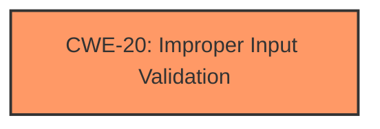

# Analysis Report for CVE-2022-30713

# Vulnerability Analysis Report: CVE-2022-30713

## Description


## Analysis (with Relationship Data)

# Summary
| CWE ID | CWE Name | Confidence | CWE Abstraction Level | CWE Vulnerability Mapping Label | CWE-Vulnerability Mapping Notes |
|---|---|---|---|---|---|
| CWE-20 | Improper Input Validation | 0.75 | Class | Primary | Discouraged |

## Evidence and Confidence

*   **Confidence Score:** 0.75
*   **Evidence Strength:** MEDIUM

## Relationship Analysis
The primary CWE identified is CWE-20 **Improper Input Validation**, which is a Class-level CWE. This CWE is discouraged for direct mapping due to its generality, with suggestions to use more specific child CWEs. However, without more information, I will use it as the primary CWE.



## Vulnerability Chain
The vulnerability chain starts with the **Improper validation** of input, which leads to attackers being able to launch certain activities.

## Summary of Analysis
The initial analysis, based on the provided evidence, points towards CWE-20 **Improper Input Validation**. The **rootcause** of the vulnerability is the **improper validation** in LSOItemData. This allows attackers to launch certain activities, indicating a security impact resulting from the lack of proper input handling.

The vulnerability description explicitly states "**Improper validation** vulnerability". The CVE description says: "The patch adds proper validation logic to prevent privilege escalation." This evidence supports the classification of **Improper Input Validation**.

The confidence level is 0.75 because while the description points towards input validation, the specifics of the validation are unknown.

Relevant CWE Information:

# Enhanced Context (25 CWEs)

## CWE-476: NULL Pointer Dereference
**Abstraction Level**: Base
**Similarity Score**: 0.75
**Source**: dense
**Description**:
The product dereferences a pointer that it expects to be valid but is NULL.
**Mapping Guidance**:
- Usage: Allowed

## CWE-667: Improper Locking
**Abstraction Level**: Class
**Similarity Score**: 0.75
**Source**: dense
**Description**:
The product does not properly acquire or release a lock on a resource, leading to unexpected resource state changes and behaviors.
**Mapping Guidance**:
- Usage: Allowed-with-Review

## CWE-754: Improper Check for Unusual or Exceptional Conditions
**Abstraction Level**: Class
**Similarity Score**: 0.74
**Source**: dense
**Description**:
The product does not check or incorrectly checks for unusual or exceptional conditions that are not expected to occur frequently during day to day operation of the product.
**Mapping Guidance**:
- Usage: Allowed-with-Review

## CWE-1289: Improper Validation of Unsafe Equivalence in Input
**Abstraction Level**: Base
**Similarity Score**: 0.74
**Source**: dense
**Description**:
The product receives an input value that is used as a resource identifier or other type of reference, but it does not validate or incorrectly validates that the input is equivalent to a potentially-unsafe value.
**Mapping Guidance**:
- Usage: Allowed

## CWE-404: Improper Resource Shutdown or Release
**Abstraction Level**: Class
**Similarity Score**: 0.74
**Source**: dense
**Description**:
The product does not release or incorrectly releases a resource before it is made available for re-use.
**Mapping Guidance**:
- Usage: Allowed-with-Review

## CWE-822: Untrusted Pointer Dereference
**Abstraction Level**: Base
**Similarity Score**: 0.74
**Source**: dense
**Description**:
The product obtains a value from an untrusted source, converts this value to a pointer, and dereferences the resulting pointer.
**Mapping Guidance**:
- Usage: Allowed

## CWE-252: Unchecked Return Value
**Abstraction Level**: Base
**Similarity Score**: 0.74
**Source**: dense
**Description**:
The product does not check the return value from a method or function, which can prevent it from detecting unexpected states and conditions.
**Mapping Guidance**:
- Usage: Allowed

## CWE-226: Sensitive Information in Resource Not Removed Before Reuse
**Abstraction Level**: Base
**Similarity Score**: 0.74
**Source**: dense
**Description**:
The product releases a resource such as memory or a file so that it can be made available for reuse, but it does not clear or "zeroize" the information contained in the resource before the product performs a critical state transition or makes the resource available for reuse by other entities.
**Mapping Guidance**:
- Usage: Allowed

## CWE-170: Improper Null Termination
**Abstraction Level**: Base
**Similarity Score**: 0.74
**Source**: dense
**Description**:
The product does not terminate or incorrectly terminates a string or array with a null character or equivalent terminator.
**Mapping Guidance**:
- Usage: Allowed

## CWE-41: Improper Resolution of Path Equivalence
**Abstraction Level**: Base
**Similarity Score**: 0.74
**Source**: dense
**Description**:
The product is vulnerable to file system contents disclosure through path equivalence. Path equivalence involves the use of special characters in file and directory names. The associated manipulations are intended to generate multiple names for the same object.
**Mapping Guidance**:
- Usage: Allowed

## CWE-22: Improper Limitation of a Pathname to a Restricted Directory ('Path Traversal')
**Abstraction Level**: Base
**Similarity Score**: 7149.76
**Source**: sparse
**Description**:
The product uses external input to construct a pathname that is intended to identify a file or directory that is located underneath a restricted parent directory, but the product does not properly neutralize special elements within the pathname that can cause the pathname to resolve to a location that is outside of the restricted directory.
**Mapping Guidance**:
- Usage: Allowed

## CWE-863: Incorrect Authorization
**Abstraction Level**: Class
**Similarity Score**: 6909.29
**Source**: sparse
**Description**:
The product performs an authorization check when an actor attempts to access a resource or perform an action, but it does not correctly perform the check.
**Mapping Guidance**:
- Usage: Allowed-with-Review

## CWE-23: Relative Path Traversal
**Abstraction Level**: Base
**Similarity Score**: 6862.81
**Source**: sparse
**Description**:
The product uses external input to construct a pathname that should be within a restricted directory, but it does not properly neutralize sequences such as ".." that can resolve to a location that is outside of that directory.
**Mapping Guidance**:
- Usage: Allowed

## CWE-285: Improper Authorization
**Abstraction Level**: Class
**Similarity Score**: 6757.98
**Source**: sparse
**Description**:
The product does not perform or incorrectly performs an authorization check when an actor attempts to access a resource or perform an action.
**Mapping Guidance**:
- Usage: Discouraged

## CWE-639: Authorization Bypass Through User-Controlled Key
**Abstraction Level**: Base
**Similarity Score**: 6751.69
**Source**: sparse
**Description**:
The system's authorization functionality does not prevent one user from gaining access to another user's data or record by modifying the key value identifying the data.
**Mapping Guidance**:
- Usage: Allowed

## CWE-73: External Control of File Name or Path
**Abstraction Level**: base
**Similarity Score**: 4.82
**Source**: graph
**Description**:
CWE-73: External Control of File Name or Path
**Mapping Guidance**:
- Usage: Allowed

## CWE-22: Improper Limitation of a Pathname to a Restricted Directory ('Path Traversal')
**Abstraction Level**: base
**Similarity Score**: 4.33
**Source**: graph
**Description**:
CWE-22: Improper Limitation of a Pathname to a Restricted Directory ('Path Traversal')
**Mapping Guidance**:
- Usage: Allowed

## CWE-770: Allocation of Resources Without Limits or Throttling
**Abstraction Level**: base
**Similarity Score**: 4.33
**Source**: graph
**Description**:
CWE-770: Allocation of Resources Without Limits or Throttling
**Mapping Guidance**:
- Usage: Allowed

## CWE-190: Integer Overflow or Wraparound
**Abstraction Level**: base
**Similarity Score**: 4.33
**Source**: graph
**Description**:
CWE-190: Integer Overflow or Wraparound
**Mapping Guidance**:
- Usage: Allowed

## CWE-184: Incomplete List of Disallowed Inputs
**Abstraction Level**: base
**Similarity Score**: 3.80
**Source**: graph
**Description**:
CWE-184: Incomplete List of Disallowed Inputs
**Mapping Guidance**:
- Usage: Allowed

## CWE-843: Access of Resource Using Incompatible Type ('Type Confusion')
**Abstraction Level**: base
**Similarity Score**: 3.44
**Source**: graph
**Description**:
CWE-843: Access of Resource Using Incompatible Type ('Type Confusion')


## CWE Relationship Analysis

Current CWEs represent these abstraction levels: .


### Vulnerability Chain Analysis

**Chain starting from CWE-41:**
- 41 (Improper Resolution of Path Equivalence) - ROOT


**Chain starting from CWE-754:**
- 754 (Improper Check for Unusual or Exceptional Conditions) - ROOT


### CWE Relationship Diagram

```mermaid
graph TD
    classDef primary fill:#f96,stroke:#333,stroke-width:2px
    classDef secondary fill:#69f,stroke:#333
    classDef tertiary fill:#9e9,stroke:#333
```


*Report generated on 2025-03-30 20:52:08*
