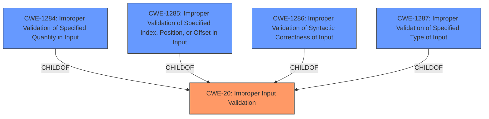

# Analysis for CVE-2022-30720

# Summary
| CWE ID | CWE Name | Confidence | CWE Abstraction Level | CWE Vulnerability Mapping Label | CWE-Vulnerability Mapping Notes |
|---|---|---|---|---|---|
| CWE-20 | Improper Input Validation | 0.9 | Class | Primary | Discouraged |
| CWE-1284 | Improper Validation of Specified Quantity in Input | 0.7 | Base | Secondary | Allowed |

## Evidence and Confidence

*   **Confidence Score:** 0.9
*   **Evidence Strength:** HIGH

## Relationship Analysis
The primary CWE is CWE-20, which is a class-level CWE. While discouraged, the provided information does not give enough specificity to choose a specific base CWE. The relationship that impacted my decision was primarily the parent-child relationship, as the retriever results pointed to more specific child CWEs of CWE-20.

## Vulnerability Chain
The vulnerability chain starts with the **improper input validation check logic**, which then leads to a crash.
  - Initial Flaw: **Improper input validation check logic**
  - Impact: Trigger Crash

## Summary of Analysis
The initial assessment based on the vulnerability description and key phrases points to **improper input validation**. The root cause is explicitly stated as **"Improper input validation check logic"**. The impact is that "attackers can trigger a device crash."

The primary CWE match from similar CVE descriptions is CWE-20 [CWE-20: Improper Input Validation].

The retriever results suggest several CWEs, including CWE-1285 [CWE-1285: Improper Validation of Specified Index, Position, or Offset in Input], CWE-20 [CWE-20: Improper Input Validation], CWE-1284 [CWE-1284: Improper Validation of Specified Quantity in Input], CWE-476 [CWE-476: NULL Pointer Dereference], and CWE-285 [CWE-285: Improper Authorization].

CWE-20 [CWE-20: Improper Input Validation] is a class-level CWE and is generally discouraged because it is often misused. However, without more information about the specific type of input that is not being validated, it's difficult to select a more specific CWE. The remediation mentioned in the CVE Reference Links Content Summary states: "The patch adds proper validation of the buffer length." This points to CWE-1284 [CWE-1284: Improper Validation of Specified Quantity in Input] because it refers to a length.

I am selecting CWE-20 [CWE-20: Improper Input Validation] as the primary CWE because it is the primary CWE match for similar CVE descriptions, and the description clearly indicates **improper input validation**. I am also selecting CWE-1284 [CWE-1284: Improper Validation of Specified Quantity in Input] as a secondary CWE because the remediation mentions buffer length.

Relevant CWE Information:

# Enhanced Context (25 CWEs)

## CWE-367: Time-of-check Time-of-use (TOCTOU) Race Condition
**Abstraction Level**: Base
**Similarity Score**: 0.79
**Source**: dense

**Description**:
The product checks the state of a resource before using that resource, but the resource's state can change between the check and the use in a way that invalidates the results of the check. This can cause the product to perform invalid actions when the resource is in an unexpected state.

**Mapping Guidance**:
- Usage: Allowed
- Rationale: This CWE entry is at the Base level of abstraction, which is a preferred level of abstraction for mapping to the root causes of vulnerabilities.

*Not used because a race condition is not mentioned.*

## CWE-404: Improper Resource Shutdown or Release
**Abstraction Level**: Class
**Similarity Score**: 0.78
**Source**: dense

**Description**:
The product does not release or incorrectly releases a resource before it is made available for re-use.

**Mapping Guidance**:
- Usage: Allowed-with-Review
- Rationale: This CWE entry is a Class and might have Base-level children that would be more appropriate

*Not used because resource shutdown or release is not mentioned.*

## CWE-1289: Improper Validation of Unsafe Equivalence in Input
**Abstraction Level**: Base
**Similarity Score**: 0.77
**Source**: dense

**Description**:
The product receives an input value that is used as a resource identifier or other type of reference, but it does not validate or incorrectly validates that the input is equivalent to a potentially-unsafe value.

**Mapping Guidance**:
- Usage: Allowed
- Rationale: This CWE entry is at the Base level of abstraction, which is a preferred level of abstraction for mapping to the root causes of vulnerabilities.

*Not used because unsafe equivalence is not mentioned.*

## CWE-667: Improper Locking
**Abstraction Level**: Class
**Similarity Score**: 0.77
**Source**: dense

**Description**:
The product does not properly acquire or release a lock on a resource, leading to unexpected resource state changes and behaviors.

**Mapping Guidance**:
- Usage: Allowed-with-Review
- Rationale: This CWE entry is a Class and might have Base-level children that would be more appropriate

*Not used because improper locking is not mentioned.*

## CWE-754: Improper Check for Unusual or Exceptional Conditions
**Abstraction Level**: Class
**Similarity Score**: 0.76
**Source**: dense

**Description**:
The product does not check or incorrectly checks for unusual or exceptional conditions that are not expected to occur frequently during day to day operation of the product.

**Mapping Guidance**:
- Usage: Allowed-with-Review
- Rationale: This CWE entry is a Class and might have Base-level children that would be more appropriate

*Not used because unusual or exceptional conditions are not mentioned.*

## CWE-668: Exposure of Resource to Wrong Sphere
**Abstraction Level**: Class
**Similarity Score**: 0.76
**Source**: dense

**Description**:
The product exposes a resource to the wrong control sphere, providing unintended actors with inappropriate access to the resource.

**Mapping Guidance**:
- Usage: Discouraged
- Rationale: CWE-668 is high-level and is often misused as a catch-all when lower-level CWE IDs might be applicable. It is sometimes used for low-information vulnerability reports [REF-1287]. It is a level-1 Class (i.e., a child of a Pillar). It is not useful for trend analysis.

*Not used because exposure of resource to wrong sphere is not mentioned.*

## CWE-362: Concurrent Execution using Shared Resource with Improper Synchronization ('Race Condition')
**Abstraction Level**: Class
**Similarity Score**: 0.76
**Source**: dense

**Description**:
The product contains a concurrent code sequence that requires temporary, exclusive access to a shared resource, but a timing window exists in which the shared resource can be modified by another code sequence operating concurrently.

**Mapping Guidance**:
- Usage: Allowed-with-Review
- Rationale: This CWE entry is a Class and might have Base-level children that would be more appropriate

*Not used because concurrent execution is not mentioned.*

## CWE-703: Improper Check or Handling of Exceptional Conditions
**Abstraction Level**: Pillar
**Similarity Score**: 0.76
**Source**: dense

**Description**:
The product does not properly anticipate or handle exceptional conditions that rarely occur during normal operation of the product.

**Mapping Guidance**:
- Usage: Discouraged
- Rationale: This CWE entry is extremely high-level, a Pillar.

*Not used because improper check or handling of exceptional conditions is not mentioned.*

## CWE-208: Observable Timing Discrepancy
**Abstraction Level**: Base
**Similarity Score**: 0.76
**Source**: dense

**Description**:
Two separate operations in a product require different amounts of time to complete, in a way that is observable to an actor and reveals security-relevant information about the state of the product, such as whether a particular operation was successful or not.