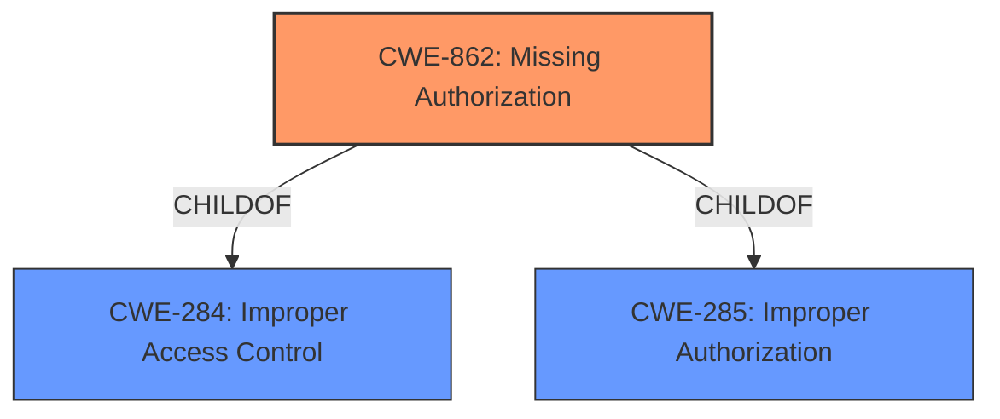

# Analysis Report for CVE-2022-30730

# Vulnerability Analysis Report: CVE-2022-30730

## Description


## Analysis (with Relationship Data)

# Summary
| CWE ID | CWE Name | Confidence | CWE Abstraction Level | CWE Vulnerability Mapping Label | CWE-Vulnerability Mapping Notes |
|---|---|---|---|---|---|
| CWE-862 | Missing Authorization | 0.85 | Base | Allowed | Primary CWE |
| CWE-284 | Improper Access Control | 0.7 | Pillar | Discouraged | Secondary Candidate |
| CWE-285 | Improper Authorization | 0.6 | Class | Discouraged | Secondary Candidate |

## Evidence and Confidence

*   **Confidence Score:** 0.8
*   **Evidence Strength:** HIGH

## Relationship Analysis
The primary CWE is CWE-862 **Missing Authorization**, which is a child of CWE-284 **Improper Access Control** and CWE-285 **Improper Authorization**. The vulnerability description indicates a clear absence of authorization checks, making CWE-862 the most specific and appropriate choice. While CWE-284 and CWE-285 are related, they are too general for this specific case.



## Vulnerability Chain
The vulnerability chain consists of:
1.  **Root Cause:** **Missing Authorization** (CWE-862) - The application **fails to perform** authorization checks before granting access to the account list.
2.  **Impact:** Unauthorized Access - Physical attackers can access the account list without authentication.

## Summary of Analysis
The initial analysis identified **Improper authorization** as the root cause from the "Vulnerability Description Key Phrases" and "CVE Reference Links Content Summary". The Retriever Results listed CWE-284, CWE-285, and other related CWEs. However, based on the detailed descriptions and relationships, CWE-862 **Missing Authorization** best captures the specific weakness. The application **lacks** the necessary authorization checks, allowing unauthorized access.

The evidence from the vulnerability description is: "**Improper authorization** in Samsung Pass prior to 1.0.00.33 allows physical attackers to access account list without authentication."
The evidence from the CVE Reference Links Content Summary: "The vulnerability is due to **improper authorization** within the Samsung Pass application" and "**Improper authorization** allows access to the account list without proper user authentication."

CWE-284 **Improper Access Control** and CWE-285 **Improper Authorization** were considered but not selected because they are too general. CWE-863 **Incorrect Authorization** was also considered, but it implies that an authorization check is performed incorrectly, rather than being absent altogether. CWE-287 **Improper Authentication** was not selected as the issue is with Authorization and not Authentication.

CWE-862 provides the most accurate representation of the vulnerability, as it directly addresses the **lack of** authorization checks. It is a Base level CWE, which is the preferred level of abstraction.

Relevant CWE Information:

# Enhanced Context (25 CWEs)

## CWE-302: Authentication Bypass by Assumed-Immutable Data
**Abstraction Level**: Base
**Similarity Score**: 0.76
**Source**: dense

**Description**:
The authentication scheme or implementation uses key data elements that are assumed to be immutable, but can be controlled or modified by the attacker.
**NOT USED:** This vulnerability is not about data assumed immutable, but the **lack of** authorization checks.

## CWE-807: Reliance on Untrusted Inputs in a Security Decision
**Abstraction Level**: Base
**Similarity Score**: 0.75
**Source**: dense

**Description**:
The product uses a protection mechanism that relies on the existence or values of an input, but the input can be modified by an untrusted actor in a way that bypasses the protection mechanism.
**NOT USED:** This vulnerability is not about untrusted inputs, but the **lack of** authorization checks.

## CWE-303: Incorrect Implementation of Authentication Algorithm
**Abstraction Level**: Base
**Similarity Score**: 0.75
**Source**: dense

**Description**:
The requirements for the product dictate the use of an established authentication algorithm, but the implementation of the algorithm is incorrect.
**NOT USED:** This vulnerability is not about authentication algorithms, but the **lack of** authorization checks.

## CWE-1390: Weak Authentication
**Abstraction Level**: Class
**Similarity Score**: 0.75
**Source**: dense

**Description**:
The product uses an authentication mechanism to restrict access to specific users or identities, but the mechanism does not sufficiently prove that the claimed identity is correct.
**NOT USED:** This vulnerability is not about weak authentication, but the **lack of** authorization checks.

## CWE-288: Authentication Bypass Using an Alternate Path or Channel
**Abstraction Level**: Base
**Similarity Score**: 0.74
**Source**: dense

**Description**:
The product requires authentication, but the product has an alternate path or channel that does not require authentication.
**NOT USED:** This vulnerability is not about an alternate path, but the **lack of** authorization checks.

## CWE-300: Channel Accessible by Non-Endpoint
**Abstraction Level**: Class
**Similarity Score**: 0.74
**Source**: dense

**Description**:
The product does not adequately verify the identity of actors at both ends of a communication channel, or does not adequately ensure the integrity of the channel, in a way that allows the channel to be accessed or influenced by an actor that is not an endpoint.
**NOT USED:** This vulnerability is not about channel accessibility, but the **lack of** authorization checks.

## CWE-289: Authentication Bypass by Alternate Name
**Abstraction Level**: Base
**Similarity Score**: 0.74
**Source**: dense

**Description**:
The product performs authentication based on the name of a resource being accessed, or the name of the actor performing the access, but it does not properly check all possible names for that resource or actor.
**NOT USED:** This vulnerability is not about checking names, but the **lack of** authorization checks.

## CWE-639: Authorization Bypass Through User-Controlled Key
**Abstraction Level**: Base
**Similarity Score**: 0.74
**Source**: dense

**Description**:
The system's authorization functionality does not prevent one user from gaining access to another user's data or record by modifying the key value identifying the data.
**NOT USED:** This vulnerability is not about user-controlled keys, but the **lack of** authorization checks.

## CWE-1220: Insufficient Granularity of Access Control
**Abstraction Level**: Base
**Similarity Score**: 0.73
**Source**: dense

**Description**:
The product implements access controls via a policy or other feature with the intention to disable or restrict accesses (reads and/or writes) to assets in a system from untrusted agents. However, implemented access controls lack required granularity, which renders the control policy too broad because it allows accesses from unauthorized agents to the security-sensitive assets.
**NOT USED:** This vulnerability is not about granularity, but the **lack of** authorization checks.

## CWE-472: External Control of Assumed-Immutable Web Parameter
**Abstraction Level**: Base
**Similarity Score**: 0.73
**Source**: dense

**Description**:
The web application does not sufficiently verify inputs that are assumed to be immutable but are actually externally controllable, such as hidden form fields.
**NOT USED:** This vulnerability is not about external control, but the **lack of** authorization checks.

## CWE-863: Incorrect Authorization
**Abstraction Level**: Class
**Similarity Score**: 5533.43
**Source**: sparse

**Description**:
The product performs an authorization check when an actor attempts to access a resource or perform an action, but it does not correctly perform the check.
**NOT USED:** This vulnerability is not about incorrect authorization, but the **lack of** authorization checks.

## CWE-285: Improper Authorization
**Abstraction Level**: Class
**Similarity Score**: 5519.21
**Source**: sparse

**Description**:
The product does not perform or incorrectly performs an authorization check when an actor attempts to access a resource or perform an action.
**NOT USED:** This vulnerability is better represented by CWE-862.

## CWE-425: Direct Request ('Forced Browsing')
**Abstraction Level**: Base
**Similarity Score**: 5450.16
**Source**: sparse

**Description**:
The web application does not adequately enforce appropriate authorization on all restricted URLs, scripts, or files.
**NOT USED:** This vulnerability is not about direct request, but the **lack of** authorization checks.

## CWE


## CWE Relationship Analysis

Current CWEs represent these abstraction levels: .


### Vulnerability Chain Analysis

**Chain starting from CWE-862:**
- 862 (Missing Authorization) - ROOT


**Chain starting from CWE-425:**
- 425 (Direct Request ('Forced Browsing')) - ROOT


### CWE Relationship Diagram

```mermaid
graph TD
    classDef primary fill:#f96,stroke:#333,stroke-width:2px
    classDef secondary fill:#69f,stroke:#333
    classDef tertiary fill:#9e9,stroke:#333
```


*Report generated on 2025-03-31 10:38:23*
