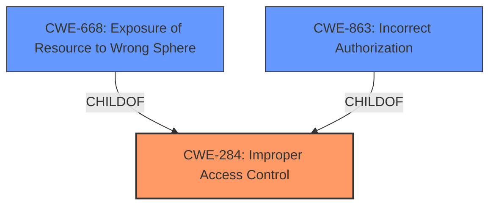

# Analysis Report for CVE-2022-30731

# Vulnerability Analysis Report: CVE-2022-30731

## Description


## Analysis (with Relationship Data)

# Summary
| CWE ID | CWE Name | Confidence | CWE Abstraction Level | CWE Vulnerability Mapping Label | CWE-Vulnerability Mapping Notes |
|---|---|---|---|---|---|
| CWE-284 | Improper Access Control | 0.9 | Pillar | Primary CWE | Discouraged |
| CWE-668 | Exposure of Resource to Wrong Sphere | 0.7 | Class | Secondary Candidate | Discouraged |
| CWE-863 | Incorrect Authorization | 0.6 | Class | Secondary Candidate | Allowed-with-Review |

## Evidence and Confidence

*   **Confidence Score:** 0.8
*   **Evidence Strength:** HIGH

## Relationship Analysis
The primary relationship considered was the hierarchical relationship between CWE-284 (Improper Access Control), a Pillar-level CWE, and its potential children, like CWE-863 (Incorrect Authorization) and CWE-668 (Exposure of Resource to Wrong Sphere). While the vulnerability description points to an access control issue, the high-level nature of the description makes it difficult to pinpoint the exact mechanism. Therefore, while CWE-284 is the initial choice, the possibility of more specific child CWEs is considered.



## Vulnerability Chain
The chain of events is as follows:

1.  **Root Cause:** **Improper access control** (**CWE-284**) within the My Files application.
2.  **Weakness:** Failure to properly restrict access to private files.
3.  **Impact:** Attackers can access arbitrary private files.

## Summary of Analysis
The initial analysis immediately points to **CWE-284 (Improper Access Control)** because the vulnerability description key phrases include "**Improper access control**" as the root cause. The CVE Reference Links Content Summary further reinforces this, stating, "**Root cause of vulnerability**: Improper access control in the My Files application." The impact is that "**attackers**" can "**access arbitrary private files**".

However, **CWE-284** is a Pillar-level CWE, and the mapping guidance explicitly **Discourages** its use, recommending more specific descendants. Therefore, I considered potential child CWEs like **CWE-668 (Exposure of Resource to Wrong Sphere)** and **CWE-863 (Incorrect Authorization)**.

**CWE-668** is a Class-level CWE that describes the product exposing a resource to the wrong control sphere, giving unintended actors access. This aligns reasonably with the vulnerability, where private files are accessible to unauthorized attackers. However, the description is still quite general. The retriever results show a relatively high similarity score for this CWE as well.

**CWE-863** is another Class-level CWE that describes the product performing an authorization check, but performing it incorrectly. While the vulnerability description doesn't explicitly mention a check, the **improper access control** suggests that a check might be in place but is flawed. The retriever results also show a relatively high similarity score for this CWE.

Despite the availability of these Class level CWEs, the evidence remains insufficient to promote either to the primary choice over **CWE-284**, but are listed as secondary candidates.

The decision is based on the explicit statement of "**Improper access control**" as the root cause and the lack of detailed information to pinpoint the specific authorization or resource exposure mechanism at play.
I am maintaining **CWE-284** as the primary CWE, acknowledging its high-level nature, but recognizing that it directly reflects the identified root cause. Because of the high level nature of the CWE, the overall confidence score is 0.8.


## CWE Relationship Analysis

Current CWEs represent these abstraction levels: .


### Vulnerability Chain Analysis

**Chain starting from CWE-668:**
- 668 (Exposure of Resource to Wrong Sphere) - ROOT


**Chain starting from CWE-863:**
- 863 (Incorrect Authorization) - ROOT


### CWE Relationship Diagram

```mermaid
graph TD
    classDef primary fill:#f96,stroke:#333,stroke-width:2px
    classDef secondary fill:#69f,stroke:#333
    classDef tertiary fill:#9e9,stroke:#333
```


*Report generated on 2025-03-31 11:06:35*
