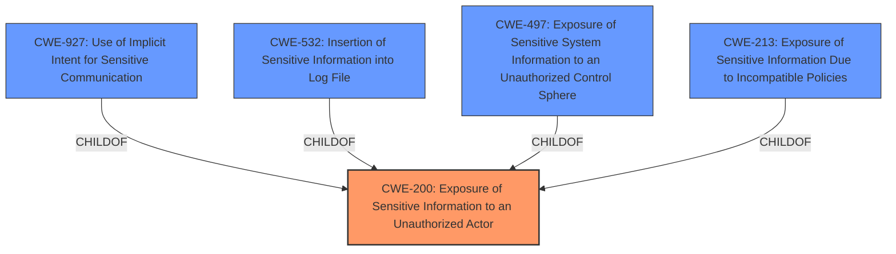

# Raw Analyzer Response for CVE-2022-30732

# Summary
| CWE ID | CWE Name | Confidence | CWE Abstraction Level | CWE Vulnerability Mapping Label | CWE-Vulnerability Mapping Notes |
|---|---|---|---|---|---|
| CWE-200 | Exposure of Sensitive Information to an Unauthorized Actor | 0.8 | Class | Primary CWE | Discouraged |
| CWE-927 | Use of Implicit Intent for Sensitive Communication | 0.6 | Variant | Secondary Candidate | Allowed |

## Evidence and Confidence

*   **Confidence Score:** 0.7
*   **Evidence Strength:** MEDIUM

## Relationship Analysis
The primary relationship considered was that CWE-200 [Exposure of Sensitive Information to an Unauthorized Actor] is a parent Class of several more specific Base and Variant level CWEs. The description explicitly states **Exposure of Sensitive Information**, making CWE-200 a direct match even though it is discouraged. CWE-927 [Use of Implicit Intent for Sensitive Communication] is included as a secondary candidate because the vulnerability occurs in `onActivityResult`, which is related to implicit intents in Android applications.

## Vulnerability Chain
The vulnerability chain starts with the **Exposure of Sensitive Information** due to the way the Samsung Account handles `onActivityResult`. The end result is that attackers can access sensitive information.

## Summary of Analysis
The initial assessment identified **Exposure of Sensitive Information** as the core issue. The retriever results also highlighted CWE-200 [Exposure of Sensitive Information to an Unauthorized Actor] as the top candidate. While the CWE description explicitly discourages using CWE-200 due to its high-level nature and potential for misuse, the vulnerability description uses the exact phrase "**Exposure of Sensitive Information**", making it difficult to ignore. The description and content summary also point to `onActivityResult` as the point of failure, which is an Android component.

The selection of CWE-200 is based on the direct mention of "**Exposure of Sensitive Information**" in the vulnerability description. The evidence from the "Vulnerability Description Key Phrases" section is: "**weakness:** **Exposure of Sensitive Information**" and "CVE Reference Links Content Summary" section: "**Root cause of vulnerability:** **Exposure of Sensitive Information** in Samsung Account."

The vulnerability description mentions that the exposure occurs via `onActivityResult`. CWE-927 [Use of Implicit Intent for Sensitive Communication] is included as a secondary candidate. `onActivityResult` is commonly used when dealing with implicit intents in Android development. Since implicit intents do not specify a particular application to receive the data, any application can process the intent by using an Intent Filter for that intent which can allow untrusted applications to obtain sensitive data.

The chosen CWEs are at appropriate levels of specificity. CWE-200 [Exposure of Sensitive Information to an Unauthorized Actor] captures the general nature of the information exposure, while CWE-927 [Use of Implicit Intent for Sensitive Communication] captures the specifics of implicit intent handling in Android. The evidence from the "CVE Reference Links Content Summary" section is: "The vulnerability lies in how the Samsung Account handles `onActivityResult`, potentially exposing sensitive information."

Relevant CWE Information:

## CWE-668: Exposure of Resource to Wrong Sphere
**Abstraction Level**: Class
**Similarity Score**: 0.76
**Source**: dense

**Description**:
The product exposes a resource to the wrong control sphere, providing unintended actors with inappropriate access to the resource.

**Mapping Guidance**:
- Usage: Discouraged
- Rationale: CWE-668 is high-level and is often misused as a catch-all when lower-level CWE IDs might be applicable. It is sometimes used for low-information vulnerability reports [REF-1287]. It is a level-1 Class (i.e., a child of a Pillar). It is not useful for trend analysis.