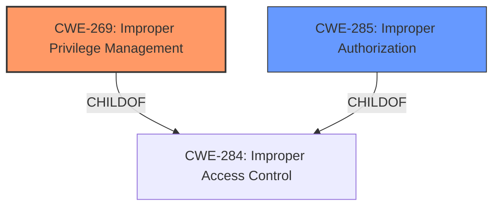

# Analysis for CVE-2022-30736

# Summary
| CWE ID | CWE Name | Confidence | CWE Abstraction Level | CWE Vulnerability Mapping Label | CWE-Vulnerability Mapping Notes |
|---|---|---|---|---|---|
| CWE-269 | Improper Privilege Management | 0.9 | Class | Primary | Discouraged |
| CWE-285 | Improper Authorization | 0.6 | Class | Secondary | Discouraged |

## Evidence and Confidence

*   **Confidence Score:** 0.9
*   **Evidence Strength:** HIGH

## Relationship Analysis
The primary CWE, CWE-269 (Improper Privilege Management), is a Class-level CWE that is a child of CWE-284 (Improper Access Control). While CWE-269 is discouraged due to frequent misuse, it directly aligns with the vulnerability description's **rootcause**: "**Improper privilege management**." The relationships suggest that a more specific child of CWE-269 might be appropriate, but based on the information provided, CWE-269 remains the best fit. CWE-285 is another candidate, but less specific than CWE-269.

## Vulnerability Chain
The chain of events is:
1.  **Root Cause:** **Improper privilege management** (CWE-269)
2.  **Impact:** Attackers can get the data of contact and gallery without permission.

## Summary of Analysis
The initial assessment, based on the vulnerability description's key phrases and the CVE reference summary, strongly points to **improper privilege management** as the root cause. The phrase "**Improper privilege management**" from the "Vulnerability Description Key Phrases" section directly supports this. The "CVE Reference Links Content Summary" also confirms this, stating, "The vulnerability stems from **improper privilege management** within the Samsung Account application," and that it "allows attackers to access contact and gallery data without the necessary permissions."

Although CWE-269 is a Class-level CWE and is discouraged for direct mapping due to its potential for misuse and lack of specificity, it aligns most closely with the provided evidence. The MITRE mapping guidance advises examining children of CWE-269 for additional hints. However, given the available information, a more specific child CWE cannot be confidently assigned.

CWE-285 (Improper Authorization) and its children were also considered. While the impact involves unauthorized access, the root cause, as stated in the description, is specifically related to privilege management rather than a general authorization failure. Therefore, CWE-269 is the more appropriate primary mapping.

The final decision to use CWE-269 is based on the explicit mention of "**Improper privilege management**" in the vulnerability description and supporting CVE reference content. While a more specific CWE would be ideal, the available evidence does not support a more granular classification. The confidence level is high (0.9) due to the direct match with the vulnerability description.

Relevant CWE Information:

# Enhanced Context (25 CWEs)

## CWE-269: Improper Privilege Management
**Abstraction:** Class
**Similarity Score**: N/A
**Source**: N/A

**Description**:
The product does not properly assign, modify, track, or check privileges for an actor, creating an unintended sphere of control for that actor.

**Technical Explanation**:
The vulnerability description states "**Improper privilege management**" as the root cause. This aligns with the definition of CWE-269, which involves incorrect handling of privileges leading to an unintended sphere of control.
**Security Implications**:
Attackers can bypass intended access restrictions and gain unauthorized access to sensitive data (contact and gallery data in this case).
**Relationship Explanation**:
CWE-269 is a child of CWE-284 (Improper Access Control), indicating it's a specific type of access control issue.
**Mapping Guidance Influence**:
CWE-269 is generally discouraged because it is high-level, but in this case there is no lower-level child CWE that fits better.
**Justification**:
The vulnerability's description explicitly mentions "**Improper privilege management**", making CWE-269 the most relevant despite its general nature.

## CWE-285: Improper Authorization
**Abstraction:** Class
**Similarity Score**: N/A
**Source**: N/A

**Description**:
The product does not perform or incorrectly performs an authorization check when an actor attempts to access a resource or perform an action.

**Technical Explanation**:
The vulnerability allows attackers to "get the data of contact and gallery without permission," which can be interpreted as a failure to properly authorize access to those resources.
**Security Implications**:
Attackers gain unauthorized access to sensitive user data.
**Relationship Explanation**:
CWE-285 is a child of CWE-284 (Improper Access Control), indicating it's a specific type of access control issue.
**Mapping Guidance Influence**:
CWE-285 is discouraged because it is high-level, and the description refers to **improper privilege management**, so CWE-269 is the better choice.
**Justification**:
While the impact relates to authorization, the root cause is privilege management, making CWE-269 more accurate.

Other CWEs Considered:

*   CWE-287 (Improper Authentication): Authentication does not appear to be the issue, as the problem is with what an authenticated user can access.
*   CWE-862 (Missing Authorization): While the impact is unauthorized access, the root cause points to **improper privilege management**, not a complete lack of authorization.
*   CWE-732 (Incorrect Permission Assignment for Critical Resource): This is more about resource permissions than general privilege management.
*   CWE-613 (Insufficient Session Expiration): Session management doesn't seem to be relevant here.
*   CWE-927 (Use of Implicit Intent for Sensitive Communication): This is specific to Android intents and doesn't fit the general description of the vulnerability.
*   CWE-926 (Improper Export of Android Application Components): Again, this is specific to Android components and doesn't fit the general description.